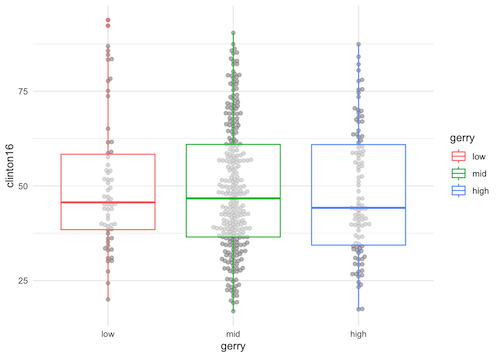

## Getting started

### Packages

We'll use the **tidyverse** package for this analysis.

```{r}
#| label: load-packages
#| message: false
library(tidyverse)
library(usdata)
library(ggbeeswarm)
```

### Data

The data are availale in the **usdata** package.

```{r}
#| label: gerrymander
glimpse(gerrymander)
```

## Congressional districts per state

Which state has the most congressional districts?
How many congressional districts are there in this state?

Add your response here.

```{r}
#| label: districts
# add code here
```

## Gerrymandering and flipping

Is a Congressional District more likely to be flipped to a Democratic seat if it has high prevalence of gerrymandering or low prevalence of gerrymandering?
Support your answer with a visualization and summary statistics.

Add your response here.

```{r}
#| label: flips
#| fig-asp: 0.4
# add code here
```

## Aesthetic mappings

Recreate the following visualization, and then improve it.



```{r}
#| label: recreate
#| fig-asp: 0.4
# add code here
```
