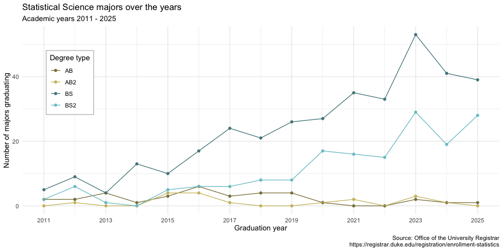
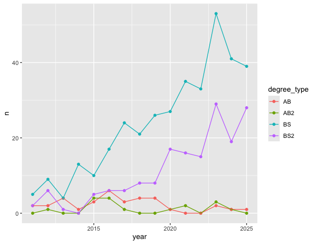

## Goal

Our ultimate goal in this application exercise is to make the following data visualization.

{fig-align="center"}

## Data

The data come from the [Office of the University Registrar](https://registrar.duke.edu/registration/enrollment-statistics).
They make the data available as a table that you can download as a PDF, but I've put the data exported in a CSV file for you.
Let's load that in.

```{r}
#| label: load-packages-data
#| message: false

library(tidyverse)

statsci <- read_csv("data/statsci_clean.csv")
```

And let's take a look at the data.

```{r}
statsci
```

## Pivoting

-   **Demo:** Pivot the `statsci` data frame *longer* such that:

    -   Each row represents a degree type / year combination
    -   `year` and `n`umber of graduates for that year are columns in the data frame
    -   The resulting `year` column is numeric

```{r}
#| label: pivot

# add your code here
```

-   **Your Turn:** Now, repeat your code from above, but this time **save the result** to a **new** dataframe. 

```{r}
#| label: pivot-with-transform-name

# add your code here
```

## Plotting

-   **Your turn:** Now we will start making our plot, but let's not get too fancy right away. Create the following plot, which will serve as the "first draft" on the way to our [goal]. Which data frame should you use in your plot?



```{r}
#| label: plot-draft

# add your code here
```

-   **Question**: Why was the pivot necessary in order to create this plot?

*Add your response here!*

-   **Question:** What aspects of the plot need to be updated to go from the draft you created above to the [goal] plot at the beginning of this application exercise?

*Add your response here.*

-   **Demo:** Update x-axis scale such that the years displayed go from 2011 to 2025 in increments of 2 years. Do this by adding on to your pipeline from earlier.

```{r}
#| label: plot-improve-1

# add your code here
```

-   **Demo:** Update line colors using the following level / color assignments. Once again, do this by adding on to your pipeline from earlier.
    -   "BS" = "cadetblue4"

    -   "BS2" = "cadetblue3"

    -   "AB" = "lightgoldenrod4"

    -   "AB2" = "lightgoldenrod3"

```{r}
#| label: plot-improve-2

# add your code here
```

-   **Your turn:** Update the plot labels (`title`, `subtitle`, `x`, `y`, and `caption`) and use `theme_minimal()`. Once again, do this by adding on to your pipeline from earlier.

```{r}
#| label: plot-improve-3

# add your code here
```

-   **Demo:** Adding to your pipeline you've developed so far, move the legend into the plot, make its background white, and its border gray.

```{r}
#| label: plot-improve-4

# add your code here
```

-   **Demo:** Finally, set `fig-width: 10` and `fig-height: 5` for your plot in the chunk options.

```{r}
#| label: plot-improve-5

# add your code here
```

## Let's now pivot wider!

-   **Demo:** Just like you can pivot longer, you can pivot wider. Let's convert our longer data frame back into the wider one in a single pipeline.

```{r}
#| label: wider

# add your code here
```
