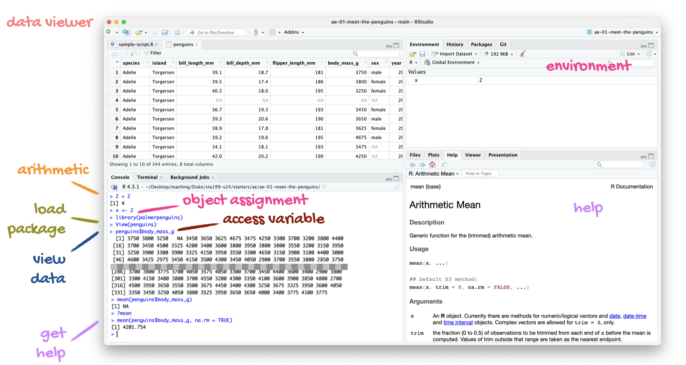
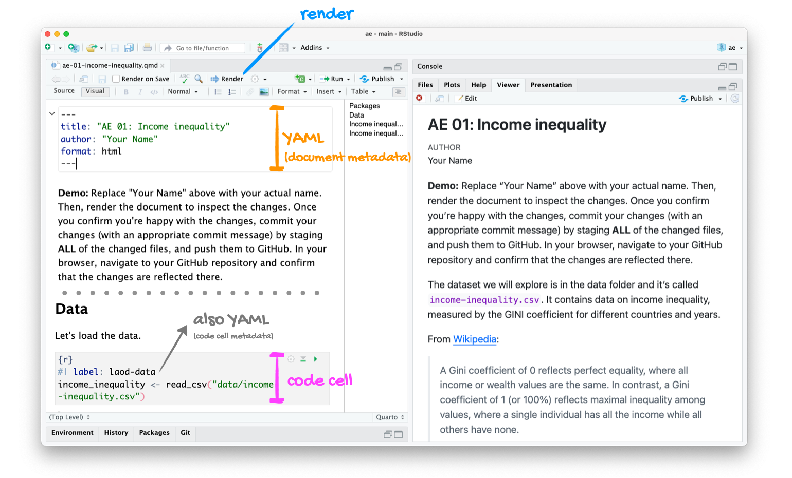

# Introduction

This lab will introduce you to the course computing workflow and data visualization.
The main goal is to reinforce our demo of R and RStudio, which we will be using throughout the course both to learn the statistical concepts discussed in the course and to analyze real data and come to informed conclusions.

::: callout-note
R is the name of the programming language itself and RStudio is a convenient interface, commonly referred to as an integrated development environment or an IDE, for short.
:::

An additional goal is to reinforce Git and GitHub, the version control, web hosting, and collaboration systems that we will be using throughout the course.

::: callout-note
Git is a version control system (like "Track Changes" features from Microsoft Word but more powerful) and GitHub is the home for your Git-based projects on the internet (like DropBox but much better).
:::

As the labs progress, you are encouraged to explore beyond what the labs dictate; a willingness to experiment will make you a much better programmer.
Before we get to that stage, however, you need to build some basic fluency in R.
Today we begin with the fundamental building blocks of R and RStudio: the interface, reading in data, and basic commands.

::: callout-warning
This lab assumes that you have already completed [Lab 0](https://sta199-su26.github.io/lab/lab-0.html).
If you have not, please go back and do that first before proceeding.
:::

## Learning objectives

By the end of the lab, you will...

-   Be familiar with the workflow using R, RStudio, Git, and GitHub
-   Gain practice writing a reproducible report using Quarto
-   Practice version control using Git and GitHub
-   Be able to create data visualizations using `ggplot2`
-   Practice piping to string together sequences of functions for *tidying* data

## Getting started

### Log in to RStudio

-   Go to <https://cmgr.oit.duke.edu/containers> and login with your Duke NetID and Password.
-   Click `STA199` under My reservations to log into your container. You should now see the RStudio environment.

### Clone the repo & start new RStudio project

-   Go to the course GitHub organization at <https://github.com/sta199-su26/>.
    Click on the repo with the prefix **lab-1**.
    It contains the starter documents you need to complete the lab.

-   Click on the green **CODE** button, select **Use SSH** (this might already be selected by default, and if it is, you'll see the text **Clone with SSH**).
    Click on the clipboard icon to copy the repo URL.

-   In RStudio, go to *File* ➛ *New Project* ➛*Version Control* ➛ *Git*.

-   Copy and paste the URL of your assignment repo into the dialog box *Repository URL*. Again, please make sure to have *SSH* highlighted under *Clone* when you copy the address.

-   Click *Create Project*, and the files from your GitHub repo will be displayed in the *Files* pane in RStudio.

-   Click *lab-1.qmd* to open the template Quarto file.
    This is where you will write up your code and narrative for the lab.

### R and R Studio

Below are the components of the RStudio IDE.

{fig-alt="RStudio IDE"}

Below are the components of a Quarto (.qmd) file.

{fig-alt="Quarto document"}

### YAML

The top portion of your R Markdown file (between the three dashed lines) is called **YAML**.
It stands for "YAML Ain't Markup Language".
It is a human friendly data representation for all programming languages.
All you need to know is that this area is called the YAML (we will refer to it as such) and that it contains meta information about your document.

::: callout-important
Open the Quarto (`.qmd`) file in your project, change the author name to your name, and render the document.
Examine the rendered document.
:::

### Committing changes

Now, go to the Git pane in your RStudio instance.
This will be in the top right hand corner in a separate tab.

If you have made changes to your Quarto (.qmd) file, you should see it listed here.
Click on it to select it in this list and then click on **Diff**.
This shows you the *diff*erence between the last committed state of the document and its current state including changes.
You should see deletions in red and additions in green.

If you're happy with these changes, we'll prepare the changes to be pushed to your remote repository.
First, **stage** your changes by checking the appropriate box on the files you want to prepare.
Next, write a meaningful commit message (for instance, "updated author name") in the **Commit message** box.
Finally, click **Commit**.
Note that every commit needs to have a commit message associated with it.

You don't have to commit after every change, as this would get quite tedious.
You should commit states that are *meaningful to you* for inspection, comparison, or restoration.

In the first few assignments we will tell you exactly when to commit and in some cases, what commit message to use.
As the semester progresses we will let you make these decisions.

Now let's make sure all the changes went to GitHub.
Go to your GitHub repo and refresh the page.
You should see your commit message next to the updated files.
If you see this, all your changes are on GitHub and you're good to go!

### Pushing changes

Now that you have made an update and committed this change, it's time to push these changes to your repo on GitHub.

In order to push your changes to GitHub, you must have **staged** your **commit** to be pushed.
click on **Push**.

## Packages

In this lab we will work with the **tidyverse** package, which is a collection of packages for doing data analysis in a "tidy" way.

```{r}
#| eval: true
#| message: false

library(tidyverse)
```

**Render** the document which loads this package with the `library()` function.

::: callout-note
The rendered document will include a message about which packages the tidyverse package is loading along with it.
It's just R being informative, a **message** does not indicate anything is wrong (it's not a **warning** or an **error**).
:::

The tidyverse is a meta-package.
When you load it you get nine packages loaded for you:

-   **dplyr**: for data wrangling
-   **forcats**: for dealing with factors
-   **ggplot2**: for data visualization
-   **lubridate**: for dealing with dates
-   **purrr**: for iteration with functional programming
-   **readr**: for reading and writing data
-   **stringr**: for string manipulation
-   **tibble**: for modern, tidy data frames
-   **tidyr**: for data tidying and rectangling

The message that's printed when you load the package tells you which versions of these packages are loaded as well as any conflicts they may have introduced, e.g., the `filter()` function from dplyr has now masked (overwritten) the `filter()` function available in base R (and that's ok, we'll use `dplyr::filter()` anyway).

## Guidelines

As we've discussed in lecture, your plots should include an informative title, axes should be labeled, and careful consideration should be given to aesthetic choices.

In addition, the all code should be fully visible & readable (i.e., code should not run outside of the grey shaded box, and certainly not off the page, in the rendered PDF).
Make sure that is the case, and add line breaks where the code is running off the page.[^1]
As a reminder, when working in "Source" mode, you can refer to the thin, vertical grey line to visually assess whether or not your code will remain in the grey shaded box when rendered.
Written narratives auto-wrap and do not require line breaks.

[^1]: Remember, haikus not novellas when writing code!

Remember that continuing to develop a sound workflow for reproducible data analysis is important as you complete the lab and other assignments in this course.
There will be periodic reminders in this assignment to remind you to **render, commit, and push** your changes to GitHub.
You should have **at least 3 commits** with meaningful commit messages by the end of the assignment.
Commit count will be assessed for workflow points when grading.

# Questions

## Part 1

**Let's take a trip to the Midwest!**

We will use the `midwest` data frame for this lab.
It is part of the **ggplot2** R package, so the `midwest` data set is automatically loaded when you load the tidyverse package.

The data contains demographic characteristics of counties in the Midwest region of the United States.

Because the data set is part of the **ggplot2** package, you can read documentation for the data set, including variable definitions by typing `?midwest` in the Console or searching for `midwest` in the Help pane.

### Question 1

Visualize the distribution of population density of counties using a histogram with `geom_histogram()` with four separate binwidths: a binwidth of 100, a binwidth of 1,000, a binwidth of 10,000, and a binwidth of 100,000.
For example, you can create the first plot with:

```{r}
ggplot(midwest, aes(x = popdensity)) +
  geom_histogram(binwidth = 100) +
  labs(
    x = "Population density",
    y = "Count",
    title = "Population density of midwesten counties",
    subtitle = "Binwidth = 100"
  )
```

You will need to make four different histograms; you should note that the code for the first plot has been provided for you, and you should add code for the remaining 3 plots in the same code chunk above.
Be sure to leave an empty line of code in between each plot item for readability.
Make sure to set informative titles and axis labels for each of your plots.
Then, comment on which binwidth is most appropriate for these data & why.

::: render-commit-push
Render, commit, and push your changes to GitHub with the commit message "Added answer for Question 1".

Make sure to commit and push all changed files so that your Git pane is empty afterward.
:::

### Question 2

Visualize the distribution of population density of counties again, this time using a boxplot with `geom_boxplot()`.
Make sure to set informative titles and axis labels for your plot.
Then, using information as needed from the boxplot as well as the histogram (of your preferred binwidth) from Question 1, describe the distribution of population density of Midwest counties and comment on any outliers, making sure to identify at least one county that is a clear outlier by name in your narrative and commenting on whether it makes sense to you that this county is an outlier.
You should use a single pipeline to identify the outlier(s) you mention in your narrative, though you should confirm your findings by using the data viewer to identify these outliers interactively.

::: callout-tip
## Hint:

When answering a question that prompts you to "describe a distribution", you should ensure that your narrative mentions each of the following:

1)  Center
2)  Shape (this includes modality & skew)
3)  Spread
4)  Any likely outliers

If you are stuck, read through [IMS - Ch. 5](https://openintrostat.github.io/ims/explore-numerical.html) for an overview of how to interpret plots for numerical data.
:::

::: render-commit-push
Render, commit, and push your changes to GitHub with the commit message "Added answer for Question 2".

Make sure to commit and push all changed files so that your Git pane is empty afterward.
:::

### Question 3

Create a scatterplot of the percentage below poverty (`percbelowpoverty` on the y-axis) versus percentage of people with a college degree (`percollege` on the x-axis), where the color [**and**]{.underline} shape of points are determined by `state`.
Make sure to set informative titles, axis, and legend labels for your plot.
First, describe the **overall** relationship between the percentage of people with a college degree and the percentage of people below the poverty line across all counties in the Midwest.
Then, comment on whether you can identify how this relationship varies across states.

If you have plotted correctly, you should notice a clear outlier in the state of Wisconsin; using a single pipeline, identify the county corresponding to this data point.
Again, you should confirm your findings by using the data viewer to identify this outlier interactively.

::: render-commit-push
Render, commit, and push your changes to GitHub with the commit message "Added answer for Question 3".

Make sure to commit and push all changed files so that your Git pane is empty afterward.
:::

### Question 4

Now, let's examine the relationship between the same two variables, once again using different colors and shapes to represent each state, and using a separate plot for each state, i.e., by faceting with `facet_wrap()`.
In addition to representing the data with points (`geom_point()`), include a smooth curve fit to the data with `geom_smooth()`; be sure to remove the standard error bars.
Make sure to set informative titles, axis, and legend labels for your plot.
Which plot do you prefer - this plot or the plot in Question 3?
Briefly explain your choice.

::: callout-note
`se = FALSE` removes the confidence bands around the line.
These bands show the uncertainty around the smooth curve.
We'll discuss uncertainty around estimates later in the course and bring these bands back then.
:::

::: render-commit-push
Render, commit, and push your changes to GitHub with the commit message "Added answer for Question 4".

Make sure to commit and push all changed files so that your Git pane is empty afterward.
:::

### Question 5

Recreate the plot below, and then give it a title.
You will need to create the variable plotted on the y-axis; name this variable `percabovepoverty` and create it using the `mutate()` function.

```{r}
#| eval: true
#| echo: false

midwest <- midwest |>
  mutate(percabovepoverty = 100 - percbelowpoverty)

ggplot(
  midwest,
  aes(x = perchsd, y = percabovepoverty, color = percwhite)
) +
  geom_point(size = 2, alpha = 0.5) +
  facet_wrap(~ state) +
  theme_minimal() +
  labs(
    title = "ADD TITLE",
    x = "% high school degree",
    y = "% above poverty line",
    color = "% white"
  )
```

::: callout-tip
## Hint

-   [The `ggplot2` reference for themes](https://ggplot2.tidyverse.org/reference/ggtheme.html) will be helpful in determining the theme.
-   The `size` of the points is 2.
-   The transparency (`alpha`) of the points is 0.5.
-   You can put line breaks in labels with `\n`.
:::

### Question 6

*Do some states have a higher percentage of their counties located in a metropolitan area?*

Create a segmented bar chart with one bar per state and the bar filled with colors according to the value of `metro` -- one color indicating `Yes` and the other color indicating `No` for whether a county is considered to be a metro area.
The y-axis of the segmented barplot should range from 0 to 1, indicating proportions.
Compare the percentage of counties in metro areas across the states based on this plot.
Make sure to supplement your narrative with rough estimates of these percentages.

::: callout-tip
## Hint

For this question, you should begin with the data wrangling pipeline below.
This pipeline creates a new variable called `metro` based on the value of the existing variable called `inmetro`.
If the value of `inmetro` is equal to 1 (`inmetro == 1`), it sets the value of `metro` to `"Yes"`, and if not, it sets the value of `metro` to `"No"`.
The resulting data frame is assigned back to `midwest`, overwriting the existing `midwest` data frame with a version that includes the new `metro` variable.

```{r}
#| label: hint
#| eval: false

midwest <- midwest |>
  mutate(metro = if_else(inmetro == 1, "Yes", "No"))
```
:::

::: callout-tip
# Another Hint

This question might be a bit tricky - [IMS section 4.1](https://openintro-ims.netlify.app/explore-categorical) has good conceptual advice and [R4DS section 9.6](https://r4ds.hadley.nz/layers.html) has some good coding advice.
You might notice that this chapter has lots of other coding tips - feel free to take a look (a lot of it is helpful!), but don't freak out - you *do not need to read this whole chapter.*
:::

::: render-commit-push
Now is another good time to render, commit, and push your changes to GitHub with a meaningful commit message.

And once again, make sure to commit and push all changed files so that your Git pane is empty afterward.

We keep repeating this because it's important and because we see students forget to do this.
So take a moment to make sure you're following along with the version control instructions.
:::

## Part 2

**Enough about the Midwest!**

For this task you will be working with a synthetic data set of sales records for Lego construction sets.

You can read this file into R with the following code:

```{r}
#| eval: false

lego_sales <- read_csv("data/lego_sales")
```

This will read the CSV (comma separated values) file from the `data` folder and store the dataset as a data frame called `lego_sales` in R.

This dataset contains basic information about the purchaser (name, age, phone number, etc.) as well as their purchase history.

### Question 7

a.  How many observations are in the dataset? How many variables are there? Use inline code to answer these questions, filling in the blanks below. Describe what each observation represents.

There are \_\_\_ observations and \_\_\_ variables in this dataset.

b.  Make a dataframe where each row represents a unique customer present in the `lego_sales` dataframe and his / her age; in particular, this should be a df with 3 variables: `first_name`, `last_name`, and `age`.
    Save this dataframe as `purchaser_ages`.

c.  Visualize the distribution of purchaser age using a histogram with `geom_histogram()`; describe the distribution.
    Quiet the warning by including a `binwidth =` argument in `geom_histogram()`; you should choose a reasonable binwidth based on the scale of the data.

### Question 8

Fill in the code skeleton provided below to identify the three Lego themes that have generated the most revenue for Lego.
Your code should result in a printed tibble with 2 variables: `Theme` and `total_revenue`, where `total_revenue` is a variable you create.
Revenue can be calculated as `USPrice` $\times$ `Quantity`.

```{r}
#| eval: false

df |>
  mutate(revenue = ___) |>
  group_by(Theme) |>
  summarize(total_revenue = ___) |>
  arrange(desc(___)) |>
  slice(___)

```

### Question 9

Did you select your pages on Gradescope?
You don't need to write an answer for this question, if you select your pages when you upload your lab to Gradescope, you'll get full points on this question.
Otherwise, you'll get a 0 on this question.[^2]

[^2]: We're assigning points to this seemingly trivial task because not selecting your pages and questions will greatly slow down the grading.
    So we want to make sure you're properly motivated to complete this task!

# Wrap-up

## Submission

Once you are finished with the lab, you will submit your final PDF document to Gradescope.

::: callout-warning
Before you wrap up the assignment, make sure all of your documents are updated on your GitHub repo.
We will be checking these to make sure you have been practicing how to commit and push changes.

You must turn in a PDF file to the Gradescope page by the submission deadline to be considered "on time".
:::

To submit your assignment:

-   Go to <http://www.gradescope.com> and click *Log in* in the top right corner.
-   Click *School Credentials* $\rightarrow$ *Duke NetID* and log in using your NetID credentials.
-   Click on your *STA 199* course.
-   Click on the assignment, and you'll be prompted to submit it.
-   Mark all the pages associated with question. All the pages of your lab should be associated with at least one question (i.e., should be "checked").

::: callout-important
## Checklist

Make sure you have:

-   attempted all questions
-   rendered your Quarto document
-   committed and pushed everything to your GitHub repository such that the Git pane in RStudio is empty
-   uploaded your PDF to Gradescope
-   selected pages associated with each question on Gradescope
:::
