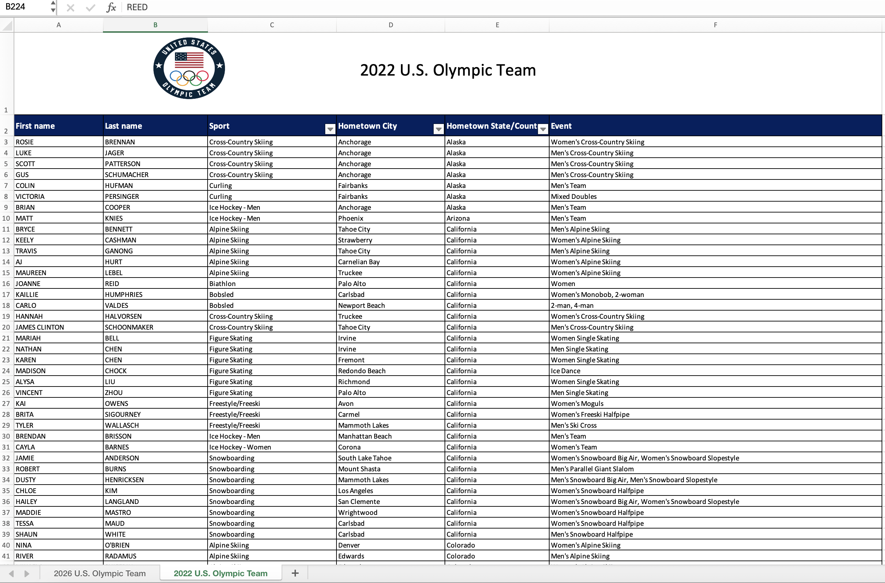
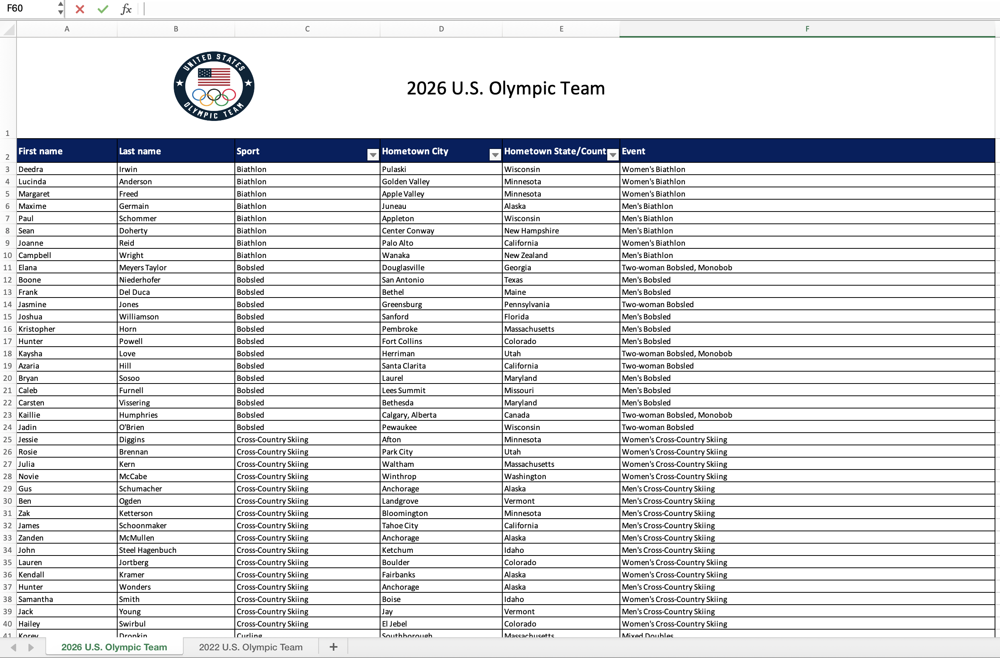

# Introduction

In this lab, you'll review topics you've worked with in previous labs and practice new topics we have learned since the last lab.

::: {callout-note}
This lab assumes you've completed [Lab 1](/lab/lab-1.html) and [Lab 2](/lab/lab-2.html) and doesn't repeat setup and overview content from those labs.
If you haven't done those yet, you should review them before starting with this one.
The same ideas apply.
:::

## Getting Started

By now you should be familiar with how to get started on a lab assignment by cloning the GitHub repo for the assignment.

<details>

<summary>Click to expand if you need a refresher on how to get started with a lab assignment.</summary>

-   Go to <https://cmgr.oit.duke.edu/containers> and login with your Duke NetID and Password.
-   Click `STA199` under My reservations to log into your container. You should now see the RStudio environment.
-   Go to the course organization at [github.com/sta199-su26](https://github.com/sta199-su26) organization on GitHub. Click on the repo with the prefix **lab-3**. It contains the starter documents you need to complete the homework.
-   Click on the green **CODE** button, select **Use SSH**. Click on the clipboard icon to copy the repo URL.
-   In RStudio, go to *File* ➛ *New Project* ➛*Version Control* ➛ *Git*.
-   Copy and paste the URL of your assignment repo into the dialog box *Repository URL*. Again, please make sure to have *SSH* highlighted under *Clone* when you copy the address.
-   Click *Create Project*, and the files from your GitHub repo will be displayed in the *Files* pane in RStudio.

</details>

Open the *lab-3.qmd* template Quarto file and update the `authors` field to add your name (first and last).
Render the document.
Examine the rendered document and make sure your name is updated in the document.
Commit your changes with a meaningful commit message and push to GitHub.

<details>

<summary>Click to expand if you need a refresher on assignment guidelines.</summary>

**Code Guidelines:**

As we've discussed in the lecture, your plots should include an informative title, axes and legends should have human-readable labels, and aesthetic choices should be carefully considered.

Additionally, code should follow the [tidyverse style](https://style.tidyverse.org/).
In particular,

-   there should be spaces before and line breaks after each `+` when building a `ggplot`,

-   there should also be spaces before and line breaks after each `|>` in a data transformation pipeline,

-   code should be properly indented,

-   there should be spaces around `=` signs and spaces after commas.

Furthermore, all code should be visible in the PDF output, i.e., should not run off the page on the PDF.
Long lines that run off the page should be split across multiple lines with line breaks.

As you complete the lab and other assignments in this course, remember to develop a sound workflow for reproducible data analysis.
This assignment will periodically remind you to render, commit, and push your changes to GitHub.
You should have at least 3 commits with meaningful commit messages by the end of the assignment.

</details>

## Packages

In this lab we will work with the **tidyverse**, **readxl**, and **janitor** packages.

```{r}
#| eval: true
#| message: false
library(tidyverse)
library(readxl)
library(janitor)
```

# Part 1: NIL Data

For Questions 1-2, you will work with the following survey data:

YouGov, in collaboration with Elon University Poll and the Knight Commission on Intercollegiate Athletics, polled 1,500 US adults (aged 18 and older) between July 7-11, 2025.[^1]
The following question was asked to these 1,500 adults:

[^1]: Full survey results can be found at <https://eloncdn.blob.core.windows.net/eu3/sites/819/2025/07/Elon-Knight-Commission-survey-TOPLINE.pdf>.

> Overall, how would you describe the impact of the many changes (transfer portal, athlete name, image and likeness (NIL) compensation, conference realignments[^2]) taking place in Division I college athletics?

[^2]: The transfer portal is an online database for college student-athletes who wish to transfer to a different school.
    Name, image, and likeness (NIL) compensation allows college athletes to earn money from third-party companies for using their "name, image, and likeness" through activities like endorsements, social media promotions, and public appearances.
    Conference realignments refer to the shifting of colleges and universities between athletic conferences, which can affect competition levels, revenue distribution, and media exposure.

Responses were broken down into the following categories:

| Variable | Levels |
|:-------------------|:---------------------------------------------------|
| Age | 18-44; 45+ |
| Opinion | Very positive; Somewhat positive; Neutral; Somewhat negative; Very negative; Unsure |

Of the 1,500 responses, 699 were between the ages of 18-44.

Of the individuals that are between 18-44,

-   78 individuals said they thought the changes were Very positive,
-   176 individuals said they thought the changes were Somewhat positive,
-   162 individuals said they thought the changes were Neutral,
-   50 individuals said they thought the changes were Somewhat negative,
-   36 individuals said they thought the changes were Very negative.

Of the individuals that are 45+,

-   41 individuals said they thought the changes were Very positive,
-   121 individuals said they thought the changes were Somewhat positive,
-   186 individuals said they thought the changes were Neutral,
-   146 individuals said they thought the changes were Somewhat negative,
-   97 individuals said they thought the changes were Very negative.

## Question 1

a.  Complete the code below to create a two-way table that summarizes these data by filling in the blanks.

```{r}
#| eval: false

survey_counts <- tribble(
  ~age,    ~opinion,            ~n,
  "18-44", "Very positive",     ___,
  "18-44", "Somewhat positive", ___,
  "18-44", "Neutral",           ___,
  "18-44", "Somewhat negative", ___,
  "18-44", "Very negative",     ___,
  "18-44", "Unsure",            ___,
  "45+",   "Very positive",     ___,
  "45+",   "Somewhat positive", ___,
  "45+",   "Neutral",           ___,
  "45+",   "Somewhat negative", ___,
  "45+",   "Very negative",     ___,
  "45+",   "Unsure",            ___
) |>
  mutate(
    age     = fct_relevel(age, ___),
    opinion = fct_relevel(opinion, ___)
  )

survey_counts |>
  pivot_wider(
    names_from = ___,
    values_from = ___
  )
```

For parts b-d below, use a single pipeline starting with `survey_counts`, calculate the desired proportions, and make sure the result is an **ungrouped** data frame with a column for relevant counts, a column for relevant proportions, and a column for the groups you're interested in.

b.  Marginal proportions of age: Calculate the proportions of individuals who are 18-44 year olds and 45+ year-olds in this sample.

c.  Marginal proportions of opinion: Calculate the proportions of individuals who are Very positive, Somewhat positive, Neutral, Somewhat negative, Very negative, and Unsure.

d.  Conditional proportions of opinion based on age: Calculate the proportions of individuals who are Very positive, Somewhat positive, Neutral, Somewhat negative, Very negative, and Unsure

    -   among those who are 18-44 years old and
    -   among those who are 45+ years old.

## Question 2

a.  What type of plot would be appropriate to visualize the relationship between `age` and `opinion` on the impact of the many changes taking place in Division I college athletics?

b.  Create the plot that you described in part (a) using `geom_col()`.
    Use the discrete viridis color scale for the fill aesthetic, `scale_fill_viridis_d()`.
    You should review the documentation for this function (type `??scale_fill_viridis_d` into the console and click into `ggplot2::scale_colour_virids_d`, which contains the documentation for the fill aesthetic in addition to the color aesthetic; scroll down to the "Arguments" section and read about the eight `options` available) and choose a Viridis color scale other than the default, but you must use one of these since the data are ordinal and an ordinal color scale is most appropriate.
    Make sure to include appropriate labels and a title (and also a subtitle if you wish).

::: callout-tip
Your visualization should be displaying the proportions you calculated in Question 1(d).
:::

c.  In 1-2 sentences, explain why `geom_col()` was more appropriate than `geom_bar()`, which we have previously used for similar-looking plots in this course, for these data.

::: callout-tip
If you're unsure, try replacing `geom_col()` with `geom_bar()` in your plot code.
The resulting error message should serve as a hint for the above question.
:::

d.  Based on your calculations so far, as well as your visualization, write 1-2 sentences that describe the relationship, in this sample, between age and opinion on the impact of the many changes taking place in Division I college athletics.

# Part 2: Gapminder

Gapminder is a “fact tank” that uses publicly available world data to produce data visualizations and teaching resources on global development.
We will use an excerpt of their data to explore relationships among world health metrics across countries and regions between the years 2000 and 2023.
The data set is called `gapminder` and it’s in your lab repository’s data folder.

## Question 3

In this question you'll prepare the dataset you'll use in this part.

a.  **Read:** Read the data and save it as an object called `gapminder_raw`.

b.  **Filter:** For our analysis, we will only be working with data from 2023.
    Filter the data set so only values from the year 2023 are included.
    Save this data set as `gapminder_raw_23` and use it for the remainder of this exercise and the following.

c.  **Glimpse:** Glimpse at `gapminder_raw_23` and list the variables and their types.
    Comment on any unexpected features in the data.

d.  **Clean:** First, figure out why `gdp_percap` is read in as a character variable and describe your findings in one sentence.
    Then, clean the `gdp_percap` variable and convert it to numeric values.
    Save the resulting data frame as `gapminder_23`.

## Question 4

This question relies on successful completion of the above question (Question 3), where the `gapminder` dataframe is read in and transformed into `gapminder_23`.
We are interested in learning more about life expectancy in countries, and we’ll start by exploring the relationship between life expectancy and GDP.

a.  Create two visualizations:

-   Scatter plot of `life_exp` vs. `gdp_percap`

-   Scatter plot of `life_exp_log` vs. `gdp_percap`, where `life_exp_log` is a new variable you add to the data set by taking the natural log of `life_exp`.

b.  First describe the relationship between each pair of the variables. Then, comment on which relationship would be better modeled using a linear model, and explain your reasoning. We will discuss linear models in more detail in the second half of this course; for now, you can think about this question as asking which plot it makes more sense to add a linear trendline to based on the overall shape of the plotted data.

# Part 3: Team USA \@ The Winter Olympics

For this part of your homework, you'll work with data from the rosters of Team USA from the 2022 and 2026 Winter Olympics.
The data come from <https://www.teamusa.com> and the rosters for the two games are in a single Excel file (`team-usa.xlsx` in your `data` folder) across two separate spreadsheets within that file.
@fig-olympics-sheets shows screenshots of these spreadsheets.

::: {#fig-olympics-sheets layout-ncol="2"}




Excel file with two sheets for rosters of Team USA 2022 and 2026.
:::

Your goal is to answer questions about athletes who competed in both games and only one of the games.

## Question 5

a.  Read data from the two sheets of `team-usa.xlsx` as two separate data frames called `team_usa_2022` and `team_usa_2026`.

::: callout-tip
The names of the sheets are shown in the screenshots in @fig-olympics-sheets, or you can use the `excel_sheets()` function to discover them.
Additionally, note that the first row of the sheets contain a logo and a title describing the contents of the data, and not the header row containing variable names.
:::

b.  Read the documentation for the `clean_names()` function from the **janitor** package at <https://sfirke.github.io/janitor/reference/clean_names.html>.
    Use this function to "clean" the variable names of `team_usa_2022` and `team_usa_2026` and save the data frames with the new variable names.

c.  Create a new variable in both of the datasets called `name` that:

    -   `paste()`s together the `first_name` and `last_name` variables with a space in between and
    -   is the first variable in the resulting data frame.

d.  Using the appropriate `*_join()` function, determine how many athletes participated in both Olympic Games.

::: callout-important
Your answer to this question, based on the data frames you created, should be 0, even if it doesn't make sense in context of actual Olympic athletes.
:::

## Question 6

If you have even a passing knowledge of the Olympic Games, you might know that there are some athletes that participated in both the 2022 and 2026 games, e.g., Brittany Bowe, Chloe Kim, etc.

a.  The reason why athlete names didn't match across the two data frames is that in one data frame, names are in UPPER CASE, and in the other, they're in Title Case. Update the 2026 data frame to make `name` all upper case. Display the first 10 rows of `team_usa_2026` with upper case names.

::: callout-important
Your answer must use the `str_to_upper()` function.
:::

b.  Let's try question 5d again: How many athletes participated in both Olympic Games?

c.  How many athletes participated in the 2022 Olympic Games but not the 2026 Olympic Games?
    How many athletes participated in the 2026 Olympic Games but not the 2022 Olympic Games?

# Wrap-up

::: callout-warning
Before you wrap up the assignment, make sure that you render, commit, and push one final time so that the final versions of both your `.qmd` file and the rendered PDF are pushed to GitHub and your Git pane is empty.
We will be checking these to make sure you have been practicing how to commit and push changes.
:::

## Grading and Feedback

Reminders:

-   Questions will be graded for accuracy and completeness

-   Partial credit will be given where appropriate

-   There are also workflow points for:

    -   committing at least three times as you work through your homework

    -   having your final version of `.qmd` and `.pdf` files in your GitHub repository

    -   selecting pages corresponding to each question in Gradescope
