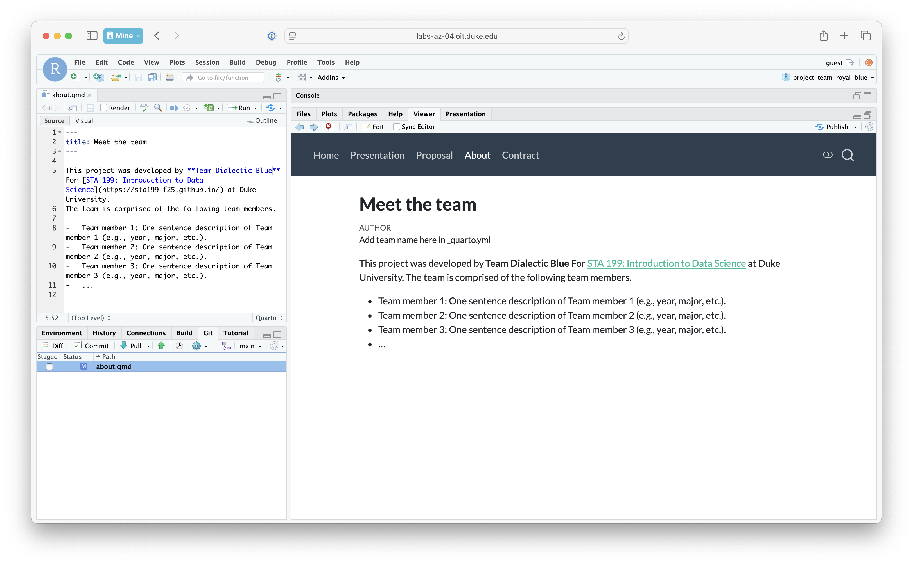
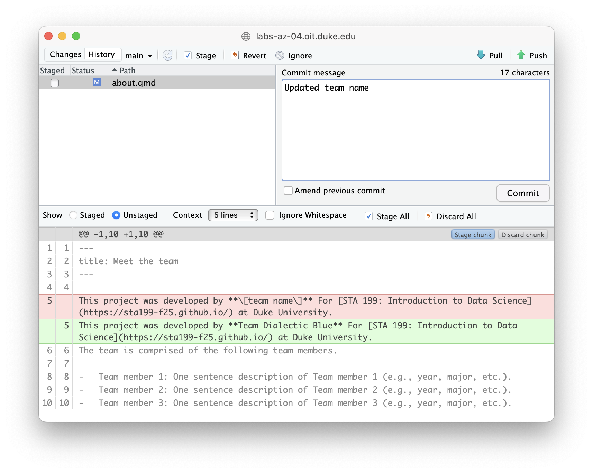
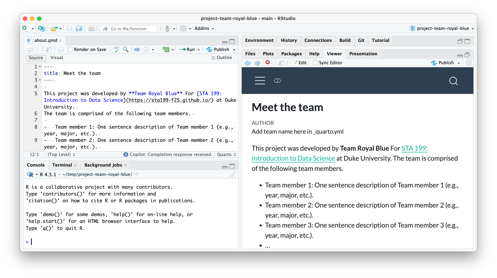
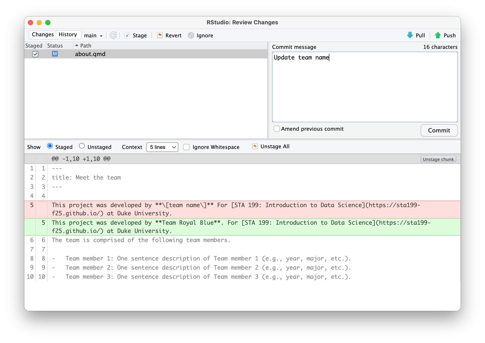
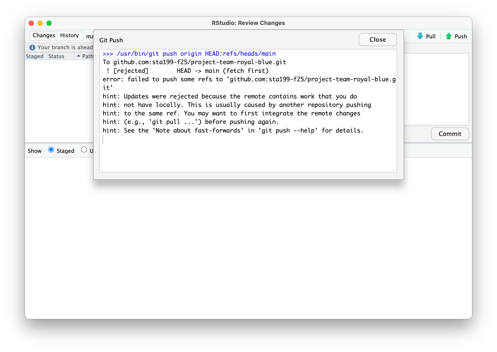
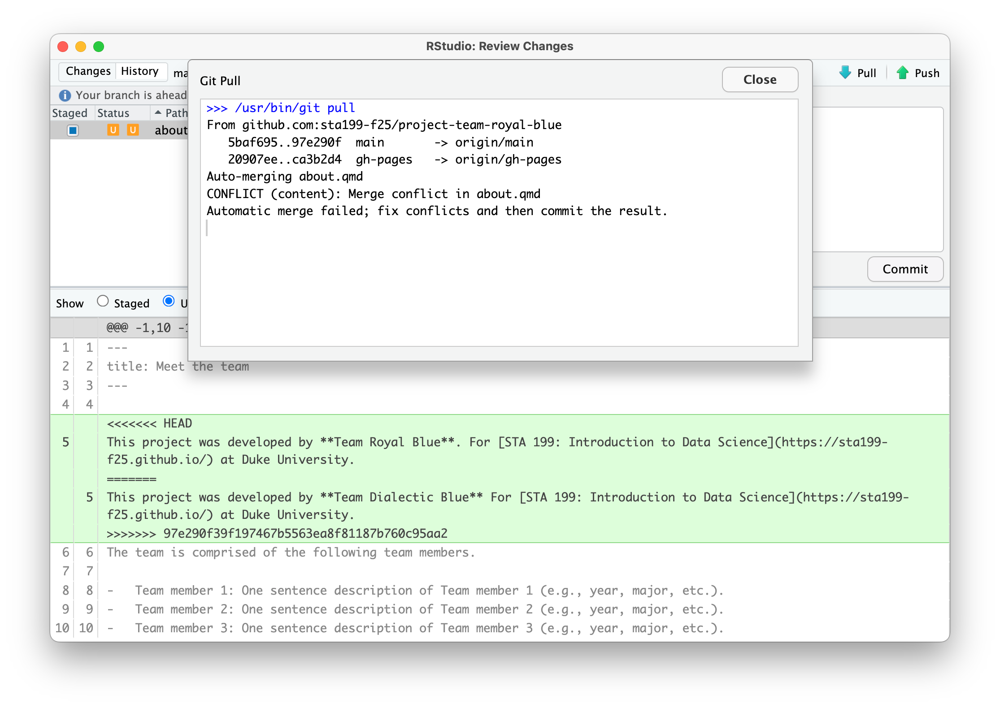
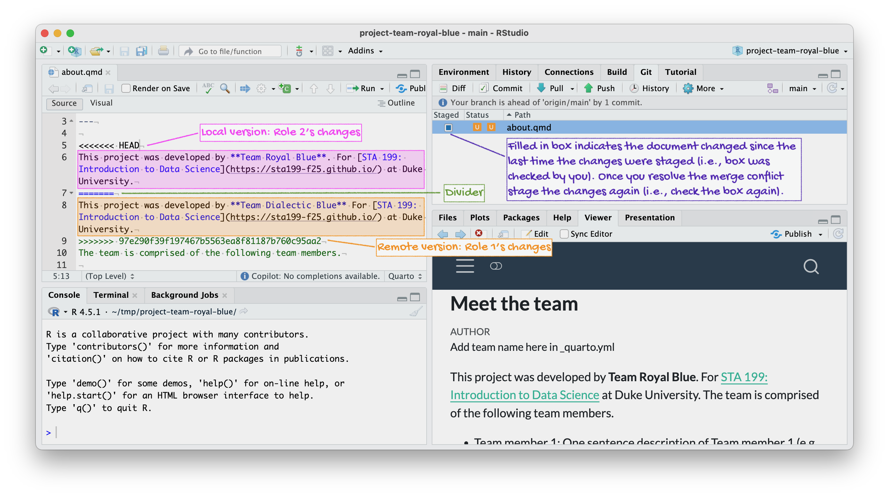
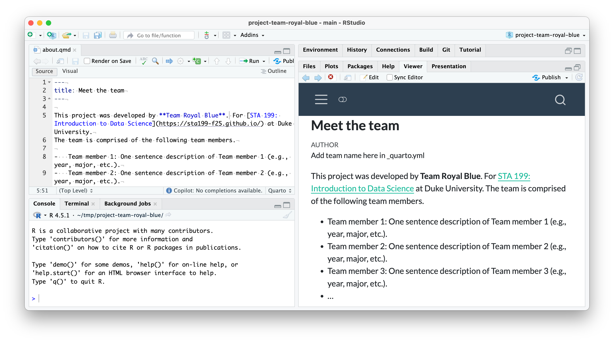
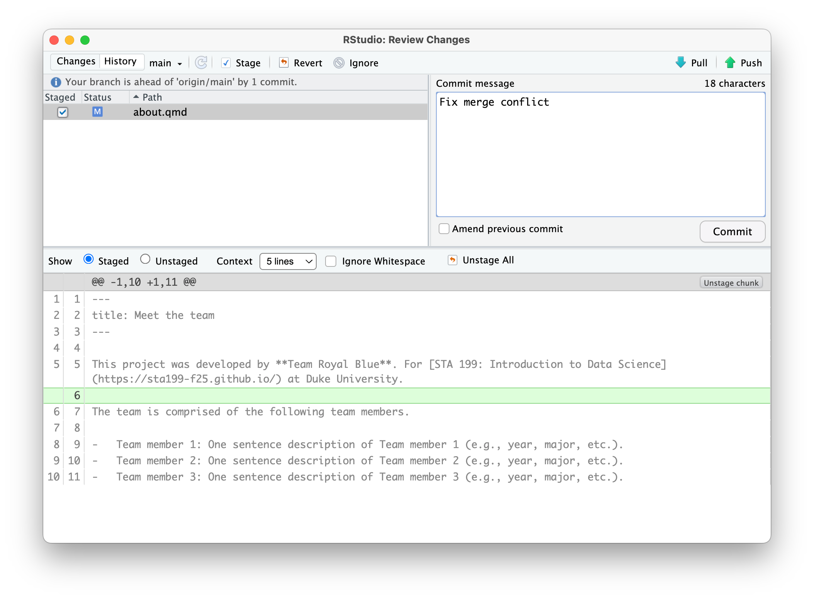
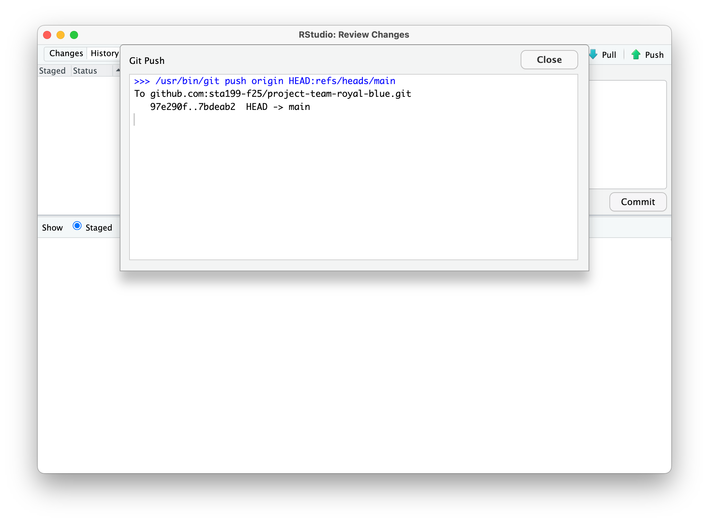

::: callout-important
You must attend this lab in person and participate in the merge conflict activity to be eligible for the points for this milestone.
Team members who are not in lab in person for this activity will not be eligible for these points, regardless of their contribution throughout the rest of the project.
:::

Data science is a collaborative discipline.
Pretty much no data scientist works alone, so neither should you!
In this course you'll collaborate with teammates on the project.

The first milestone of the project, today's activity, will introduce you to the technical aspects of collaborating on a reproducible data science project that is version controlled by Git and hosted on GitHub in a repository shared by all teammates.

Yes, this means you and all of your teammates will be pushing to the same repository!
Sometimes things will go swimmingly, and sometimes you'll run into **merge conflicts**.

::: callout-note
The word "conflict" has a negative connotation.
And, indeed, merge conflicts can be frustrating.
But they serve to make sure no team member inadvertently writes another team member's work.
All changes that are in "conflict" with each other need to get resolved explicitly, with a commit message, which helps avoid haphazard overwriting.
:::

# Goals

The goals of this milestone are as follows:

-   Pick a team name
-   Collaborate on GitHub with your teammates and resolve merge conflicts when they inevitably occur
-   Discuss and write up your team contract

# Team name

Pick a team name.
It can be straightforward, or it can be cheeky, but it must be [SFW](https://www.merriam-webster.com/dictionary/SFW).
Let your TA know your team name asap.
Once everyone's team names are in, your project repos will be created (give your TA a couple of minutes), and then you can continue with the rest of your task.

# Activity

This activity is about resolving *merge conflicts*, which can arise when multiple people are using Git and GitHub to collaborate on the same repository.
The TA will demonstrate before you begin the activity, but you can also read more [here](1-working-collaboratively-preread.qmd).

## Setup

-   Clone the `project` repo and open the `about.qmd` file.
-   Assign the numbers 1, 2, 3, and 4 to each of the team members. If your team has fewer than 4 people, one person will need to have 2 numbers.

## Let's cause a merge conflict!

Our goal is to see two different types of merges: first we'll see a type of merge that git can't figure out on its own how to do on its own (a **merge conflict**) and requires human intervention, then another type of where that git can figure out how to do without human intervention.

Doing this will require some tight choreography, so pay attention!

Take turns in completing the exercise, only one member at a time.
**Others should just watch, not doing anything on their own projects (this includes not even pulling changes!)** until they are instructed to.
If you feel like you won't be able to resist the urge to touch your computer when it's not your turn, we recommend putting your hands in your pockets or sitting on them!

### Before starting

Everyone should have the repo cloned and know which role number(s) they are.

### Role 1

-   Go to `about.qmd` in your project repo. Change the `[team name]` to `Team Dialectic Blue`.
-   Render the project by clicking on Render in the Build tab, commit (all changed files), and push.

::: {#fig-role-1 layout-ncol="2"}
{width="400px"}

{width="400px"}

Role 1 changes the team name to "Team Dialectic Blue" and renders the project, then commits and pushes the changes.
:::

::: callout-important
Make sure the previous role has finished before moving on to the next step.
:::

### Role 2

-   Change the team name to **your actual team name** (in this example, the team name is "Team Royal Blue"). Then, render the project by clicking on Render in the Build tab and commit all changed files.

::: {#fig-role-2-1 layout-ncol="2"}
{width="400px"}

{width="400px"}

Role 2 changes the team name to "Team Royal Blue" and renders the project, then commits the changes.
:::

-   Now try to push your changes. You should get an error.

::: {#fig-role-2-2 layout-ncol="2"}
{width="400px"}

Role 2 tries to push the changes, but gets an error because Role 1 has already pushed changes to the remote repo.
:::

-   Pull. Take a look at the document (`about.qmd`) with the merge conflict.

::: {#fig-role-2-3 layout-ncol="2"}
{width="400px"}

{width="400px"}

Role 2 tries to pulls from the remote repo as the error instructed and views the merge conflict.
:::

-   Resolve the merge conflict by editing the document to choose the correct/preferred change. Then, render the project by clicking on Render in the Build tab.

::: {#fig-role-2-4}
{width="400px"}

Role resolves the merge conflict by editing the `about.qmd` document to remove the merge conflict decorators (`<<<<<< HEAD`, `======`, and `>>>>>>> 97e290f39f197467b5563ea8f81187b760c95aa2`, the commit hash).
Since the team name is "Team Royal Blue", Role 2 deletes Role 1's edit and keeps their own.
Then, Role 2 renders the project.
:::

-   **Click the Stage checkbox** for all files in your Git tab. Make sure they all have check marks, not filled-in boxes.

::: {#fig-role-2-4}
{width="400px"}

Role 2 stages all changed files and commits them with a message indicating that they resolved the merge conflict.
:::

-   Commit and push.

::: {#fig-role-2-5}
{width="400px"}

Role 2 successfully pushes their changes after resolving the merge conflict.
:::

::: callout-important
Make sure the previous role has finished before moving on to the next step.
:::

### Role 3

-   Change the name of the first team member.
-   Render the project by clicking on Render in the Build tab, commit, and push. You should get an error.
-   Pull. No merge conflicts should occur, but you should see a message about merging.
-   Now push.

::: callout-important
Make sure the previous role has finished before moving on to the next step.
:::

### Role 4

-   Change the name of the first team member to something other than what the previous team member did.
-   Render the project by clicking on Render in the Build tab, commit, and push. You should get an error.
-   Pull. Take a look at the document with the merge conflict. Clear the merge conflict by choosing the correct/preferred change. Render the project by clicking on Render in the Build tab, commit, and push.

::: callout-important
Make sure the previous role has finished before moving on to the next step.
:::

### Everyone

Pull, and observe the changes in your project.

# Tips for collaborating via GitHub

-   **Always pull first before you start working.**
-   Resolve a merge conflict (render and push) *before* continuing your work. Never do new work while resolving a merge conflict.
-   Render, commit, and push often to minimize merge conflicts and/or to make merge conflicts easier to resolve.
-   If you find yourself in a situation that is difficult to resolve, ask questions ASAP. Don't let it linger and get bigger.

# Team contract

Go to your project repository and open `contract.qmd`.
As the instructions suggest, pick a teammate to be the scribe.
Discuss the prompts and write up your answers.
Once done, click *Render* in the build tab, commit, and push.

# Grading

We will evaluate the first milestone of your project based on your participation in this activity.
Each team member who participates in the activity in person during the lab session will earn 5 points towards their project.
