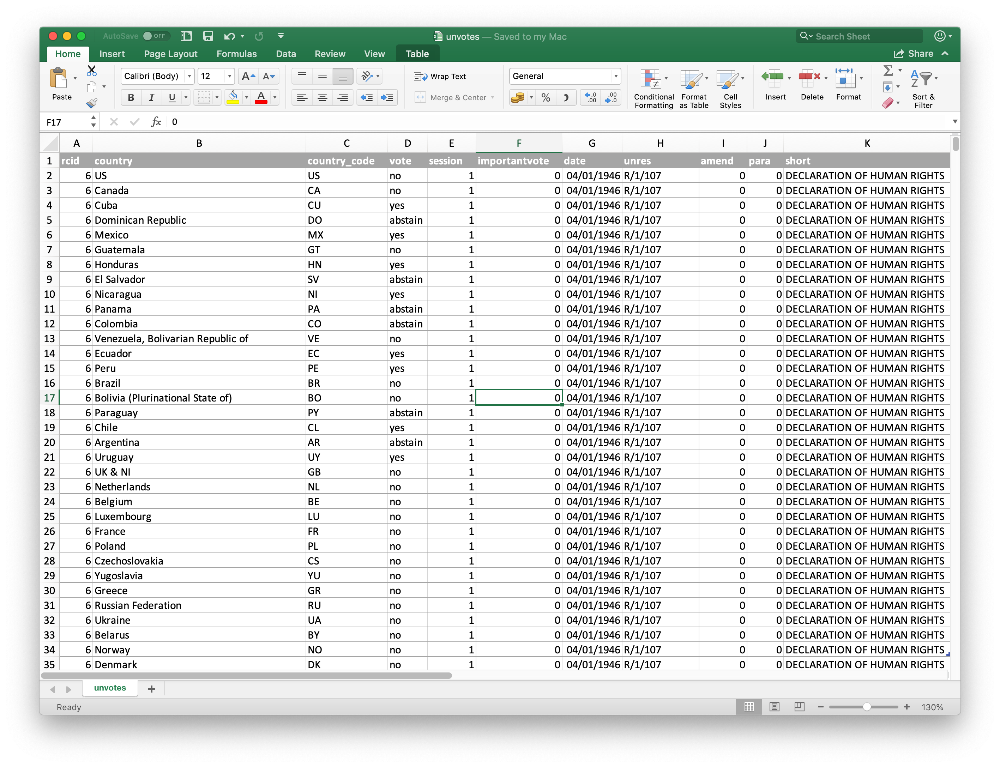
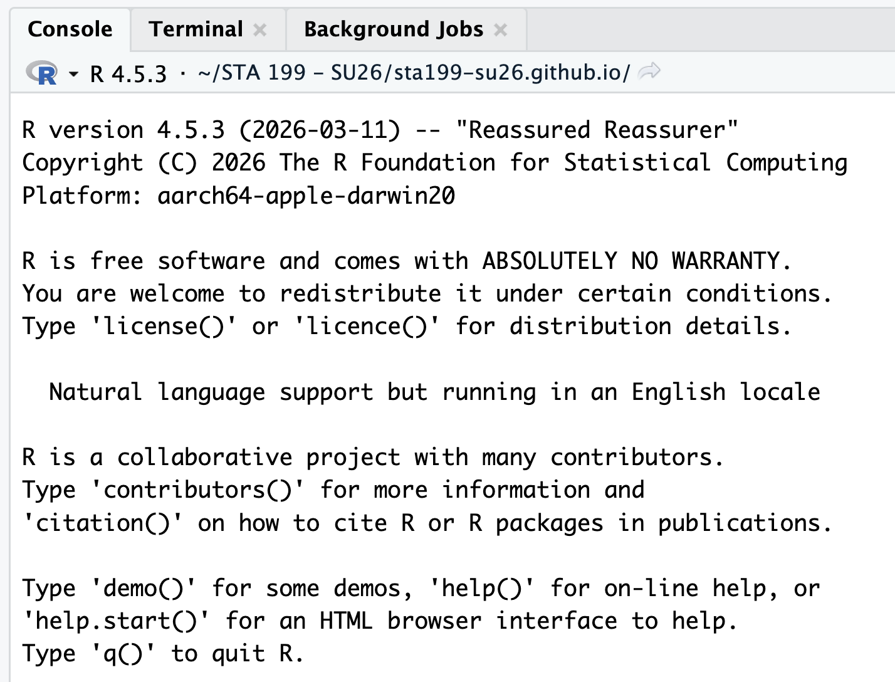

# Hello world!

```{r}
#| echo: false

```

## Meet your teaching team

<hr>

***Instructor\
***Katie Solarz\
katie.solarz\@duke.edu

<hr>

***TA, Lab Instructor\
***Kenna Roberts\
makenna.roberts\@duke.edu

<hr>

## About me!

{fig-alt="About me!" fig-align="center"}

## Meet each other!

-   Name
-   Year
-   Major(s) (or, potential major(s) if undecided!)
-   Hometown
-   Something you plan to do this summer when STA 199 ends 💔

## What are we studying?

First half:

::: callout-note
## Data science

-   Transforming messy, incomplete, imperfect data into *knowledge*;
-   *Knowledge* often takes the form of pictures and a concise set of numerical summaries.
:::

. . .

Second half:

::: callout-warning
## Statistical thinking

Quantifying our uncertainty about that knowledge.
:::

## Imagine this dialog {.small}

. . .

[**Campaign manager**]{style="color:blue;"}: What is the probability that our candidate wins the election?

. . .

(A flurry of analysis takes place.)

. . .

[**Data scientist**]{style="color:red;"}: Our best guess is 54%.

. . .

[**Campaign manager**]{style="color:blue;"}: How reliable is that estimate?
How confident are we in that?
What's the margin of error?

. . .

:::::: columns
::: {.column width="50%"}
**Parallel Universe 1**

[**Data scientist**]{style="color:red;"}: It's 54% give or take 3%.
:::

:::: {.column width="50%"}
::: fragment
**Parallel Universe 2**

[**Data scientist**]{style="color:red;"}: It's 54% give or take 20%.
:::
::::
::::::

. . .

::: callout-note
## It's all about decision-making under uncertainty

The manager is going to make wildly different decisions about campaign strategy and spending depending on how uncertain the environment is.
:::

# Software

## Excel... 👎

{fig-alt="An Excel window with data about countries" fig-align="center" width="80%"}

## R

{fig-alt="An R shell" fig-align="center" width="75%"}

# Syllabus highlights

## Homepage

[https://sta199-su26.github.io](https://sta199-su26.github.io/){.uri}

-   All course materials
-   Links to Canvas, GitHub, RStudio containers, etc.

## Activities {.smaller}

-   Introduce new content and prepare for lectures by watching the videos and completing the readings
-   Attend and actively participate in lectures (and ask / answer questions for participation credit) and labs, office hours, team meetings
-   Practice applying statistical concepts and computing with application exercises during lecture
-   Put together what you've learned to analyze real-world data
    -   Lab assignments
    -   Exams
    -   Term project (completed in teams)

## Application exercises

-   Roughly one per lecture

-   Graded for good-faith attempt, not accuracy

-   Practice this week; graded thereafter

-   At least one commit to your AE repo by 10:45am of the day of lecture

-   Complete 80% for full lecutre attendance credit

## Labs {.smaller}

-   Lab session formally takes place on Mondays and Thursdays following lecture (11:00am - 12:15pm)

-   Labs are to be started during the lab session & completed at home by the posted due date

-   I encourage you to make the most of lab sessions, as you have access to both your peers and Kenna, the course TA, during this time

-   Due dates (typically):

    -   Monday Lab: Due Wednesday at 11:59 PM

    -   Thursday Lab: Due Sunday at 11:59 PM

-   Discussion with classmates = 🤩 ; Copying = ❌

-   Lowest lab score is dropped

## Exams {.smaller}

-   Two exams, each 25%

-   Midterm: June 1, during lecture + lab (tentatively)

-   Final: June 24, 9am - 12pm

-   You will be permitted a "cheat sheet" (both sides of a single 8.5” x 11” piece of paper)

::: callout-caution
It's possible the first midterm gets bumped to June 2; this will be communicated by next Wednesday, 5/20. The final exam date is above my pay grade & cannot be changed. If you cannot take the exams on these dates, please have a discussion with me ***today***.
:::

## Project {.smaller}

-   Dataset of your choice, method of your choice

-   Teamwork

-   Presentation and write-up

-   Presentations will take place in the last lab (June 22)

-   Interim deadlines, peer review on content, peer evaluation for team contribution

-   Some lab sessions allocated to project progress 

::: callout-caution
Final presentation date cannot be changed; you must complete the project and participate in project presentations to pass this class.
:::

## Project teams {.smaller}

-   Assigned by me (& influenced by communicated topics / areas of interest)
-   3-4 members per team
-   Peer evaluation during teamwork and after completion
-   Expectations and roles
    -   Everyone is expected to contribute equal *effort*
    -   Everyone is expected to understand *all* code turned in
    -   Individual contribution evaluated by peer evaluation, commits, etc.

## Grading {.smaller}

| Category              | Percentage |
|-----------------------|------------|
| Labs                  | 20%        |
| Project               | 20%        |
| Exam 1                | 25%        |
| Exam 2                | 25%        |
| Application Exercises | 5%         |
| Lab Attendance        | 5%         |

<br><br> See [course syllabus](https://sta199-su26.github.io/syllabus/) for how the final letter grade will be determined.

## Support

-   Attend office hours
-   Ask and answer questions on the Ed discussion board
-   Reserve email for questions on personal matters and / or grades

## Office Hours

***Katie: Old Chem 203***

-   Tuesday 11:00AM - 1:00PM

-   Sunday 1:00 - 3:00PM

***Kenna:***
Time & Location TBD

## Announcements

-   Posted on Canvas (Announcements tool) and sent via email, be sure to check both regularly
-   All information is on the course website - please pin to your browser of choice & refer to it often!

## Course toolkit

All linked from the course website:

-   GitHub organization: [github.com/sta199-su26](github.com/sta199-su26)
-   RStudio containers: [cmgr.oit.duke.edu/containers](https://cmgr.oit.duke.edu/containers)
-   Communication: Ed Discussion
-   Assignment submission and feedback: Gradescope

## Accessibility

-   The [Student Disability Access Office (SDAO)](https://access.duke.edu/students) is available to ensure that students are able to engage with their courses and related assignments.

-   I am committed to making all course materials accessible, and I'm always open to feedback on how to do this better!

# Course policies

## Late work, waivers, regrades policy

-   We have policies!
-   Read about them on the [course syllabus](https://sta199-su26.github.io/course-syllabus.html) and refer back to them when you need it

::: callout-note
## If you need testing accommodations

Make sure I get a letter, and make your appointments in the Testing Center now.
:::

## Collaboration

-   **Labs**: discussing and helping one another is fine;
    sharing your solutions via text, email, AirDrop, carrier pigeon, or any other method, and / or copying from others is not permitted;

-   **Exams**: collaboration of any kind is completely forbidden

-   **Projects**: collaboration of all kinds is enthusiastically encouraged *within your team*; between teams, it's the same as labs; do not directly share your materials or copy from others.

## Use of AI tools {.smaller}

-    **AI tools for code:**

    -   Sure, but be careful/critical! Working code `!=` correct / good code.
    -   Must explicitly cite with a direct url linking to the conversation you had.

-    **AI tools for narrative:** Absolutely not!

-    **AI tools for learning:** Sure, but be careful/critical!

::: callout-caution
**Exception:** Use of AI tools is ***completely forbidden*** during lab session. When you are in lab, you have far better tools / resources available to you - Kenna, our TA, and each other! Blatant disregard for this policy will result in a 0 for the current lab assignment. 
:::

## Academic integrity {.smaller}

> To uphold the Duke Community Standard:
>
> -   I will not lie, cheat, or steal in my academic endeavors;
>
> -   I will conduct myself honorably in all my endeavors; and
>
> -   I will act if the Standard is compromised.

# GitHub

{fig-align="center" width=75%}

## What is GitHub?

<br> <br>

More on this tomorrow - basically, it is the Google Drive of coding!

## AE 00: Make your GitHub account

<br><br> Find AE 00 on the course website!
 
## This week's tasks

-   Complete Lab 0
    -   Computational setup
    -   Getting to know you survey
-   Read the syllabus
-   Get started with data science!
