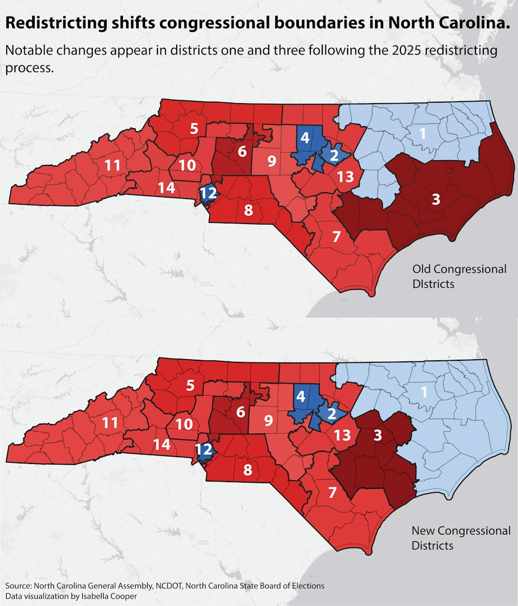
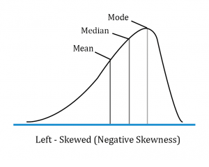
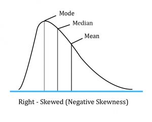

<!-- begin: ae definition -->

```{r}
#| include: false
todays_ae <- "ae-04-gerrymander-explore-I"
```

<!-- end: ae definition -->

## While you wait... {.scrollable .medium}

Prepare for today's application exercise: **`{r} todays_ae`**

-   Switch to your `ae` project in RStudio;

-   Make sure all of your changes up to this point are committed (i.e., there's nothing left in your Git pane);

-   Click Pull to get today's application exercise file: *`{r} paste0(todays_ae, ".qmd")`*.

-   (To see the new file, you may have to refresh the Files pane by clicking "Home")

-   Wait till the you're prompted to work on the application exercise during class before editing the file.

## Packages {.smaller}

-   For the data: [**usdata**](https://openintrostat.github.io/usdata/)

```{r}
library(usdata)
```

-   For the exploratory data analysis (EDA): [**tidyverse**](https://www.tidyverse.org/packages/) and [**ggthemes**](https://jrnold.github.io/ggthemes/)

```{r}
library(tidyverse)
library(ggthemes)
```

## Data: `gerrymander` {.small}

```{r}
gerrymander
```

## What is gerrymandering?

::: {style="display: flex; justify-content: center;"}
<iframe width="560" height="315" src="https://www.youtube.com/embed/bGLRJ12uqmk?si=DAoLH-0Cwd2yg1LL" title="YouTube video player" frameborder="0" allow="accelerometer; autoplay; clipboard-write; encrypted-media; gyroscope; picture-in-picture; web-share" referrerpolicy="strict-origin-when-cross-origin" allowfullscreen>

</iframe>
:::

## (Latest) Gerrymandering in NC

{fig-align="center" width="50%"}

## Data: `gerrymander` {.scrollable .smaller .incremental}

::: question
What is a good first function to use to get to know a dataset?
:::

```{r}
glimpse(gerrymander)
```

## Data: `gerrymander` {.scrollable .medium}

-   Rows: Congressional districts

-   Columns:

    -   Congressional district and state

    -   2016 election: winning party, % for Clinton, % for Trump, whether a Democrat won the House election, name of election winner

    -   2018 election: winning party, whether a Democrat won the 2018 House election

    -   Whether a Democrat flipped the seat in the 2018 election

    -   Prevalence of gerrymandering: low, mid, and high

## Overview of Data Types {.scrollable .medium}

-   ***Numerical Data:***

    -   Takes a wide range of numerical values

    -   Makes sense to add, subtract, etc.

    -   Can be either discrete (e.g., integers) or continuous

-   ***Categorical Data:***

    -   Values can be thought of as distinct categories

    -   The possible values are called ***levels***

    -   Binary data is a subset of categorical data with 2 levels (e.g., 0/1, T/F, yes/no)

    -   Ordinal data is a subset of categorical data in which there is some inherent "ordering" to the levels (e.g., pain, where pain can be "low", "medium", or "high"; letter grades, where A \> B \> C \> ... \> F)

## Variable types: `district`

::::: columns
::: {.column .xsmall}
| Variable     | Type                         |
|--------------|------------------------------|
| `district`   | [categorical, ID]{.fragment} |
| `last_name`  |                              |
| `first_name` |                              |
| `party16`    |                              |
| `clinton16`  |                              |
| `trump16`    |                              |
| `dem16`      |                              |
| `state`      |                              |
| `party18`    |                              |
| `dem18`      |                              |
| `flip18`     |                              |
| `gerry`      |                              |
:::

::: {.column .small}
Congressional district:

```{r}
gerrymander |>
  select(district)
```
:::
:::::

## Variable types: `last_name`

::::: columns
::: {.column .xsmall}
| Variable     | Type                         |
|--------------|------------------------------|
| `district`   | categorical, ID              |
| `last_name`  | [categorical, ID]{.fragment} |
| `first_name` |                              |
| `party16`    |                              |
| `clinton16`  |                              |
| `trump16`    |                              |
| `dem16`      |                              |
| `state`      |                              |
| `party18`    |                              |
| `dem18`      |                              |
| `flip18`     |                              |
| `gerry`      |                              |
:::

::: {.column .small}
Last name of 2016 election winner:

```{r}
gerrymander |>
  select(last_name)
```
:::
:::::

## Variable types: `first_name`

::::: columns
::: {.column .xsmall}
| Variable     | Type                         |
|--------------|------------------------------|
| `district`   | categorical, ID              |
| `last_name`  | categorical, ID              |
| `first_name` | [categorical, ID]{.fragment} |
| `party16`    |                              |
| `clinton16`  |                              |
| `trump16`    |                              |
| `dem16`      |                              |
| `state`      |                              |
| `party18`    |                              |
| `dem18`      |                              |
| `flip18`     |                              |
| `gerry`      |                              |
:::

::: {.column .small}
First name of 2016 election winner:

```{r}
gerrymander |>
  select(first_name)
```
:::
:::::

## Variable types: `party16`

::::: columns
::: {.column .xsmall}
| Variable     | Type                     |
|--------------|--------------------------|
| `district`   | categorical, ID          |
| `last_name`  | categorical, ID          |
| `first_name` | categorical, ID          |
| `party16`    | [categorical]{.fragment} |
| `clinton16`  |                          |
| `trump16`    |                          |
| `dem16`      |                          |
| `state`      |                          |
| `party18`    |                          |
| `dem18`      |                          |
| `flip18`     |                          |
| `gerry`      |                          |
:::

::: {.column .small}
Political party of 2016 election winner:

```{r}
gerrymander |>
  select(party16)
```
:::
:::::

## Variable types: `clinton16`

::::: columns
::: {.column .xsmall}
| Variable     | Type                               |
|--------------|------------------------------------|
| `district`   | categorical, ID                    |
| `last_name`  | categorical, ID                    |
| `first_name` | categorical, ID                    |
| `party16`    | categorical                        |
| `clinton16`  | [numerical, continuous]{.fragment} |
| `trump16`    |                                    |
| `dem16`      |                                    |
| `state`      |                                    |
| `party18`    |                                    |
| `dem18`      |                                    |
| `flip18`     |                                    |
| `gerry`      |                                    |
:::

::: {.column .small}
Percent of vote received by Clinton in 2016 Presidential Election:

```{r}
gerrymander |>
  select(clinton16)
```
:::
:::::

## Variable types: `trump16`

::::: columns
::: {.column .xsmall}
| Variable     | Type                               |
|--------------|------------------------------------|
| `district`   | categorical, ID                    |
| `last_name`  | categorical, ID                    |
| `first_name` | categorical, ID                    |
| `party16`    | categorical                        |
| `clinton16`  | numerical, continuous              |
| `trump16`    | [numerical, continuous]{.fragment} |
| `dem16`      |                                    |
| `state`      |                                    |
| `party18`    |                                    |
| `dem18`      |                                    |
| `flip18`     |                                    |
| `gerry`      |                                    |
:::

::: {.column .small}
Percent of vote received by Trump in 2016 Presidential Election:

```{r}
gerrymander |>
  select(trump16)
```
:::
:::::

## Variable types: `dem16`

::::: columns
::: {.column .xsmall}
| Variable     | Type                             |
|--------------|----------------------------------|
| `district`   | categorical, ID                  |
| `last_name`  | categorical, ID                  |
| `first_name` | categorical, ID                  |
| `party16`    | categorical                      |
| `clinton16`  | numerical, continuous            |
| `trump16`    | numerical, continuous            |
| `dem16`      | [categorical, binary]{.fragment} |
| `state`      |                                  |
| `party18`    |                                  |
| `dem18`      |                                  |
| `flip18`     |                                  |
| `gerry`      |                                  |
:::

::: {.column .small}
Did a Democrat win the 2016 House election.
Levels of 1 (yes) and 0 (no):

```{r}
gerrymander |>
  select(dem16)
```
:::
:::::

## Variable types: `state`

::::: columns
::: {.column .xsmall}
| Variable     | Type                     |
|--------------|--------------------------|
| `district`   | categorical, ID          |
| `last_name`  | categorical, ID          |
| `first_name` | categorical, ID          |
| `party16`    | categorical              |
| `clinton16`  | numerical, continuous    |
| `trump16`    | numerical, continuous    |
| `dem16`      | categorical, binary      |
| `state`      | [categorical]{.fragment} |
| `party18`    |                          |
| `dem18`      |                          |
| `flip18`     |                          |
| `gerry`      |                          |
:::

::: {.column .small}
State the Representative is from:

```{r}
gerrymander |>
  select(state)
```
:::
:::::

## Variable types: `party18`

::::: columns
::: {.column .xsmall}
| Variable     | Type                             |
|--------------|----------------------------------|
| `district`   | categorical, ID                  |
| `last_name`  | categorical, ID                  |
| `first_name` | categorical, ID                  |
| `party16`    | categorical                      |
| `clinton16`  | numerical, continuous            |
| `trump16`    | numerical, continuous            |
| `dem16`      | categorical, binary              |
| `state`      | categorical                      |
| `party18`    | [categorical, binary]{.fragment} |
| `dem18`      |                                  |
| `flip18`     |                                  |
| `gerry`      |                                  |
:::

::: {.column .small}
Political Party of the 2018 election winner:

```{r}
gerrymander |>
  select(party18)
```
:::
:::::

## Variable types: `dem18`

::::: columns
::: {.column .xsmall}
| Variable     | Type                             |
|--------------|----------------------------------|
| `district`   | categorical, ID                  |
| `last_name`  | categorical, ID                  |
| `first_name` | categorical, ID                  |
| `party16`    | categorical                      |
| `clinton16`  | numerical, continuous            |
| `trump16`    | numerical, continuous            |
| `dem16`      | categorical, binary              |
| `state`      | categorical                      |
| `party18`    | categorical, binary              |
| `dem18`      | [categorical, binary]{.fragment} |
| `flip18`     |                                  |
| `gerry`      |                                  |
:::

::: {.column .small}
Did a Democrat win the 2018 House election.
Levels of 1 (yes) and 0 (no):

```{r}
gerrymander |>
  select(dem18)
```
:::
:::::

## Variable types: `flip18`

::::: columns
::: {.column .xsmall}
| Variable     | Type                             |
|--------------|----------------------------------|
| `district`   | categorical, ID                  |
| `last_name`  | categorical, ID                  |
| `first_name` | categorical, ID                  |
| `party16`    | categorical                      |
| `clinton16`  | numerical, continuous            |
| `trump16`    | numerical, continuous            |
| `dem16`      | categorical, binary              |
| `state`      | categorical                      |
| `party18`    | categorical, binary              |
| `dem18`      | categorical, binary              |
| `flip18`     | [categorical]{.fragment} |
| `gerry`      |                                  |
:::

::: {.column .small}
In the 2018 election, did the seat flip from D to R (-1), from R to D (1), or not change (0)?

```{r}
gerrymander |>
  select(flip18)
```
:::
:::::

## Variable types: `gerry`

::::: columns
::: {.column .xsmall}
| Variable     | Type                              |
|--------------|-----------------------------------|
| `district`   | categorical, ID                   |
| `last_name`  | categorical, ID                   |
| `first_name` | categorical, ID                   |
| `party16`    | categorical                       |
| `clinton16`  | numerical, continuous             |
| `trump16`    | numerical, continuous             |
| `dem16`      | categorical, binary               |
| `state`      | categorical                       |
| `party18`    | categorical, binary               |
| `dem18`      | categorical, binary               |
| `flip18`     | categorical              |
| `gerry`      | [categorical, ordinal]{.fragment} |
:::

::: {.column .small}
Categorical variable for prevalence of gerrymandering with levels of low, mid and high:

```{r}
gerrymander |>
  select(gerry)
```
:::
:::::

# Univariate analysis

## Univariate analysis

Analyzing a single variable:

::: incremental
-   Numerical: histogram, box plot, density plot, etc.

-   Categorical: bar plot, pie chart, etc.
:::

## Histogram - Step 1 {.smaller .scrollable}

```{r}
ggplot(gerrymander)
```

## Histogram - Step 2 {.smaller .scrollable}

```{r}
ggplot(gerrymander, aes(x = trump16))
```

## Histogram - Step 3 {.smaller .scrollable}

```{r}
#| code-line-numbers: "2"
ggplot(gerrymander, aes(x = trump16)) +
  geom_histogram()
```

## Histogram - Step 4 {.smaller .scrollable}

```{r}
ggplot(gerrymander, aes(x = trump16)) +
  geom_histogram(binwidth = 1)
```

## Histogram - Step 4 {.smaller .scrollable}

```{r}
ggplot(gerrymander, aes(x = trump16)) +
  geom_histogram(binwidth = 100)
```

## Histogram - Step 4 {.smaller .scrollable}

```{r}
ggplot(gerrymander, aes(x = trump16)) +
  geom_histogram(binwidth = 3)
```

## Histogram - Step 4 {.smaller .scrollable}

```{r}
ggplot(gerrymander, aes(x = trump16)) +
  geom_histogram(binwidth = 5)
```

## Histogram - Step 5 {.smaller .scrollable}

```{r}
#| code-line-numbers: "3-8"
ggplot(gerrymander, aes(x = trump16)) +
  geom_histogram(binwidth = 5) +
  labs(
    title = "Percent of vote received by Trump in 2016 Presidential Election",
    subtitle = "From each Congressional District",
    x = "Percent of vote",
    y = "Count"
  )
```

## Density plot - Step 1 {.smaller .scrollable}

```{r}
ggplot(gerrymander)
```

## Density plot - Step 2 {.smaller .scrollable}

```{r}
ggplot(gerrymander, aes(x = trump16))
```

## Density plot - Step 3 {.smaller .scrollable}

```{r}
#| code-line-numbers: "2"
ggplot(gerrymander, aes(x = trump16)) +
  geom_density()
```

## Contrast that with the histogram {.smaller .scrollable}

```{r}
ggplot(gerrymander, aes(x = trump16)) +
  geom_histogram(aes(y = after_stat(density))) + 
  geom_density(color = "red")
  
```

Prettier.
Smooths out the lumps and bumps.
There are still defaults you could learn to override.

## Density plot - Step 4 {.smaller .scrollable}

```{r}
ggplot(gerrymander, aes(x = trump16)) +
  geom_density(color = "red")
```

## Density plot - Step 5 {.smaller .scrollable}

```{r}
ggplot(gerrymander, aes(x = trump16)) +
  geom_density(color = "firebrick", fill = "firebrick1")
```

## Density plot - Step 6 {.smaller .scrollable}

```{r}
ggplot(gerrymander, aes(x = trump16)) +
  geom_density(color = "firebrick", fill = "firebrick1", alpha = 1)
```

## Density plot - Step 6 {.smaller .scrollable}

```{r}
ggplot(gerrymander, aes(x = trump16)) +
  geom_density(color = "firebrick", fill = "firebrick1", alpha = 0)
```

## Density plot - Step 6 {.smaller .scrollable}

```{r}
ggplot(gerrymander, aes(x = trump16)) +
  geom_density(color = "firebrick", fill = "firebrick1", alpha = 0.5)
```

## Density plot - Step 7 {.smaller .scrollable}

```{r}
ggplot(gerrymander, aes(x = trump16)) +
  geom_density(color = "firebrick", fill = "firebrick1", alpha = 0.5, linewidth = 2)
```

## Density plot - Step 8 {.smaller .scrollable}

```{r}
#| code-line-numbers: "3-8"
ggplot(gerrymander, aes(x = trump16)) +
  geom_density(color = "firebrick", fill = "firebrick1", alpha = 0.5, linewidth = 2) +
  labs(
    title = "Percent of vote received by Trump in 2016 Presidential Election",
    subtitle = "From each Congressional District",
    x = "Percent of vote",
    y = "Density"
  )
```

## "Describe a distribution"

{fig-align="center" width="50%"}

## "Describe a distribution"

::: callout-tip
When answering a question that prompts you to "describe a distribution", you should ensure that your narrative mentions each of the following:

1)  Center
2)  Shape (this includes modality & skew)
3)  Spread
4)  Any likely outliers
:::

## Example: The Standard Normal Distribution {.smaller}

```{r}
#| echo: false
#| message: false
#| fig-width: 8
#| fig-height: 5
#| dpi: 300
#| dev: "ragg_png"

normal_data <- tibble(
  x = rnorm(100000, mean = 0, sd = 1)
)

mean_x <- mean(normal_data$x)
median_x <- median(normal_data$x)

ggplot(normal_data, aes(x = x)) +
  geom_histogram(
    aes(y = after_stat(density)),
    alpha = 0.5
  ) +
  geom_density(
    color = "deeppink",
    linewidth = 1.2
  ) +
  geom_vline(
    xintercept = mean_x,
    color = "blue",
    linewidth = 1,
    linetype = "dashed"
  ) +
  geom_vline(
    xintercept = median_x,
    color = "purple",
    linewidth = 1,
    linetype = "dotted"
  ) +
  labs(
    title = "Histogram of Simulated Standard Normal Data",
    subtitle = "Density curve overlaid",
    x = "Value",
    y = "Density"
  ) +
  annotate(
    "text",
    x = mean_x,
    y = 0.42,
    label = "Mean",
    color = "blue",
    hjust = -0.1
  ) +
  annotate(
    "text",
    x = median_x,
    y = 0.38,
    label = "Median",
    color = "purple",
    hjust = -0.1
  ) +
  theme_minimal()
```
## Example: The Standard Normal Distribution {.smaller}
:::: {.columns}

::: {.column width="55%"}

```{r}
#| echo: false
#| message: false
#| fig-width: 5
#| fig-height: 3.5
#| dpi: 300
#| dev: "ragg_png"
#| out-width: 100%

normal_data <- tibble(
  x = rnorm(100000, mean = 0, sd = 1)
)

mean_x <- mean(normal_data$x)
median_x <- median(normal_data$x)

ggplot(normal_data, aes(x = x)) +
  geom_histogram(
    aes(y = after_stat(density)),
    alpha = 0.5
  ) +
  geom_density(
    color = "deeppink",
    linewidth = 1
  ) +
  geom_vline(
    xintercept = mean_x,
    color = "blue",
    linewidth = 1,
    linetype = "dashed"
  ) +
  geom_vline(
    xintercept = median_x,
    color = "purple",
    linewidth = 1,
    linetype = "dotted"
  ) +
  labs(
    title = "Histogram of Simulated Standard Normal Data",
    subtitle = "Density curve overlaid",
    x = "Value",
    y = "Density"
  ) +
  annotate(
    "text",
    x = mean_x,
    y = 0.42,
    label = "Mean",
    color = "blue",
    hjust = -0.1
  ) +
  annotate(
    "text",
    x = median_x,
    y = 0.38,
    label = "Median",
    color = "purple",
    hjust = -0.1
  ) +
  theme_minimal()
```

:::

::: {.column width="45%"}

::: incremental

1.  Centered at 0 (mean and median agree)
2.  Symmetric (about it's center); unimodal (one peak)
3.  Values range between -3 and +3, roughly
4.  No apparent outliers

:::

:::

::::

## Back to Gerry

```{r}
#| echo: false
#| message: false 

mean_x <- mean(gerrymander$trump16)
median_x <- median(gerrymander$trump16)

ggplot(gerrymander, aes(x = trump16)) +
  geom_histogram(aes(y = after_stat(density))) + 
  geom_density(color = "red") +
  geom_vline(
    xintercept = mean_x,
    color = "cornflowerblue",
    linewidth = 1,
    linetype = "dashed"
  ) +
  geom_vline(
    xintercept = median_x,
    color = "blue",
    linewidth = 1,
    linetype = "dotted"
  ) +
  annotate(
    "text",
    x = mean_x,
    y = 0.04,
    label = "Mean",
    color = "cornflowerblue",
    hjust = -0.1
  ) +
  annotate(
    "text",
    x = median_x,
    y = 0.0375,
    label = "Median",
    color = "blue",
    hjust = -0.1
  ) +
  theme_minimal()
  
```


## "Skewed" data
:::: {.columns}

::: {.column width="47.5%"}

{fig-align="center" width="90%"}

:::

::: {.column width="45%"}

{fig-align="center" width="100%"}

:::

::::


## Box plot - Step 1 {.smaller .scrollable}

```{r}
ggplot(gerrymander)
```

## Box plot - Step 2 {.smaller .scrollable}

```{r}
ggplot(gerrymander, aes(x = trump16))
```

## Box plot - Step 3 {.smaller .scrollable}

```{r}
#| code-line-numbers: "2"
ggplot(gerrymander, aes(x = trump16)) +
  geom_boxplot()
```

## Box plot - Alternative Step 2 + 3 {.smaller .scrollable}

```{r}
ggplot(gerrymander, aes(y = trump16)) +
  geom_boxplot()
```

## Box plot - Step 4 {.smaller .scrollable}

```{r}
#| code-line-numbers: "3-8"
ggplot(gerrymander, aes(x = trump16)) +
  geom_boxplot() +
  labs(
    title = "Percent of vote received by Trump in 2016 Presidential Election",
    subtitle = "From each Congressional District",
    x = "Percent of vote",
    y = NULL
  )
```

## Whence the box? {.medium .scrollable}

The middle of the box is the **median**.
50% of the data are below, and 50% are above:

```{r}
#| echo: false

df <- gerrymander

df_long <- rbind(
  transform(df, panel = "Histogram"),
  transform(df, panel = "Box plot")
)

df_long$panel <- factor(df_long$panel, levels = c("Histogram", "Box plot"))

med <- median(df$trump16)

ggplot(df_long, aes(x = trump16)) +
  # Histogram (top)
  geom_histogram(
    data = subset(df_long, panel == "Histogram"),
    bins = 30, color = "white", fill = "grey70"
  ) +
  
  # Boxplot (bottom)
  geom_boxplot(
    data = subset(df_long, panel == "Box plot"),
    aes(y = 0),
    width = 0.2,
    outlier.shape = NA
  ) +
  
  # Median line in both panels
  geom_vline(xintercept = med, linetype = "dashed", color = "red", linewidth = 2) +
  
  facet_grid(rows = vars(panel), scales = "free_y") +
  scale_y_continuous(NULL, breaks = NULL) +
  labs(x = "x") +
  theme_minimal()

```

## Whence the box? {.medium .scrollable}

The lower edge of the box is the **25% quantile**.
25% of the data are below, and 75% are above:

```{r}
#| echo: false

df <- gerrymander

df_long <- rbind(
  transform(df, panel = "Histogram"),
  transform(df, panel = "Box plot")
)

df_long$panel <- factor(df_long$panel, levels = c("Histogram", "Box plot"))

med <- quantile(df$trump16, 0.25)

ggplot(df_long, aes(x = trump16)) +
  # Histogram (top)
  geom_histogram(
    data = subset(df_long, panel == "Histogram"),
    bins = 30, color = "white", fill = "grey70"
  ) +
  
  # Boxplot (bottom)
  geom_boxplot(
    data = subset(df_long, panel == "Box plot"),
    aes(y = 0),
    width = 0.2,
    outlier.shape = NA
  ) +
  
  # Median line in both panels
  geom_vline(xintercept = med, linetype = "dashed", color = "red", linewidth = 2) +
  
  facet_grid(rows = vars(panel), scales = "free_y") +
  scale_y_continuous(NULL, breaks = NULL) +
  labs(x = "x") +
  theme_minimal()

```

## Whence the box? {.medium .scrollable}

The upper edge of the box is the **75% quantile**.
75% of the data are below, and 25% are above:

```{r}
#| echo: false

df <- gerrymander

df_long <- rbind(
  transform(df, panel = "Histogram"),
  transform(df, panel = "Box plot")
)

df_long$panel <- factor(df_long$panel, levels = c("Histogram", "Box plot"))

med <- quantile(df$trump16, 0.75)

ggplot(df_long, aes(x = trump16)) +
  # Histogram (top)
  geom_histogram(
    data = subset(df_long, panel == "Histogram"),
    bins = 30, color = "white", fill = "grey70"
  ) +
  
  # Boxplot (bottom)
  geom_boxplot(
    data = subset(df_long, panel == "Box plot"),
    aes(y = 0),
    width = 0.2,
    outlier.shape = NA
  ) +
  
  # Median line in both panels
  geom_vline(xintercept = med, linetype = "dashed", color = "red", linewidth = 2) +
  
  facet_grid(rows = vars(panel), scales = "free_y") +
  scale_y_continuous(NULL, breaks = NULL) +
  labs(x = "x") +
  theme_minimal()

```

## Box plot facts {.scrollable .small}

-   A box plot is easier to read quickly than a histogram because it eliminates clutter and immediately draws your eye to those main features: center, spread, and skew;
-   The box spans the middle 50% of the data;
-   The width of the box is called the inner quartile range (IQR) and it measures spread;
-   From the docs (`?geom_boxplot`):

> The upper whisker extends from the hinge to the largest value no further than 1.5 \* IQR from the hinge (where IQR is the inter-quartile range, or distance between the first and third quartiles).
> The lower whisker extends from the hinge to the smallest value at most 1.5 \* IQR of the hinge.
> Data beyond the end of the whiskers are called "outlying" points and are plotted individually.

## Box plots obscure modality

Same box plot:

```{r}
#| echo: false
#| message: false 

set.seed(23456)

n <- 20000
x <- rnorm(n)
o <- 10
y  <- c(
  rnorm(o, -2, ),
  rnorm((n - 2*o) / 2, mean = -0.7, 0.2),
  rnorm((n - 2*o) / 2, mean =  0.7, 0.2),
  rnorm(o, 2)
)

df <- tibble(x = x, y = y)

df_long <- rbind(
  transform(df, panel = "Histogram"),
  transform(df, panel = "Box plot")
)

df_long$panel <- factor(df_long$panel, levels = c("Histogram", "Box plot"))

ggplot(df_long, aes(x = x)) +
  # Histogram (top)
  geom_histogram(
    data = subset(df_long, panel == "Histogram"),
    bins = 30, color = "white", fill = "grey70"
  ) +
  
  # Boxplot (bottom)
  geom_boxplot(
    data = subset(df_long, panel == "Box plot"),
    aes(y = 0),
    width = 0.2,
    outlier.shape = NA
  ) +
  facet_grid(rows = vars(panel), scales = "free_y") +
  scale_y_continuous(NULL, breaks = NULL) +
  labs(x = "x") +
  theme_minimal() + 
  coord_cartesian(xlim = c(min(df), max(df)))
```

## Box plots obscure modality

Very different distributions:

```{r}
#| echo: false
#| message: false 

ggplot(df_long, aes(x = y)) +
  # Histogram (top)
  geom_histogram(
    data = subset(df_long, panel == "Histogram"),
    bins = 30, color = "white", fill = "grey70"
  ) +
  
  # Boxplot (bottom)
  geom_boxplot(
    data = subset(df_long, panel == "Box plot"),
    aes(y = 0),
    width = 0.2,
    outlier.shape = NA
  ) +
  facet_grid(rows = vars(panel), scales = "free_y") +
  scale_y_continuous(NULL, breaks = NULL) +
  labs(x = "x") +
  theme_minimal() + 
  coord_cartesian(xlim = c(min(df), max(df)))
```


## Summary statistics

```{r}
gerrymander |>
  summarize(
    mean_trump_perc = mean(trump16),
    median_trump_perc = median(trump16),
    sd = sd(trump16),
    iqr = IQR(trump16),
    q25 = quantile(trump16, 0.25),
    q75 = quantile(trump16, 0.75)
  )
```

## What does this code do? {.scrollable .small}

```{r}
gerrymander |>
  summarize(
    gimme_my_mean = mean(trump16),
    gimme_my_median = median(trump16)
  )
```

-   `summarize` creates a *new* data frame that stores the summaries;
-   You can compute as many summaries as you want;
-   To the left of the equal signs are your choice of *column names* in the new data frame you are creating. You can type whatever you want here (within reason);
-   To the right of the equal signs is `R` code that computes the summaries. You must use the correct command names (case sensitive): `mean`, `median`, `quantile`, `sd`, `var`, etc;
-   If you want to learn what these do, read the documentation (eg `?quantile`).

## Distribution of votes for Trump in the 2016 election {.scrollable .smaller}

::: question
Describe the distribution of percent of vote received by Trump in 2016 Presidential Election from Congressional Districts.
:::

-   Shape: [The distribution of votes for Trump in the 2016 election from Congressional Districts is **unimodal and left-skewed**.]{.fragment}

-   Center: [The percent of vote received by Trump in the 2016 Presidential Election from a **typical** Congressional Districts is 48.7%.]{.fragment}

-   Spread: [In the **middle 50%** of Congressional Districts, 34.8% to 58.1% of voters voted for Trump in the 2016 Presidential Election.]{.fragment}

-   Unusual observations: [-]{.fragment}

# Bivariate analysis

## Bivariate analysis

Analyzing the relationship between two variables:

::: incremental
-   Numerical + numerical: scatterplot

-   Numerical + categorical: side-by-side box plots, violin plots, etc.

-   Categorical + categorical: stacked bar plots

-   Using an aesthetic (e.g., fill, color, shape, etc.) or facets to represent the second variable in any plot
:::

## Side-by-side box plots

```{r}
#| code-line-numbers: "|2|3-6|4|5|8"
#| output-location: column
ggplot(
  gerrymander, 
  aes(
    x = trump16, 
    y = gerry
    )
  ) +
  geom_boxplot()
```

## Summary statistics

```{r}
gerrymander |>
  # do the following for each level of gerry
  summarize(
    min = min(trump16),
    q25 = quantile(trump16, 0.25),
    median = median(trump16),
    q75 = quantile(trump16, 0.75),
    max = max(trump16),
  )
```

## Summary statistics

```{r}
gerrymander |>
  filter(gerry == "low") |>
  summarize(
    min = min(trump16),
    q25 = quantile(trump16, 0.25),
    median = median(trump16),
    q75 = quantile(trump16, 0.75),
    max = max(trump16),
  )
```

## Summary statistics

```{r}
gerrymander |>
  filter(gerry == "mid") |>
  summarize(
    min = min(trump16),
    q25 = quantile(trump16, 0.25),
    median = median(trump16),
    q75 = quantile(trump16, 0.75),
    max = max(trump16),
  )
```

## Summary statistics

```{r}
gerrymander |>
  filter(gerry == "high") |>
  summarize(
    min = min(trump16),
    q25 = quantile(trump16, 0.25),
    median = median(trump16),
    q75 = quantile(trump16, 0.75),
    max = max(trump16),
  )
```

## Summary statistics

```{r}
gerrymander |>
  group_by(gerry) |>
  summarize(
    min = min(trump16),
    q25 = quantile(trump16, 0.25),
    median = median(trump16),
    q75 = quantile(trump16, 0.75),
    max = max(trump16),
  )
```

## Density plots

```{r}
#| code-line-numbers: "|4|5|8"
#| output-location: column
ggplot(
  gerrymander, 
  aes(
    x = trump16, 
    color = gerry
    )
  ) +
  geom_density()
```

## Filled density plots

```{r}
#| code-line-numbers: "6"
#| output-location: column
ggplot(
  gerrymander, 
  aes(
    x = trump16, 
    color = gerry,
    fill = gerry
    )
  ) +
  geom_density()
```

## Better filled density plots {.smaller}

```{r}
#| code-line-numbers: "5"
ggplot(
  gerrymander, 
  aes(x = trump16, color = gerry, fill = gerry)
  ) +
  geom_density(alpha = 0.5)
```

## Better colors

```{r}
#| code-line-numbers: "7-8"
#| output-location: column
#| warning: false
ggplot(
  gerrymander, 
  aes(x = trump16, color = gerry, fill = gerry)
  ) +
  geom_density(alpha = 0.5) +
  scale_color_colorblind() +
  scale_fill_colorblind()
```

## Violin plots {.scrollable}

```{r}
#| code-line-numbers: "5"
ggplot(
  gerrymander, 
  aes(x = trump16, y = gerry, color = gerry)
  ) +
  geom_violin() +
  scale_color_colorblind() +
  scale_fill_colorblind()
```

## Multiple geoms {.scrollable}

```{r}
#| code-line-numbers: "6"
ggplot(
  gerrymander, 
  aes(x = trump16, y = gerry, color = gerry)
  ) +
  geom_violin() +
  geom_point() +
  scale_color_colorblind() +
  scale_fill_colorblind()
```

## Multiple geoms {.scrollable}

```{r}
#| code-line-numbers: "6"
ggplot(
  gerrymander, 
  aes(x = trump16, y = gerry, color = gerry)
  ) +
  geom_violin() +
  geom_jitter() +
  scale_color_colorblind() +
  scale_fill_colorblind()
```

## Remove legend {.scrollable}

```{r}
#| code-line-numbers: "9"
ggplot(
  gerrymander, 
  aes(x = trump16, y = gerry, color = gerry)
  ) +
  geom_violin() +
  geom_jitter() +
  scale_color_colorblind() +
  scale_fill_colorblind() +
  theme(legend.position = "none")
```

# Multivariate analysis

## Multivariate analysis {.scrollable .smaller}

Analyzing the relationship between multiple variables:

::: incremental
-   In general, one variable is identified as the **outcome** of interest

-   The remaining variables are **predictors** or **explanatory variables**

-   Plots for exploring multivariate relationships are the same as those for bivariate relationships, but **conditional** on one or more variables

    -   Conditioning can be done via faceting or aesthetic mappings (e.g., scatterplot of `y` vs. `x1`, colored by `x2`, faceted by `x3`)

-   Summary statistics for exploring multivariate relationships are the same as those for bivariate relationships, but **conditional** on one or more variables

    -   Conditioning can be done via grouping (e.g., correlation between `y` and `x1`, grouped by levels of `x2` and `x3`)
:::

# Application exercise {.smaller}

## `{r} todays_ae`

::: appex
-   Go to your ae project in RStudio.

-   If you haven't yet done so, make sure all of your changes up to this point are committed and pushed, i.e., there's nothing left in your Git pane.

-   If you haven't yet done so, click Pull to get today's application exercise file: *`{r} paste0(todays_ae, ".qmd")`*.

-   Work through the AE and RCP your edits by the end of class.
:::
