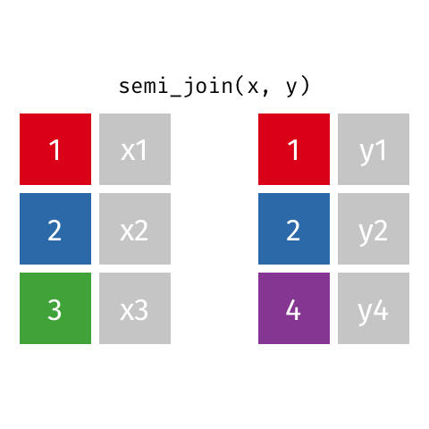
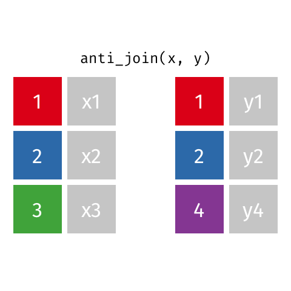

## Announcements / Reminders {.smaller}

-   Office hours are today from **1:00-3:00** on **Zoom**; I will share a link via a Canvas announcement

-   Lab 2 is now due *Monday*, 5/25 at 11:59pm to Gradescope

-   Questions about / feedback on lab yesterday?

## Outline {.smaller}

-   ***Last Time:*** Started learning about data transformation via pivoting!

-   ***Today:***

    -   Review from last time

    -   Joining data (working with multiple data frames)

```{r}
#| label: slice
#| code-line-numbers: "|1|2"
#| echo: false
#| message: false
#| warning: false

library(tidyverse)
statsci <- read_csv("data/statsci_clean.csv")
population <- read_csv("data/world-pop-2022.csv")
continent <- read_csv("data/continents.csv")
```

# AE-06

## Recap: Pivoting {.smaller}

{fig-align="center"}

## Recap: Pivot Functions {.smaller}

::::: columns
::: {.column .fragment width="50%"}
> Pivot longer...

```{r}
#| eval: false

data_set |>
  pivot_longer(
    cols = columns_to_pivot,
    names_to = "var_name_for_former_column_names", 
    values_to = "var_name_for_values"
  )
```
:::

::: {.column .fragment width="50%"}
> ...
> or wider

```{r}
#| eval: false

data_set |>
  pivot_wider( 
    names_from = var_name_with_desired_cols, 
    values_to = var_name_with_desired_vals
  )
```
:::
:::::

# Joining Data

## Joining Data

What happens if we want to access information from two different data sets at the same time (e.g., for EDA / plotting purposes)?

## Joining Data: Sample Scenario {.smaller}

::::: columns
::: {.column width="50%"}
```{r}

population

```
:::

::: {.column width="50%"}
-   We want to know about population in different continents.

-   We could use mutate to create a continent variable, but that would be painful... we would have to manually tell R which continent each country in our df belongs to

:::
:::::

## Joining Data: Sample Scenario {.smaller}

::::: columns
::: {.column width="44%"}
```{r}

population

```
:::

::: {.column width="56%"}
```{r}

continent

```
:::
:::::

## Joining: Example Data

:::::: columns
::: {.column .fragment width="50%"}
> x

| id  | X   |
|-----|-----|
| 1   | X1  |
| 2   | X2  |
| 3   | X3  |
:::

::: {.column .fragment width="50%"}
> y

| id  | Y   |
|-----|-----|
| 1   | Y1  |
| 2   | Y2  |
| 4   | Y4  |
:::

::::::

## Joining: Left Join

:::::: columns
::: {.column .fragment width="25%"}
> x

| id  | X   |
|-----|-----|
| 1   | X1  |
| 2   | X2  |
| 3   | X3  |
:::

::: {.column .fragment width="25%"}
> y

| id  | Y   |
|-----|-----|
| 1   | Y1  |
| 2   | Y2  |
| 4   | Y4  |
:::

::: {.column .fragment width="50%"}
> left_join(x, y)

| id  | X   | Y    |
|-----|-----|------|
| 1   | X1  | Y1   |
| 2   | X2  | Y2   |
| 3   | X3  | *NA* |
:::
::::::

## Joining: Left Join

:::::: columns
::: {.column width="25%"}
> x

| id  | X   |
|-----|-----|
| 1   | X1  |
| 2   | X2  |
| 3   | X3  |
:::

::: {.column width="25%"}
> y

| id  | Y   |
|-----|-----|
| 1   | Y1  |
| 2   | Y2  |
| 4   | Y4  |
:::

::: {.column width="50%"}
> left_join(x, y)

| id  | X   | Y    |
|-----|-----|------|
| 1   | X1  | Y1   |
| 2   | X2  | Y2   |
| 3   | X3  | *NA* |
:::
::::::

<div style="position: absolute; bottom: 80px; right: -90px; width: 280px; pointer-events: none;">
  
</div>

## Joining: Right Join

:::::: columns
::: {.column .fragment width="25%"}
> x

| id  | X   |
|-----|-----|
| 1   | X1  |
| 2   | X2  |
| 3   | X3  |
:::

::: {.column .fragment width="25%"}
> y

| id  | Y   |
|-----|-----|
| 1   | Y1  |
| 2   | Y2  |
| 4   | Y4  |
:::

::: {.column .fragment width="50%"}
> right_join(x, y)

| id  | X    | Y   |
|-----|------|-----|
| 1   | X1   | Y1  |
| 2   | X2   | Y2  |
| 4   | *NA* | Y4  |
:::
::::::

## Joining: Right Join

:::::: columns
::: {.column width="25%"}
> x

| id  | X   |
|-----|-----|
| 1   | X1  |
| 2   | X2  |
| 3   | X3  |
:::

::: {.column width="25%"}
> y

| id  | Y   |
|-----|-----|
| 1   | Y1  |
| 2   | Y2  |
| 4   | Y4  |
:::

::: {.column width="50%"}
> right_join(x, y)

| id  | X    | Y   |
|-----|------|-----|
| 1   | X1   | Y1  |
| 2   | X2   | Y2  |
| 4   | *NA* | Y4  |
:::
::::::

<div style="position: absolute; bottom: 80px; right: -90px; width: 280px; pointer-events: none;">
  
</div>

## Joining: Full Join

:::::: columns
::: {.column .fragment width="25%"}
> x

| id  | X   |
|-----|-----|
| 1   | X1  |
| 2   | X2  |
| 3   | X3  |
:::

::: {.column .fragment width="25%"}
> y

| id  | Y   |
|-----|-----|
| 1   | Y1  |
| 2   | Y2  |
| 4   | Y4  |
:::

::: {.column .fragment width="50%"}
> full_join(x, y)

| id  | X    | Y    |
|-----|------|------|
| 1   | X1   | Y1   |
| 2   | X2   | Y2   |
| 3   | X3   | *NA* |
| 4   | *NA* | Y4   |
:::
::::::

## Joining: Full Join

:::::: columns
::: {.column width="25%"}
> x

| id  | X   |
|-----|-----|
| 1   | X1  |
| 2   | X2  |
| 3   | X3  |
:::

::: {.column width="25%"}
> y

| id  | Y   |
|-----|-----|
| 1   | Y1  |
| 2   | Y2  |
| 4   | Y4  |
:::

::: {.column width="50%"}
> full_join(x, y)

| id  | X    | Y    |
|-----|------|------|
| 1   | X1   | Y1   |
| 2   | X2   | Y2   |
| 3   | X3   | *NA* |
| 4   | *NA* | Y4   |
:::
::::::

<div style="position: absolute; bottom: 80px; right: -90px; width: 280px; pointer-events: none;">
  
</div>

## Joining: Inner Join

:::::: columns
::: {.column .fragment width="25%"}
> x

| id  | X   |
|-----|-----|
| 1   | X1  |
| 2   | X2  |
| 3   | X3  |
:::

::: {.column .fragment width="25%"}
> y

| id  | Y   |
|-----|-----|
| 1   | Y1  |
| 2   | Y2  |
| 4   | Y4  |
:::

::: {.column .fragment width="50%"}
> inner_join(x, y)

| id  | X   | Y   |
|-----|-----|-----|
| 1   | X1  | Y1  |
| 2   | X2  | Y2  |
:::
::::::

## Joining: Inner Join

:::::: columns
::: {.column width="25%"}
> x

| id  | X   |
|-----|-----|
| 1   | X1  |
| 2   | X2  |
| 3   | X3  |
:::

::: {.column width="25%"}
> y

| id  | Y   |
|-----|-----|
| 1   | Y1  |
| 2   | Y2  |
| 4   | Y4  |
:::

::: {.column width="50%"}
> inner_join(x, y)

| id  | X   | Y   |
|-----|-----|-----|
| 1   | X1  | Y1  |
| 2   | X2  | Y2  |
:::
::::::

<div style="position: absolute; bottom: 80px; right: -90px; width: 280px; pointer-events: none;">
  
</div>

## Joining: Semi Join

:::::: columns
::: {.column .fragment width="25%"}
> x

| id  | X   |
|-----|-----|
| 1   | X1  |
| 2   | X2  |
| 3   | X3  |
:::

::: {.column .fragment width="25%"}
> y

| id  | Y   |
|-----|-----|
| 1   | Y1  |
| 2   | Y2  |
| 4   | Y4  |
:::

::: {.column .fragment width="50%"}
> semi_join(x, y)

| id  | X   |
|-----|-----|
| 1   | X1  |
| 2   | X2  |
:::
::::::

## Joining: Semi Join

:::::: columns
::: {.column width="25%"}
> x

| id  | X   |
|-----|-----|
| 1   | X1  |
| 2   | X2  |
| 3   | X3  |
:::

::: {.column width="25%"}
> y

| id  | Y   |
|-----|-----|
| 1   | Y1  |
| 2   | Y2  |
| 4   | Y4  |
:::

::: {.column width="50%"}
> semi_join(x, y)

| id  | X   |
|-----|-----|
| 1   | X1  |
| 2   | X2  |
:::
::::::

<div style="position: absolute; bottom: 80px; right: -90px; width: 280px; pointer-events: none;">
  
</div>

## Joining: Anti Join

:::::: columns
::: {.column .fragment width="25%"}
> x

| id  | X   |
|-----|-----|
| 1   | X1  |
| 2   | X2  |
| 3   | X3  |
:::

::: {.column .fragment width="25%"}
> y

| id  | Y   |
|-----|-----|
| 1   | Y1  |
| 2   | Y2  |
| 4   | Y4  |
:::

::: {.column .fragment width="50%"}
> anti_join(x, y)

| id  | X   |
|-----|-----|
| 3   | X3  |
:::
::::::

## Joining: Anti Join

:::::: columns
::: {.column width="25%"}
> x

| id  | X   |
|-----|-----|
| 1   | X1  |
| 2   | X2  |
| 3   | X3  |
:::

::: {.column width="25%"}
> y

| id  | Y   |
|-----|-----|
| 1   | Y1  |
| 2   | Y2  |
| 4   | Y4  |
:::

::: {.column width="50%"}
> anti_join(x, y)

| id  | X   |
|-----|-----|
| 3   | X3  |
:::
::::::

<div style="position: absolute; bottom: 80px; right: -90px; width: 280px; pointer-events: none;">
  
</div>

## Summary of Join Types

{fig-align="center"}

## More Notes on Join

-   In the following examples, I use left_join() to demonstrate

-   The same concept holds for other types of joins!

-   *Idea: how do we specify which columns we want to join with?*

## Join: Which columns? {.smaller}

How can I specify which column to join by?

:::::: columns
::: {.column .fragment width="25%"}
> x

| id_X | X   |
|------|-----|
| 1    | X1  |
| 2    | X2  |
| 3    | X3  |
:::

::: {.column .fragment width="25%"}
> y

| id_Y | Y   |
|------|-----|
| 1    | Y1  |
| 2    | Y2  |
| 4    | Y4  |
:::

::: {.column .fragment width="50%"}
> goal: left join

| id_X | X   | Y    |
|------|-----|------|
| 1    | X1  | Y1   |
| 2    | X2  | Y2   |
| 3    | X3  | *NA* |

```{r}
#| eval: false

left_join(x, y, 
          by = join_by(id_X == id_Y))
```
:::
::::::

## What about the pipe? {.smaller}

The following two pieces of code are equivalent:

```{r}
#| eval: false

left_join(x, y, 
          by = join_by(id_X == id_Y))
```

<br> <br>

```{r}
#| eval: false

x |> left_join(y, 
               by = join_by(id_X == id_Y))
```

## Let's save!

Most often, you will want to save the result of a join to a new data frame.

```{r}
#| eval: false

x_y <- x |> left_join(y, 
                      by = join_by(id_X == id_Y))
```

## Another potential scenario...

-   In some cases, it may be helpful to join a dataset with itself

-   When joining a dataset with itself, since the "left" and "right" data frames are exactly the same, `inner_join()`, `left_join()`, `right_join()`, and `full_join()` will "collapse" to the same solution

-   To demonstrate the utility, I will proceed with `inner_join()`

## Joining a data frame with... itself?

```{r}
#| include: false

rx_data <- tibble(
  patid = c(
    1001, 1001, 1001,
    1002, 1002,
    1003, 1003
  ),
  
  ndc_code = c(
    "00074-4333",
    "00074-4333",
    "54868-5277",
    "59011-4420",
    "59011-4420",
    "00406-0512",
    "00406-0512"
  ),
  
  rx_start = as.Date(c(
    "2025-01-01",
    "2025-01-04",
    "2025-02-10",
    "2025-03-01",
    "2025-03-20",
    "2025-04-05",
    "2025-04-08"
  )),
  
  rx_end = as.Date(c(
    "2025-01-03",
    "2025-01-30",
    "2025-03-05",
    "2025-03-15",
    "2025-04-10",
    "2025-04-07",
    "2025-05-01"
  ))
)

```

"Toy" prescription data frame
```{r}
#| label: rx_data

rx_data

```

## Joining a data frame with... itself? {.medium}

Why the `suffix =` argument? What about the warning?

```{r}
#| label: self-join

# Join the data to itself by patient ID
rx_permute <- rx_data |>
  inner_join(
    rx_data,
    by = "patid",
    suffix = c("_ref", "_comp")
  )
  
```

## Joining a data frame with... itself? {.scrollable .smaller}

```{r}
#| label: self-join-nw
#| code-line-numbers: "7"

# Join the data to itself by patient ID
rx_permute <- rx_data |>
  inner_join(
    rx_data,
    by = "patid",
    suffix = c("_ref", "_comp"),
    relationship = "many-to-many"
  )

rx_permute
  
```


## Joining a data frame with... itself? {.scrollable .smaller}

-   Now, I can calculate the time-gap (in days) between each patient's prescriptions

-   This might be helpful if I'm considering imputing (i.e., filling in missing data) data in between prescriptions

-   Or, if I have Rx fill data and I'm trying to measure adherence (i.e., is a patient picking up their refills in a timely manner, or are they going days / weeks without medication?)

```{r}

# Keep only records where the comparison prescription starts later
rx_permute |>
  filter(rx_start_comp > rx_end_ref) |>
  # Calculate the gap between prescriptions
  mutate(
    gap_days = as.numeric(rx_start_comp - rx_end_ref)) |>
  select(patid, rx_end_ref, rx_start_comp, gap_days)

```


# AE 07

Goal: Practice with joins!