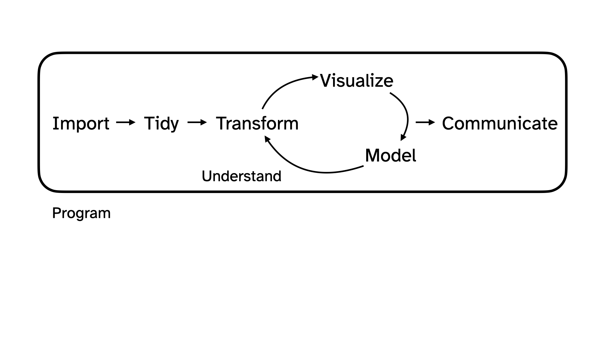
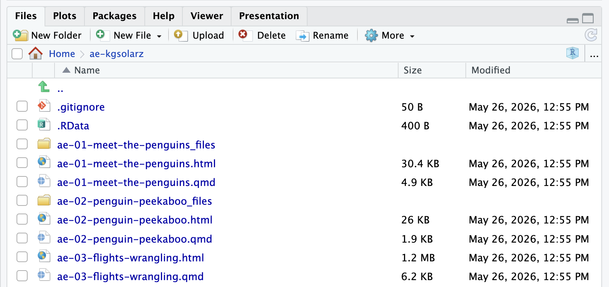
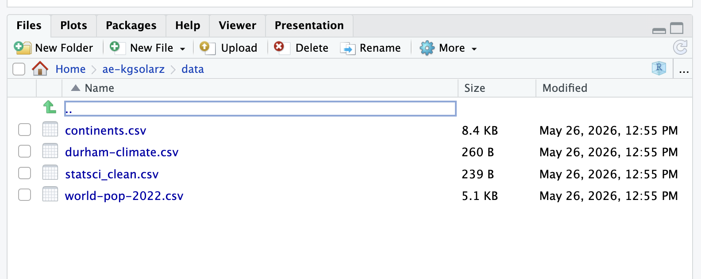
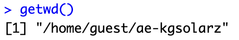
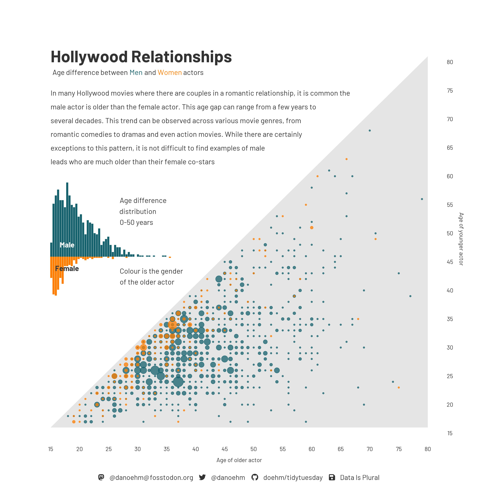
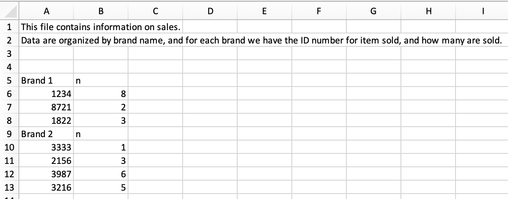
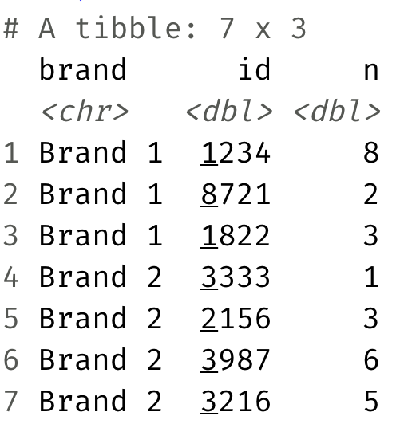

```{r}
#| include: false
library(tidyverse)
durham_climate <- read_csv("data/durham-climate.csv")
```

## Administrative Details {.scrollable .smaller}

-   Midterm next Monday!

    -   Practice + some review tomorrow in class

    -   Practice questions for both the multiple choice & live coding portions of the exam will be posted tomorrow!

    -   I will post solutions to the practice questions by Saturday morning

-   Lab 3 after lecture tomorrow

    -   This will be a *shorter than usual* lab & is meant to serve as a recap of all we've learned so far (aka, helpful exam prep!)
    
    -   Reminder: Lab 3 will be due by **12:00pm** (noon) on Sunday; there will be **no late window** for this lab assignment 
    
    -   Solutions will posted to the website promptly thereafter 
    
## Administrative Details {.scrollable .smaller}

-   Project work begins next week! More details on *what* the project *is* tomorrow :)

    -   Since the midterm takes place during both of the formal lecture and lab timeslots next Monday, lecture time next Tuesday (9:30am - 10:45am) will function as a lab meeting

    -   **Both** lab sessions next week (T, Th) will be dedicated worktime
    
    -   You will receive your team assignments (2 groups of 3, 2 groups of 4) in lab next Tuesday
    
    -   As a reminder, projects are completed in groups **BUT** grades are individual; your final project grade may ultimately differ from your teammates' if there is unequal participation
    
    -   Participation is measured by 1) lab attendance on project work days; 2) commit history in project repos on GitHub; 3) peer review forms 
    
# Back to AE-08

## Task 1: Prettifying the plot from ae-08 {.scrollable}

```{r}
ggplot(
  durham_climate, 
  aes(x = month, y = avg_high_f, group = 1)
  ) +
  geom_line() +
  geom_point(
    shape = "circle filled", size = 4,
    color = "black", fill = "white", stroke = 1
  ) +
  labs(
    x = "Month",
    y = "Average high temperature (F)",
    title = "Durham climate"
  ) + 
  theme_minimal()
```

## Things to change

::: incremental 
1. ✅ Reorder the months chronologically;
2. ✅ Fill the circles with season-specific colors;
3. ⬜ Add a legend for these colors to the *top* of the plot;
4. ⬜ Make sure the legend is ordered chronologically by season.
:::

## 0. Why `group = 1`? {.scrollable}

With it:

```{r}
#| code-line-numbers: "3"
ggplot(
  durham_climate, 
  aes(x = month, y = avg_high_f, group = 1)
  ) +
  geom_line() +
  geom_point(
    shape = "circle filled", size = 4,
    color = "black", fill = "white", stroke = 1
  ) +
  labs(
    x = "Month",
    y = "Average high temperature (F)",
    title = "Durham climate"
  ) +
  theme_minimal()
```

## 0. Why `group = 1`? {.scrollable}

Without it (even though I have `geom_line`!):

```{r}
#| code-line-numbers: "3|5"
ggplot(
  durham_climate, 
  aes(x = month, y = avg_high_f)
  ) +
  geom_line() +
  geom_point(
    shape = "circle filled", size = 4,
    color = "black", fill = "white", stroke = 1
  ) +
  labs(
    x = "Month",
    y = "Average high temperature (F)",
    title = "Durham climate"
  ) +
  theme_minimal()
```

## 0. Why `group = 1`? {.scrollable}

Don't need `group =` argument for numerical vs numerical:

```{r}
#| code-line-numbers: "3"
ggplot(
  durham_climate, 
  aes(x = avg_low_f, y = avg_high_f)
  ) +
  geom_line() +
  geom_point(
    shape = "circle filled", size = 4,
    color = "black", fill = "white", stroke = 1
  ) +
  labs(
    x = "Average low temperature (F)",
    y = "Average high temperature (F)",
    title = "Durham climate"
  ) +
  theme_minimal()
```

## 0. Why `group = 1`? {.scrollable}

**Do** need `group = ` argument for categorical vs numerical:

```{r}
#| code-line-numbers: "3"
ggplot(
  durham_climate, 
  aes(x = month, y = avg_high_f, group = 1)
  ) +
  geom_line() +
  geom_point(
    shape = "circle filled", size = 4,
    color = "black", fill = "white", stroke = 1
  ) +
  labs(
    x = "Month",
    y = "Average high temperature (F)",
    title = "Durham climate"
  ) +
  theme_minimal()
```

## 1. Reorder the months chronologically {.scrollable}

```{r}
#| code-line-numbers: "2-4"
durham_climate |>
  mutate(
    month = fct_relevel(month, month.name)
  ) |>
  ggplot(
    aes(x = month, y = avg_high_f, group = 1)
  ) +
  geom_line() +
  geom_point(
    shape = "circle filled", size = 4,
    color = "black", fill = "white", stroke = 1
  ) +
  labs(
    x = "Month",
    y = "Average high temperature (F)",
    title = "Durham climate"
  ) +
  theme_minimal()
```

## 2. Fill the circles with season-specific colors {.scrollable}

```{r}
#| code-line-numbers: "4-8|16"
durham_climate |>
  mutate(
    month = fct_relevel(month, month.name),
    season = case_when(
      month %in% c("December", "January", "February") ~ "Winter",
      month %in% c("March", "April", "May") ~ "Spring",
      month %in% c("June", "July", "August") ~ "Summer",
      month %in% c("September", "October", "November") ~ "Fall",
    )
  ) |>
  ggplot(
    aes(x = month, y = avg_high_f, group = 1)
    ) +
  geom_line() +
  geom_point(
    aes(fill = season),
    shape = "circle filled", size = 4,
    color = "black", stroke = 1
  ) +
  labs(
    x = "Month",
    y = "Average high temperature (F)",
    title = "Durham climate"
  ) +
  theme_minimal()
```

## 2.5 Let's choose different-than-default season-specific colors {.scrollable}

```{r}
#| code-line-numbers: "20-27"
durham_climate |>
  mutate(
    month = fct_relevel(month, month.name),
    season = case_when(
      month %in% c("December", "January", "February") ~ "Winter",
      month %in% c("March", "April", "May") ~ "Spring",
      month %in% c("June", "July", "August") ~ "Summer",
      month %in% c("September", "October", "November") ~ "Fall",
    )
  ) |>
  ggplot(
    aes(x = month, y = avg_high_f, group = 1)
    ) +
  geom_line() +
  geom_point(
    aes(fill = season),
    shape = "circle filled", size = 4,
    color = "black", stroke = 1
  ) +
  scale_fill_manual(
    values = c(
      "Winter" = "lightskyblue1",
      "Spring" = "chartreuse3",
      "Summer" = "gold2",
      "Fall" = "lightsalmon4"
    )
  ) + 
  labs(
    x = "Month",
    y = "Average high temperature (F)",
    title = "Durham climate"
  ) +
  theme_minimal()
```

## 3. Add legend for season to *top* of plot {.scrollable}

```{r}
#| code-line-numbers: "34"
durham_climate |>
  mutate(
    month = fct_relevel(month, month.name),
    season = case_when(
      month %in% c("December", "January", "February") ~ "Winter",
      month %in% c("March", "April", "May") ~ "Spring",
      month %in% c("June", "July", "August") ~ "Summer",
      month %in% c("September", "October", "November") ~ "Fall",
    )
  ) |>
  ggplot(
    aes(x = month, y = avg_high_f, group = 1)
    ) +
  geom_line() +
  geom_point(
    aes(fill = season),
    shape = "circle filled", size = 4,
    color = "black", stroke = 1
  ) +
  scale_fill_manual(
    values = c(
      "Winter" = "lightskyblue1",
      "Spring" = "chartreuse3",
      "Summer" = "gold2",
      "Fall" = "lightsalmon4"
    )
  ) + 
  labs(
    x = "Month",
    y = "Average high temperature (F)",
    title = "Durham climate"
  ) +
  theme_minimal() + 
  theme(legend.position = "top")
```

## 4. Order legend chronologically {.scrollable}

```{r}
#| code-line-numbers: "10"
durham_climate |>
  mutate(
    month = fct_relevel(month, month.name),
    season = case_when(
      month %in% c("December", "January", "February") ~ "Winter",
      month %in% c("March", "April", "May") ~ "Spring",
      month %in% c("June", "July", "August") ~ "Summer",
      month %in% c("September", "October", "November") ~ "Fall",
    ),
    season = fct_relevel(season, "Winter", "Spring", "Summer", "Fall")
  ) |>
  ggplot(
    aes(x = month, y = avg_high_f, group = 1)
    ) +
  geom_line() +
  geom_point(
    aes(fill = season),
    shape = "circle filled", size = 4,
    color = "black", stroke = 1
  ) +
  scale_fill_manual(
    values = c(
      "Winter" = "lightskyblue1",
      "Spring" = "chartreuse3",
      "Summer" = "gold2",
      "Fall" = "lightsalmon4"
    )
  ) + 
  labs(
    x = "Month",
    y = "Average high temperature (F)",
    title = "Durham climate"
  ) +
  theme_minimal() + 
  theme(legend.position = "top")
```

## Task 2: *pivot* to replicate this...

```{r}
#| echo: false 
durham_climate |>
  mutate(
    month = fct_relevel(month, month.name),
    season = case_when(
      month %in% c("December", "January", "February") ~ "Winter",
      month %in% c("March", "April", "May") ~ "Spring",
      month %in% c("June", "July", "August") ~ "Summer",
      month %in% c("September", "October", "November") ~ "Fall",
    ),
    season = fct_relevel(season, "Winter", "Spring", "Summer", "Fall")
  ) |>
  pivot_longer(
    cols = c(avg_high_f, avg_low_f),
    names_to = "temp_type",
    names_prefix = "avg_",
    values_to = "avg_temp_f"
  ) |>
  mutate(temp_type = str_remove(temp_type, "_f")) |>
  ggplot(aes(x = month, y = avg_temp_f, group = temp_type, color = temp_type)) +
  geom_line() +
  geom_point(
    aes(fill = season),
    shape = "circle filled", size = 3, stroke = 1
  ) +
  scale_fill_manual(
    values = c(
      "Winter" = "lightskyblue1",
      "Spring" = "chartreuse3",
      "Summer" = "gold2",
      "Fall" = "lightsalmon4"
    )
  ) +
  scale_color_manual(
    values = c(
      "high" = "gray20",
      "low" = "gray70"
    )
  ) +
  labs(
    x = "Month",
    y = "Average temperature (F)",
    title = "Durham climate",
    fill = "Season",
    color = "Type"
  ) +
  theme_minimal() +
  theme(legend.position = "top")
```

Give it a shot in your `ae-08` `.qmd` file... you can ignore the **prettification** we walked through for now. 

# Let's zoom out for a second

## Data science and statistical thinking

Before Midterm 1...

-   **Data science**: the real-world *art* of transforming messy, imperfect, incomplete data into knowledge;

After Midterm 1...

-   **Statistics**: the mathematical discipline of quantifying our uncertainty about that knowledge.

## Data science {.medium}

{fig-align="center"}

## Data science {.smaller}

:::: {style="background-color:#f3e8ff; border-left:4px solid #d8b4fe; padding:0.5em 1em; border-radius:4px; display:inline-block"}
::: incremental
1.  **Collection**: we won't seriously study data collection (take an experimental design class if you are interested!); we *will* discuss data importation methods today 

-   **for the purposes of this class**: accessing package data (`library()`; `df <- library::df`), **data importation** (`read_csv`, `read_xlsx`, `read_xls`)
-   **in reality...**: web-scraping, domain-specific issues of measurement, survey design, experimental design, etc.
:::
::::

## Data science {.smaller}

1.  **Collection**: we won't seriously study data collection; we *will* discuss data importation methods today 

:::: incremental
::: {.fragment style="background-color:#f3e8ff; border-left:4px solid #d8b4fe; padding:0.5em 1em; border-radius:4px; display:inline-block"}
2.  **Preparation**: cleaning, wrangling, and otherwise *tidying* the data so we can actually work with it.

-   **keywords**: `mutate`, `fct_relevel`, `pivot_*`, `*_join`
:::
::::

## Data science {.smaller}

1.  **Collection**: we won't seriously study data collection; we *will* discuss data importation methods today 

2.  **Preparation**: cleaning, wrangling, and otherwise *tidying* the data so we can actually work with it.

:::: incremental
::: {.fragment style="background-color:#f3e8ff; border-left:4px solid #d8b4fe; padding:0.5em 1em; border-radius:4px; display:inline-block"}
3.  **Analysis**: finally, transform the data into *knowledge*...

-   **visual summaries**: `ggplot`, `geom_*`, etc.
-   **numerical summaries**: `summarize`, `group_by`, `count`, `mean`, `median`, `sd`, `quantile`, `IQR`, `cor`, etc.
-   The visualizations and the summaries should complement one another!
:::
::::

# Reading data into R

## Package data {.smaller}

-   When data is neatly stored in a package, such as **tidyverse**, loading the package loads the dataset; you can explicitly save a packaged df to your RStudio environment by running `df <- library::df`

-   Most often, this is not the case

## Reading in rectangular data {.smaller}

{fig-align="center" width="923"}

## Reading rectangular data {.smaller}

-   Using [**readr**](https://readr.tidyverse.org/): (in **tidyverse**)
    -   Most commonly: `read_csv()` - file saved as `.csv`
    -   Maybe also: `read_tsv()`, `read_delim()`, etc - other file formats

. . .

-   Using [**readxl**](https://readxl.tidyverse.org/): 
    -   `read_excel()` - R determines file type for you
    -   `read_xls()`, `read_xlsx()` - use if you know whether you have a .xls or .xlsx file

. . .

-   Using [**googlesheets4**](https://googlesheets4.tidyverse.org/): `read_sheet()` -- we haven't covered this in the videos, but might be useful for your projects

    -   Fun fact: The "Schedule" page on the course website pulls information from an underlying Google sheets file

## Using read_csv() {.smaller}

Generally, the format is:

```{r}
#| eval: false
df_name <- read_csv("path_to_file_name.csv")
```

## Path to file {.smaller}

For example, recall we worked with *durham-climate.csv* in AE08. **Where is** *durham-climate.csv?*

When in our AE repo, we read in the data with the following code:
```{r}
#| label: load-data
#| eval: false
durham_climate <- read_csv("data/durham-climate.csv")
```

## Path to file {.smaller}

::::: columns
::: {.column width="50%"}
{width="500"}
:::

::: {.column width="50%"}
{width="500"}
:::
:::::

-   use `/` to separate folder(s) + file names; file path in quotes

-   Answer: `read_csv("data/durham-climate.csv")`

## Why not include `ae-kgsolarz`? {.smaller}

*Where is durham-climate.csv?*

::::: columns
::: {.column width="50%"}
{width="300"}
:::

::: {.column width="50%"}
{width="400"} {width="400"}

:::
:::::

## We can also write files! {.smaller}

This allows us to save data for later usage, share data outside of R, etc.

<br>

Using `write_csv()`:

```{r}
#| eval: false

write_csv(r_df_name, "path_to_file.csv")
```

# Application exercise

## Goal 1.1: Reading and writing CSV files {.smaller}

-   Read a CSV file with tidy data

-   Split it into subsets based on features of the data

-   Write out subsets as CSV files

## Goal 1.2: Practice - Case When {.smaller}

-   `case_when()` is similar to `if_else()`, but allows multiple cases
-   `case_when()` is often used within `mutate()` to create a new column

```{r}
#| eval: false

df |>
  mutate(new_var = case_when(
    condition_1 ~ result_1,
    condition_2 ~ result_2,
    condition_3 ~ result_3,
    ...,
    .default = default_result
  ))
```

## An aside - If Else {.smaller}

-   `case_when()` is similar to `if_else()`, but `if_else()` only allows for 2 cases / conditions

-   Long story short... use `if_else()` if you are only considering 2 cases / conditions; for > 2 conditions, use `case_when()`

- In words, we'd read the code below as: "**If** logical_1 evaluates to TRUE (i.e., this condition is met), **then** choose result_1; **else** (i.e., this condition is not met), choose result 2

```{r}
#| eval: false

df |>
  mutate(new_var = if_else(logical_1, result_1, result_2))

## create a new column, "is_december" with a value 1 if the month is December and a value 0 otherwise

durham_climate |>
  mutate(is_december = if_else(month == "December", 1, 0))

```

## Age gap in Hollywood relationships {.smaller}

{fig-align="center" width="600"}

## Goal 2.1: Reading Excel files & non-tidy data {.smaller}

-   Read an Excel file with non-tidy data

-   Tidy it up!

## Goal 2.2: String Functions {.smaller}

::::: columns
::: {.column width="70%"}
We've seen lots of functions that deal with numeric data (`mean`, `median`, `sum`, etc.) - what about characters?

-   **stringr** is a **tidyverse** package with lots of functions for dealing with character strings

-   today: **str_detect** in **stringr**
:::

::: {.column width="30%"}
{width="185"}
:::
:::::

## Goal 2.2: String Functions {.smaller}

-   **str_detect()** identifies if a character / sequence of characters is a *substring* within a longer string

-   useful in cases when you need to check some condition, for example:

    -   in a `filter()`

    -   in an `if_else()` or `case_when()`

## Goal 2.2: String Functions {.smaller}

-   **str_detect()** identifies if a character / sequence of characters is a *substring* within a longer string

-   useful in cases when you need to check some condition, for example:

    -   in a `filter()`

    -   in an `if_else()` or `case_when()`

**example:** which classes in a list are in the stats department?

```{r}
classes <- c("sta199", "dance122", "math185", "sta240", "pubpol202")
str_detect(classes, "sta")
```

## Goal 2.2: String Functions {.smaller}

General form:

```{r}
#| eval: false
str_detect(character_var, "word_to_detect")
```

## Sales data



. . .

::: question
Are these data tidy?
Why or why not?
:::

## Sales data

::: question
What data tidying must be done to go from the original, non-tidy data to the below tidy version of these data?
:::

{width="150"}
