# Wrap-Up AE-09

```{r}
#| label: load-packages
#| message: false
#| warning: false
#| echo: false

library(tidyverse)
library(tidymodels)
library(ggrepel)
library(ggthemes)
library(palmerpenguins)

todays_ae <- "ae-10-effective-dataviz"
```

# Project

## The bottom line, at the top {.scrollable .smaller}

**Cohesive, thoughtful** analysis of a dataset of your team's choosing (subject to instructor / TA approval) drawing on & expanding upon the techniques / methods learned in this course

::: incremental
-   Goal: Create a **reproducible** written report that introduces your research question, explains the methodology, showcases results, and discusses the implications of your work; present your work / findings to your peers and teaching team with engagig, concise slides
-   Put differently... write an in-depth article that might appear in the popular press (NYT, Chronicle, etc)...
-   For an audience that is intelligent, but non-technical and unfamiliar with the domain
-   Emphasize clear communication, attractive and informative graphics, and carefully chosen numerical summaries and / or statistical methods
-   `R` code and raw output should not appear in your final writeup (i.e., you will need to suppress your code chunks via Quarto settings)
-   All figures and tables should be labeled with captions
:::

# Telling a story

## Setup

```{r}
#| message: false
library(tidyverse)
library(tidymodels)
library(ggrepel)
library(ggthemes)
library(palmerpenguins)
```

## Multiple ways of telling a story

-   Sequential reveal: Motivation, then resolution

-   Instant reveal: Resolution, and motivation hidden within

## Simplicity vs. complexity {.smaller}

> When you're trying to show too much data at once you may end up not showing anything.

-   Never assume your audience can rapidly process complex visual displays

-   Don't add variables to your plot that are tangential to your story

-   Don't jump straight to a highly complex figure; first show an easily digestible subset (e.g., show one facet first)

-   Aim for memorable, but clear

::: {.callout-note appearance="minimal"}
**Project note:** Make sure to leave time to iterate on your plots after you practice your presentation.
If certain plots or outputs are getting too wordy to explain, take time to simplify them!
:::

## Consistency vs. repetitiveness {.smaller}

> Be consistent but don't be repetitive.

-   Use consistent features throughout plots (e.g., same color represents same level on all plots)

-   Aim to use a different type of summary or visualization for each distinct analysis

-   Reading a report with *ALL* boxplots is like walking into an ice cream shoppe that only sells versions of vanilla (e.g., Madagascar, Vanilla Bean (the best), French Vanilla, Old Fashioned, etc...) when I want a scoop of coffee and a scoop of cinnamon!

# Designing effective visualizations

## Data {.medium}

```{r}
#| output-location: column

d <- tribble(
  ~category,                     ~value,
  "Cutting tools"                , 0.03,
  "Buildings and administration" , 0.22,
  "Labor"                        , 0.31,
  "Machinery"                    , 0.27,
  "Workplace materials"          , 0.17
)
d
```

## Keep it simple

::::: columns
::: {.column width="40%"}
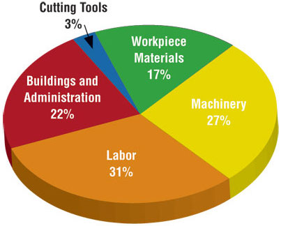
:::

::: {.column width="60%"}
```{r}
#| echo: false
#| out-width: "100%"
#| fig-width: 4
#| fig-asp: 0.5

ggplot(d, aes(y = fct_reorder(category, value), x = value)) +
  geom_col() +
  labs(x = NULL, y = NULL)
```
:::
:::::

## Judging relative area {.smaller}

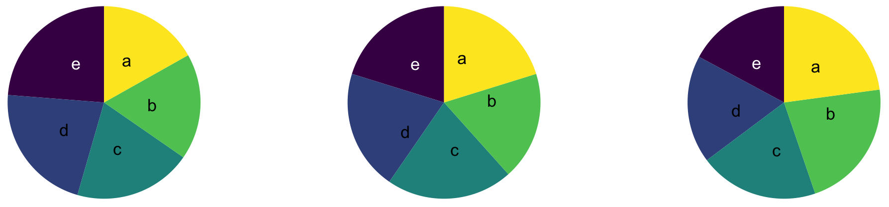{fig-align="center" width="800"}

. . .

{fig-align="center" width="800"}

::: aside
From Data to Viz caveat collection - [The issue with the pie chart](https://www.data-to-viz.com/caveat/pie.html)
:::

## Use color to draw attention

<br/> <br/>

::::: columns
::: {.column width="50%"}
```{r}
#| echo: false
#| out-width: "100%"
#| fig-width: 4
#| fig-asp: 0.5

ggplot(d, aes(x = category, y = value, fill = category)) +
  geom_col(show.legend = FALSE) +
  labs(x = NULL, y = NULL) +
  scale_x_discrete(labels = label_wrap_gen(width = 20))
```
:::

::: {.column width="50%"}
```{r}
#| echo: false
#| out-width: "100%"
#| fig-width: 4
#| fig-asp: 0.5

p <- ggplot(d, aes(y = fct_reorder(category, value), x = value, fill = category)) +
  geom_col(show.legend = FALSE) +
  labs(x = NULL, y = NULL) +
  scale_fill_manual(values = c("red", rep("gray", 4)))

p
```
:::
:::::

## Play with themes for a non-standard look {.smaller}

```{r}
#| out-width: "100%"
#| fig-width: 4
#| fig-asp: 0.5
#| layout-ncol: 2
#| echo: false

p + theme_bw() + labs(title = "theme_bw()")
p + theme_linedraw() + labs(title = "theme_linedraw()")
p + theme_minimal() + labs(title = "theme_minimal()")
p + theme_dark() + labs(title = "theme_dark()")
```

## Go beyond ggplot2 themes -- ggthemes {.smaller}

```{r}
#| out-width: "100%"
#| fig-width: 5
#| fig-asp: 0.5
#| layout-ncol: 2
#| echo: false

p + theme_economist() + labs(title = "theme_economist()")
p + theme_fivethirtyeight() + labs(title = "theme_fivethirtyeight()")
p + theme_solarized() + labs(title = "theme_solarized()")
p + theme_tufte() + labs(title = "theme_tufte()")
```

## Tell a story

::::: columns
::: {.column width="50%"}
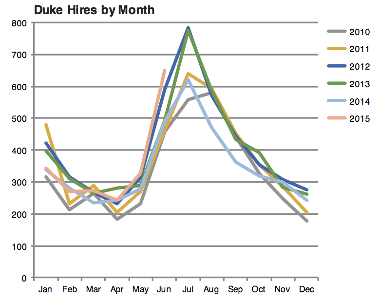{fig-align="center"}
:::

::: {.column width="50%"}
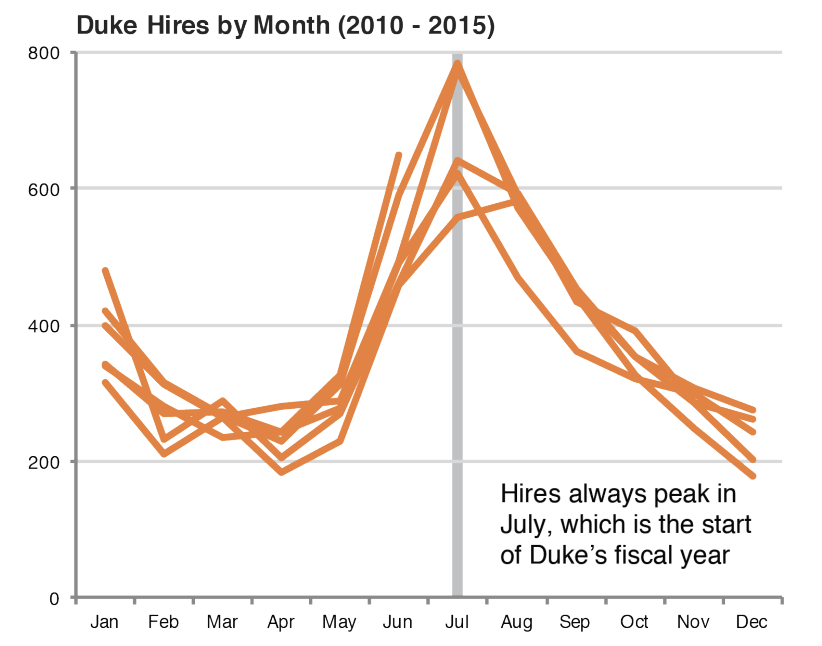{fig-align="center"}
:::
:::::

::: aside
*Credit*: Angela Zoss and Eric Monson, Duke DVS
:::

## Leave out non-story details

::::: columns
::: {.column width="50%"}
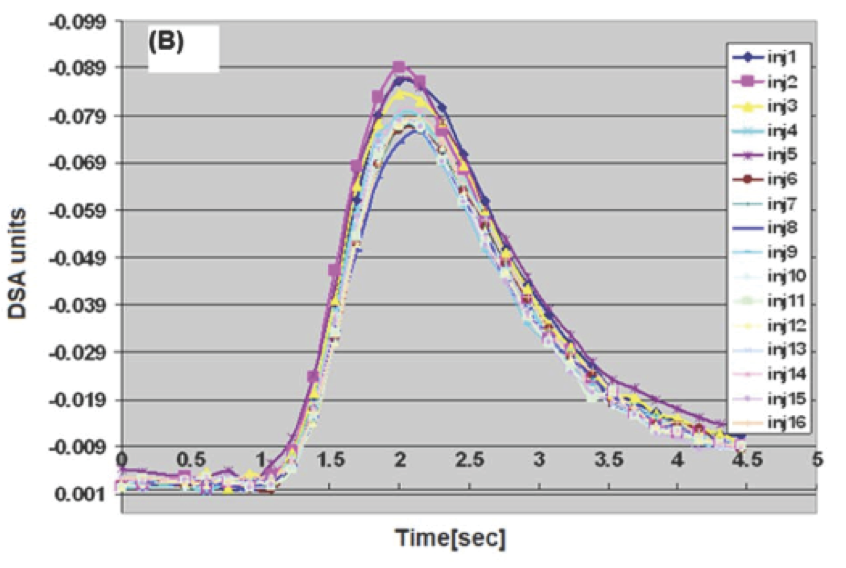{fig-align="center"}
:::

::: {.column width="50%"}
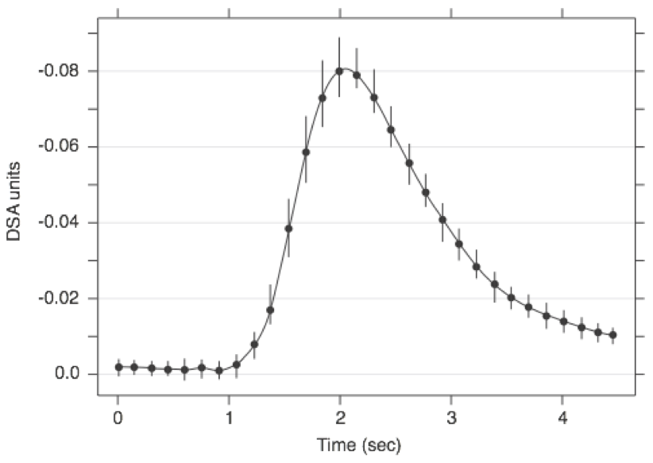{fig-align="center"}
:::
:::::

## Order matters

::::: columns
::: {.column width="50%"}
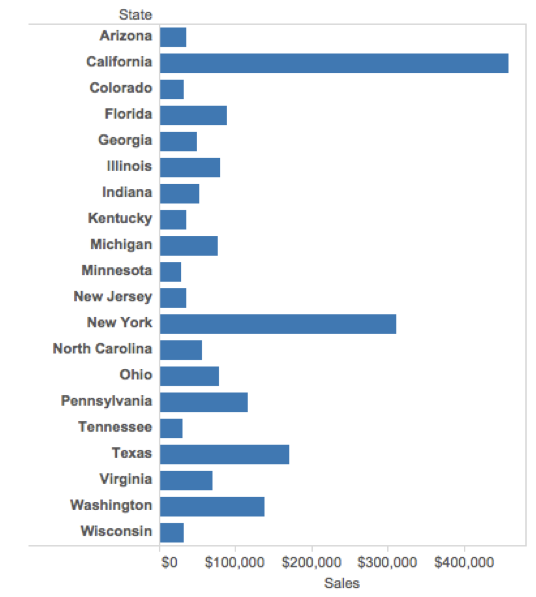{fig-align="center"}
:::

::: {.column width="50%"}
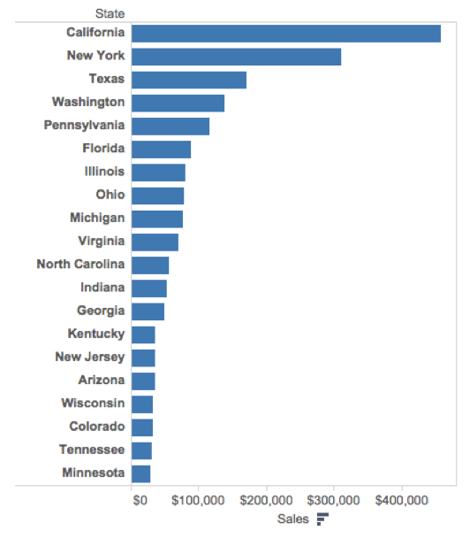{fig-align="center"}
:::
:::::

## Clearly indicate missing data

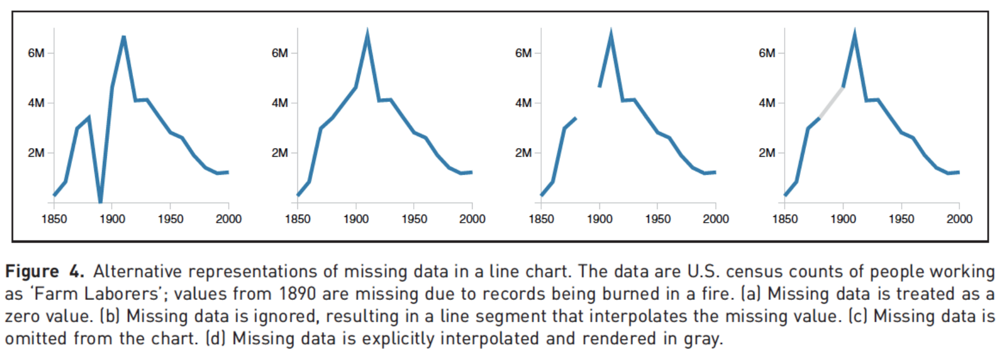{fig-align="center"}

## Reduce cognitive load

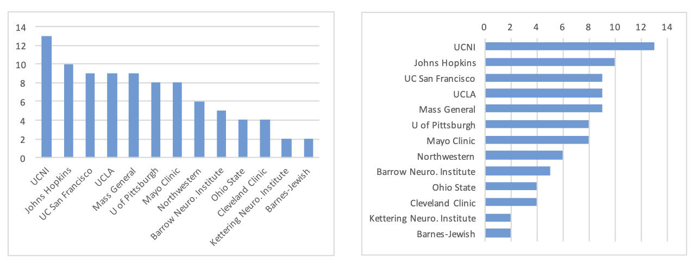{fig-align="center"}

::: aside
http://www.storytellingwithdata.com/2012/09/some-finer-points-of-data-visualization.html
:::

## Use descriptive titles

::::: columns
::: {.column width="50%"}
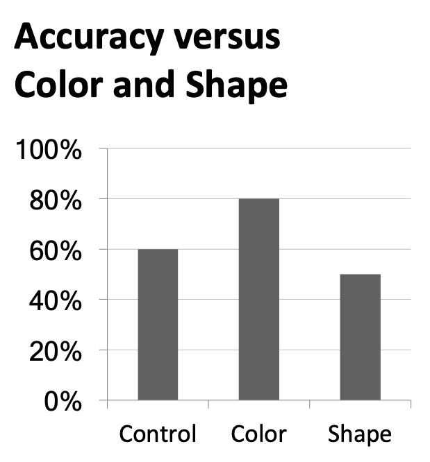{fig-align="center"}
:::

::: {.column width="50%"}
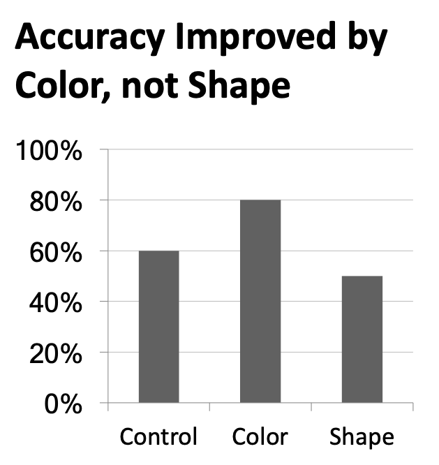{fig-align="center"}
:::
:::::

## Annotate figures

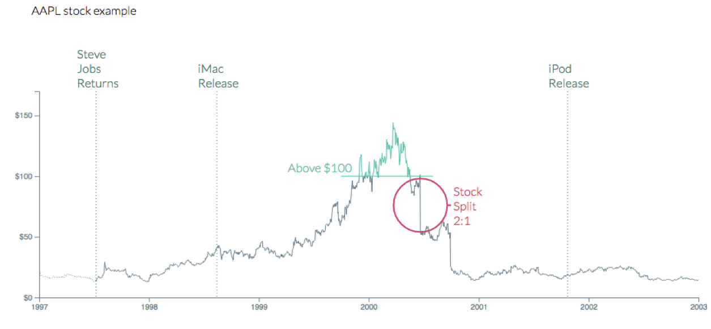{fig-align="center"}

::: aside
https://bl.ocks.org/susielu/23dc3082669ee026c552b85081d90976
:::

# Plot sizing and layout

## Sample plots

```{r}
#| fig-show: hide

p_hist <- ggplot(mtcars, aes(x = mpg)) +
  geom_histogram(binwidth = 2)

p_text <- mtcars |>
  rownames_to_column() |>
  ggplot(aes(x = disp, y = mpg)) +
  geom_text_repel(aes(label = rowname)) +
  coord_cartesian(clip = "off")
```

## Small `fig-width`

For a zoomed-in look

```{r}
#| echo: fenced
#| fig-width: 3
#| fig-asp: 0.618

p_hist
```

## Large `fig-width`

For a zoomed-out look

```{r}
#| echo: fenced
#| fig-width: 6
#| fig-asp: 0.618

p_hist
```

## `fig-width` affects text size

::::: columns
::: {.column width="50%"}
```{r}
#| echo: false
#| warning: false
#| fig-width: 5
#| fig-asp: 0.618

p_text +
  labs(title = "fig.width = 5")
```
:::

::: {.column width="50%"}
```{r}
#| echo: false
#| fig-width: 10
#| fig-asp: 0.618

p_text +
  labs(title = "fig.width = 10")
```
:::
:::::

## Multiple plots on a slide

::: {.callout-warning appearance="minimal"}
First, ask yourself, must you include multiple plots on a slide?
For example, is your narrative about comparing results from two plots?
:::

-   If no, then don't!
    Move the second plot to to the next slide!

-   If yes, use columns and sequential reveal.

# Quarto

## Writing your project report with Quarto {.medium .scrollable}

-   Figure sizing: `fig-width`, `fig-height`, etc. in code chunks.

-   Figure layout: `layout-ncol` for placing multiple figures in a chunk.

-   Further control over figure layout with the **patchwork** package.

-   Chunk options around what makes it in your final report: `message`, `echo`, etc.

-   Cross referencing figures and tables.

-   Adding footnotes and citations.

## Cross referencing figures {.smaller}

::: panel-tabset
## Output

As seen in @fig-penguins, there is a positive and relatively strong relationship between body mass and flipper length of penguins.

```{r}
#| label: fig-penguins
#| fig-cap: The relationship between body mass and flipper length of penguins.
#| fig-width: 5
#| fig-asp: 0.618
#| fig-align: left

ggplot(penguins, aes(x = flipper_length_mm, y = body_mass_g)) +
  geom_point()
```

## Input

````         
As seen in @fig-penguins, there is a positive and relatively strong relationship between body mass and flipper length of penguins.

```{{r}}
#| label: fig-penguins

ggplot(penguins, aes(x = flipper_length_mm, y = body_mass_g)) +
  geom_point()
```
````
:::

## Cross referencing tables {.smaller}

::: panel-tabset
## Output

@tbl-penguins displays summaries of flipper length by species.

```{r}
#| label: tbl-penguins
#| tbl-cap: Flipper length summaries by species

penguins |>
  group_by(species) |>
  summarize(
    Mean = mean(flipper_length_mm, na.rm = TRUE),
    Median = median(flipper_length_mm, na.rm = TRUE),
    SD = sd(flipper_length_mm, na.rm = TRUE)
  ) |>
  knitr::kable(digits = 3)
```

## Input

````         
@tbl-penguins displays summaries of flipper length by species.

```{{r}}
#| label: tbl-penguins
#| tbl-cap: Flipper length summaries by species

penguins |>
  group_by(species) |>
  summarize(
    Mean = mean(flipper_length_mm, na.rm = TRUE),
    Median = median(flipper_length_mm, na.rm = TRUE),
    SD = sd(flipper_length_mm, na.rm = TRUE)
  ) |>
  knitr::kable(digits = 3)
```
````
:::

# Take A Sad Plot & Make It Better

## Going the extra mile

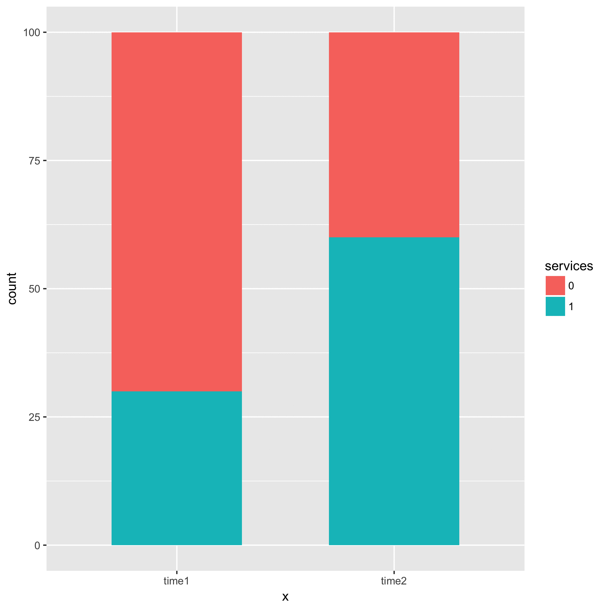{width="50%"}

## Trends in instructional staff employees at universities {.smaller .scrollable}

The American Association of University Professors (AAUP) is a nonprofit membership association of faculty and other academic professionals.
[This report](https://www.aaup.org/sites/default/files/files/AAUP_Report_InstrStaff-75-11_apr2013.pdf) by the AAUP shows trends in instructional staff employees between 1975 and 2011, and contains the following image.
What trends are apparent in this visualization?

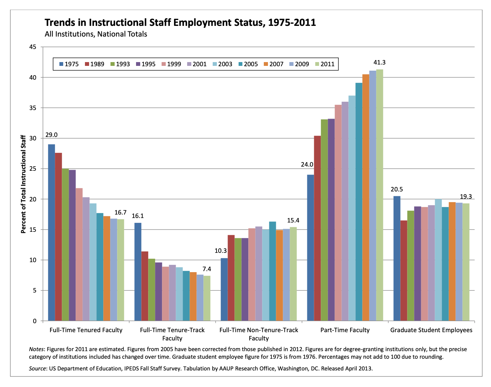{fig-align="center"}

# `{r} todays_ae`

## Data prep

```{r}
#| label: load-data-staff
#| message: false
#| code-fold: true
library(tidyverse)
library(scales)

staff <- read_csv("data/instructional-staff.csv")

staff_long <- staff |>
  pivot_longer(
    cols = -faculty_type, names_to = "year",
    values_to = "percentage"
  ) |>
  mutate(
    percentage = as.numeric(percentage),
    faculty_type = fct_relevel(
      faculty_type,
      "Full-Time Tenured Faculty",
      "Full-Time Tenure-Track Faculty",
      "Full-Time Non-Tenure-Track Faculty",
      "Part-Time Faculty",
      "Graduate Student Employees"
    ),
    year = as.numeric(year),
    faculty_type_color = if_else(faculty_type == "Part-Time Faculty", "firebrick1", "gray40")
  )
```

## Pick a purpose {.smaller}

```{r}
#| fig-asp: 0.5
#| fig-width: 12.0
#| code-fold: true
p <- ggplot(
  staff_long,
  aes(
    x = year,
    y = percentage,
    color = faculty_type_color, group = faculty_type
    )
  ) +
  geom_line(linewidth = 1, show.legend = FALSE) +
  labs(
    x = NULL,
    y = "Percent of Total Instructional Staff",
    color = NULL,
    title = "Trends in Instructional Staff Employment Status, 1975-2011",
    subtitle = "All Institutions, National Totals",
    caption = "Source: US Department of Education, IPEDS Fall Staff Survey"
  ) +
  scale_y_continuous(labels = label_percent(accuracy = 1, scale = 1)) +
  scale_color_identity() +
  theme(
    plot.caption = element_text(size = 8, hjust = 0),
    plot.margin = margin(0.1, 0.6, 0.1, 0.1, unit = "in")
  ) +
  coord_cartesian(clip = "off") +
  annotate(
    geom = "text",
    x = 2012, y = 41, label = "Part-Time\nFaculty",
    color = "firebrick1", hjust = "left", size = 5
  ) +
  annotate(
    geom = "text",
    x = 2012, y = 13.5, label = "Other\nFaculty",
    color = "gray40", hjust = "left", size = 5
  ) +
  annotate(
    geom = "segment",
    x = 2011.5, xend = 2011.5,
    y = 7, yend = 20,
    color = "gray40", linetype = "dotted"
  )

p
```

## Use labels to communicate the message {.smaller}

```{r}
#| fig-asp: 0.5
#| fig-width: 12.0
#| code-fold: true
p +
  labs(
    title = "Instruction by part-time faculty on a steady increase",
    subtitle = "Trends in Instructional Staff Employment Status, 1975-2011\nAll Institutions, National Totals",
    caption = "Source: US Department of Education, IPEDS Fall Staff Survey",
    y = "Percent of Total Instructional Staff",
    x = NULL
  )
```

## Simplify {.smaller}

```{r}
#| fig-asp: 0.5
#| fig-width: 12.0
#| code-fold: true
p +
  labs(
    title = "Instruction by part-time faculty on a steady increase",
    subtitle = "Trends in Instructional Staff Employment Status, 1975-2011\nAll Institutions, National Totals",
    caption = "Source: US Department of Education, IPEDS Fall Staff Survey",
    y = "Percent of Total Instructional Staff",
    x = NULL
  ) +
  theme(panel.grid.minor = element_blank())
```

## Summary {.smaller}

-   Represent percentages as parts of a whole
-   Place variables representing time on the x-axis when possible
-   Pay attention to data types; e.g., represent time as time on a continuous scale, not years as levels of a categorical variable
-   Prefer direct labeling over legends
-   Use accessible colors
-   Use color to draw attention
-   Pick a purpose and label, color, annotate for that purpose
-   Communicate your main message directly in the plot labels
-   Simplify before you call it done (a.k.a. "Before you leave the house, look in the mirror and take one thing off")
