```{r}
#| include: false
library(MASS)
library(tidyverse)
library(scales)
todays_ae <- NULL
```

## Today

-   Data do not speak for themselves.
    They require an interpretive lens, not all of which are created equal;

-   The practice of data science is not ethically neutral or value-free.

# Misrepresentation

## Misrepresenting data science results {.smaller}

Some common ways people do this, either intentionally or unintentionally, include:

::: incremental
-   Claiming **causality** where it's not in the scope of inference of the underlying study

-   Generalizing results to some **broader population** that is not comparable to the underlying study population

-   Distorting **axes and scales** to make the data tell a different story

-   Visualizing **spatial areas instead of human density** for issues that depend on and affect humans

-   Omitting **uncertainty** in reporting
:::

## Recall from day 1...

:::::: columns
:::: {.column width="50%"}

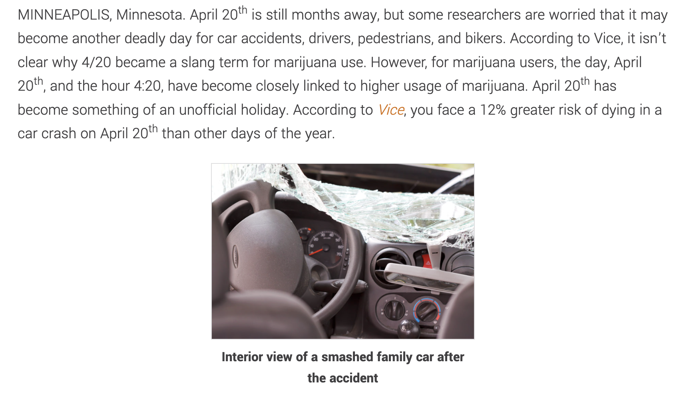{fig-align="center"}

<div style="font-size: 0.6em; margin-top: 0.5em;">
<a href="https://martinmontilino.com/april-20th-deadly-day-for-car-crashes/">
Personal Injury Law Firm Blog Post
</a>
</div>

::::

:::: {.column width="50%"}

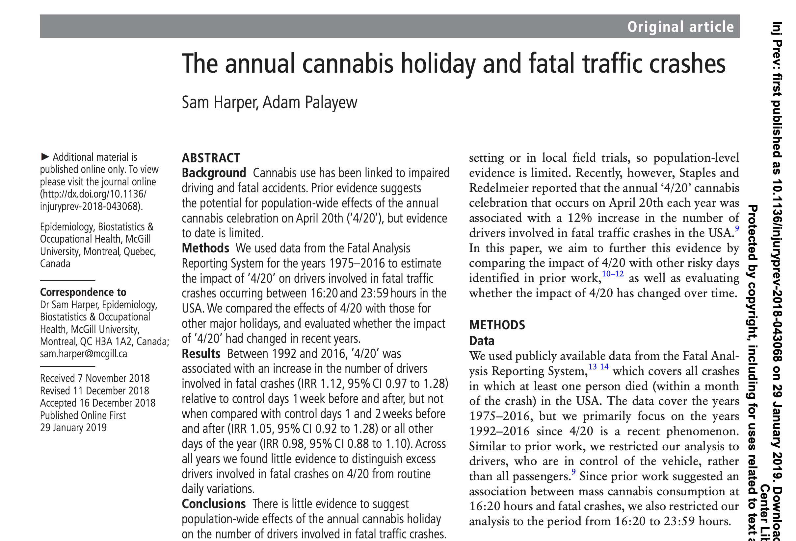{fig-align="center"}

<div style="font-size: 0.6em; margin-top: 0.5em;">
Harper and Palayew’s (2019) study,
<em>"The annual cannabis holiday and fatal traffic crashes"</em>,
available
<a href="https://osf.io/qnrg6/">here</a>.
</div>

::::
::::::

## Causality - TIME coverage

::: question
How plausible is the statement in the title of this article?
:::

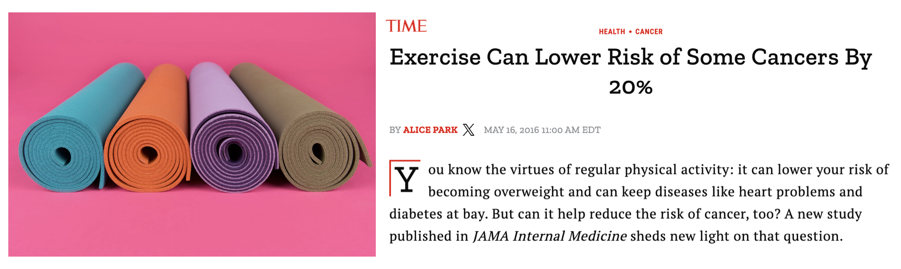

::: aside
Alice Park.
[Exercise Can Lower Risk of Some Cancers By 20%](https://time.com/4330041/reduce-cancer-risk-exercise/).
Time Magazine.
16 May 2016.
:::

## Causality - LA Times coverage

::: question
What does "research shows" mean?
:::

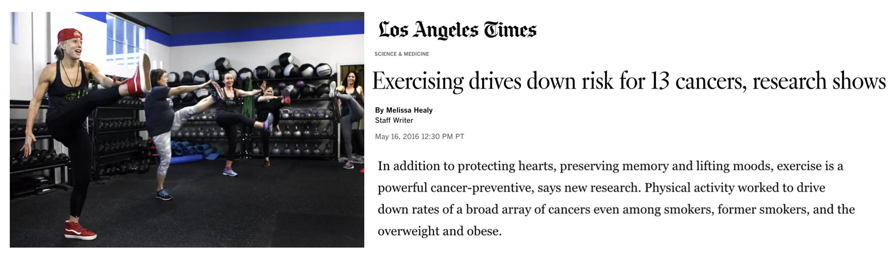

::: aside
Melissa Healy.
[Exercising drives down risk for 13 cancers, research shows](https://www.latimes.com/science/sciencenow/la-sci-sn-exercising-cancer-20160516-story.html).\
Los Angeles Times.
16 May 2016.
:::

## Causality - Original study {.smaller}

Moore, Steven C., et al. [**"Association of leisure-time physical activity with risk of 26 types of cancer in 1.44 million adults."**](https://jamanetwork.com/journals/jamainternalmedicine/fullarticle/2521826) JAMA internal medicine 176.6 (2016): 816-825.

-   **Volunteers** were **asked** about their physical activity level over the preceding year.
-   Half exercised less than about 150 minutes per week, half exercised more.
-   Compared to the bottom 10% of exercisers, the top 10% had lower rates of esophageal, liver, lung, endometrial, colon, and breast cancer.
-   Researchers found no association between exercising and 13 other cancers (e.g. pancreatic, ovarian, and brain).

::: notes
Carl Bergstrom and Jevin West.
[Calling Bullshit: The art of skepticism in a data-driven world](https://www.callingbullshit.org/).\
Random House, 2020.\
Sharon Begley.
["Does exercise prevent cancer?"](https://www.statnews.com/2016/05/16/exercise-prevent-cancer/).
StatNews.
16 May 2016.
:::

## Axes and scales - Tax cuts {.smaller}

::: question
What is the difference between these two pictures?
Which presents a better way to represent these data?
:::

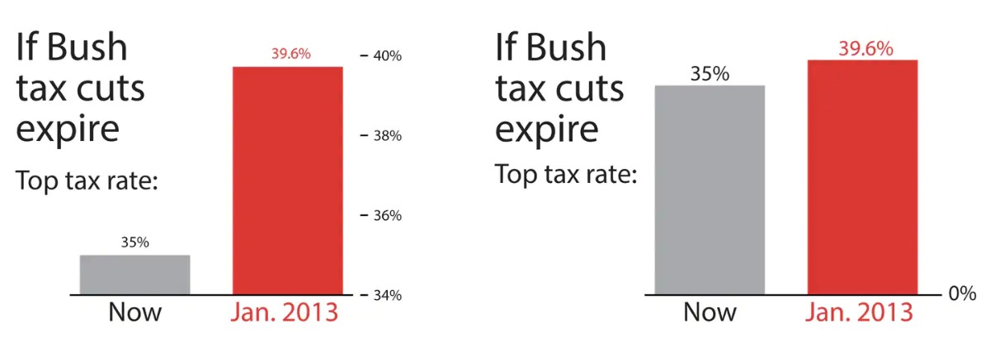

::: aside
Christopher Ingraham.
["You’ve been reading charts wrong. Here’s how a pro does it."](https://www.washingtonpost.com/business/2019/10/14/youve-been-reading-charts-wrong-heres-how-pro-does-it/).
The Washington Post.
14 October 2019.
:::

## Axes and scales - Cost of gas {.smaller}

::: question
What is wrong with this picture?
How would you correct it?
:::

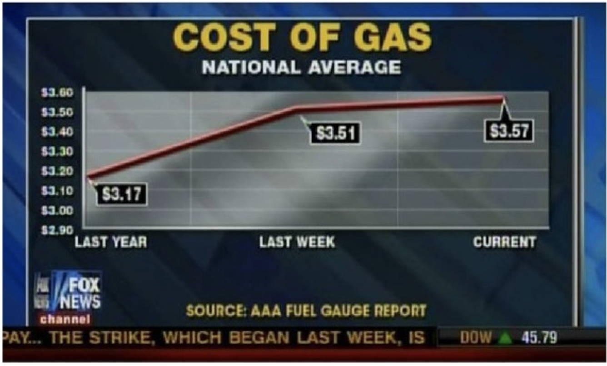{fig-align="center" width="70%"}

## Axes and scales - Cost of gas {.scrollable}

```{r}
#| out-width: 100%
#| eval: true
#| code-fold: true
df <- tibble(
  date = ymd(c("2019-11-01", "2020-10-25", "2020-11-01")),
  cost = c(3.17, 3.51, 3.57)
)
ggplot(df, aes(x = date, y = cost, group = 1)) +
  geom_point() +
  geom_line() +
  geom_label(aes(label = cost), hjust = -0.25) +
  labs(
    title = "Cost of gas",
    subtitle = "National average",
    x = NULL, y = NULL, 
    caption = "Source: AAA Fuel Gauge Report"
  ) +
  scale_x_continuous(
    breaks = ymd(c("2019-11-01", "2020-10-25", "2020-11-01")), 
    labels = c("Last year", "Last week", "Current"),
    guide = guide_axis(angle = 90),
    limits = as.numeric(ymd(c("2019-11-01", "2020-11-29"))),
    minor_breaks = ymd(c("2019-11-01", "2020-10-25", "2020-11-01"))
  ) +
  scale_y_continuous(labels = label_dollar())
```

## Axes and scales - COVID in GA {.smaller}

::: question
What is wrong with this picture?
How would you correct it?
:::

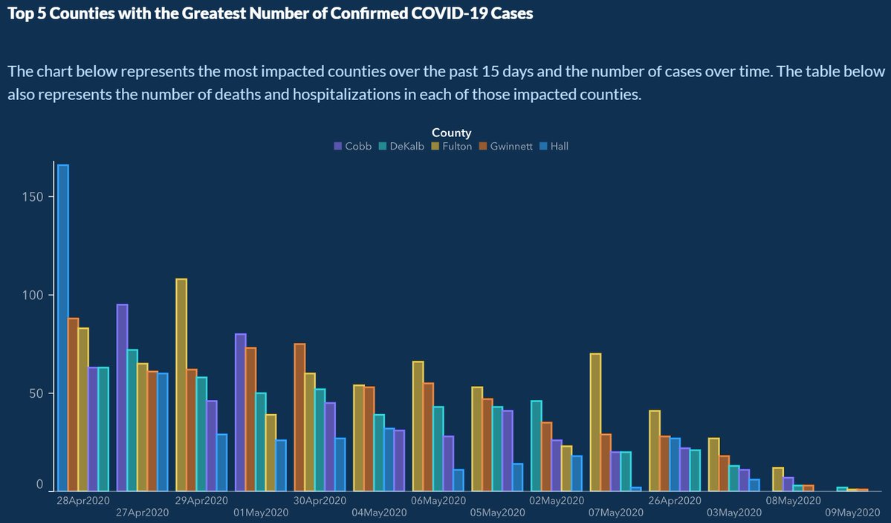{fig-align="center" width="750"}

::: aside
Georgia Department of Public Health.
11 May 2020.
:::

## Axes and scales - COVID in GA

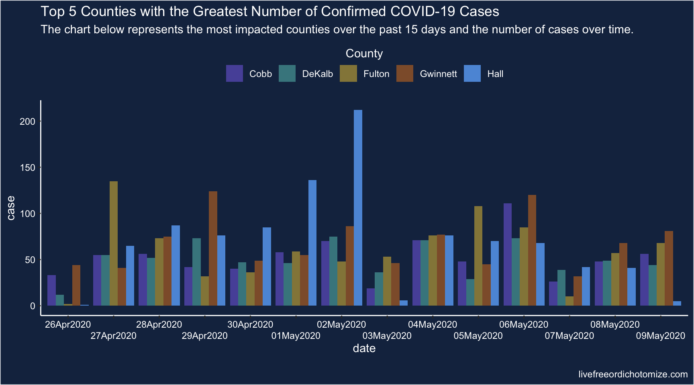{fig-align="center" width="900"}

::: aside
Lucy D'Agostino McGowan.
[Graph detective](https://livefreeordichotomize.com/posts/2020-05-17-graph-detective/).
Live Free or Dichotomize.
17 May 2020.
:::

## Axes and scales - Planned Parenthood services {.smaller}

:::::: columns
:::: {.column width="40%"}
::: question
What is wrong with this picture?
How would you correct it?
:::
::::

::: {.column width="60%" style="vertical-align: top;"}
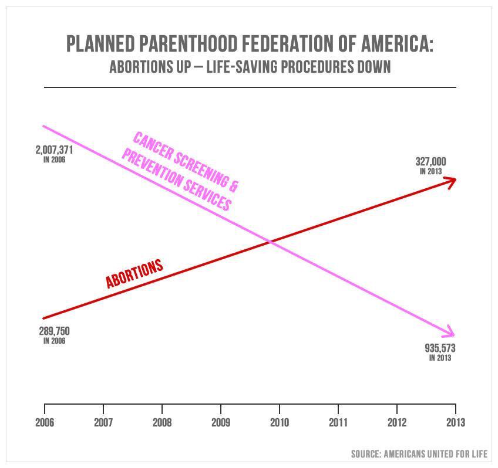{fig-align="center" width="80%"}
:::
::::::

::: aside
Timothy B. Lee.
[Whatever you think of Planned Parenthood, this is a terrible and misleading chart](https://www.vox.com/2015/9/29/9417845/planned-parenthood-terrible-chart).
Vox.
29 September 2019.
:::

## Axes and scales - Planned Parenthood services {.scrollable}

```{r}
#| code-fold: true
pp <- tibble(
  year = c(2006, 2006, 2013, 2013),
  service = c("Abortion", "Cancer", "Abortion", "Cancer"),
  n = c(289750, 2007371, 327000, 935573)
)

ggplot(pp, aes(x = year, y = n, color = service)) +
  geom_point(size = 2) +
  geom_line(linewidth = 1) +
  geom_text(aes(label = n), nudge_y = 100000) +
  geom_text(
    aes(label = year), 
    nudge_y = 200000, 
    color = "darkgray"
  ) +
  labs(
    title = "Services provided by Planned Parenthood",
    caption = "Source: Planned Parenthood",
    x = NULL,
    y = NULL
  ) +
  scale_x_continuous(breaks = c(2006, 2013)) +
  scale_y_continuous(labels = label_number(big.mark = ",")) +
  scale_color_manual(values = c("red", "purple")) +
  annotate(
    geom = "text",
    label = "Abortions",
    x = 2009.5,
    y = 400000,
    color = "red"
  ) +
  annotate(
    geom = "text",
    label = "Cancer screening\nand prevention services",
    x = 2010.5,
    y = 1600000, 
    color = "purple"
  ) +
  theme_minimal() +
  theme(legend.position = "none")
```

## Maps and areas - Voting map

::: question
Do you recognize this map?
What does it show?
:::

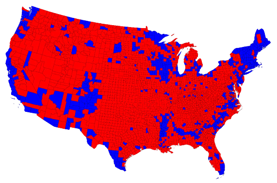{fig-align="center"}

::: aside
Lazaro Gamio.
["Election maps are telling you big lies about small things"](https://www.washingtonpost.com/graphics/politics/2016-election/how-election-maps-lie/).
The Washington Post.
1 Nov 2016.
:::

## Maps and areas - Two alternate tales

::::: columns
::: column
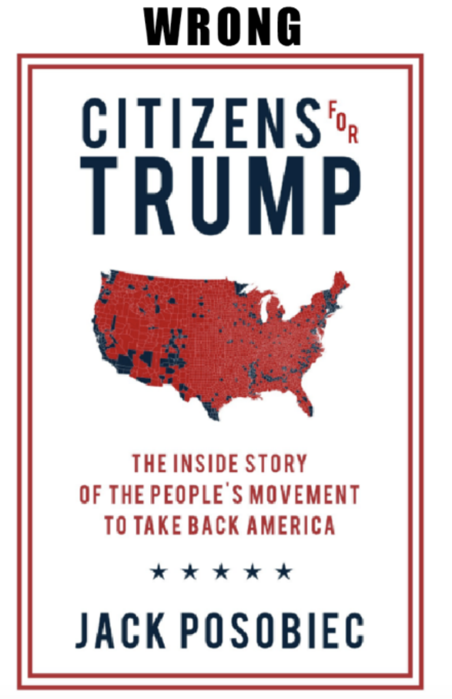{fig-align="center" width="320"}
:::

::: column
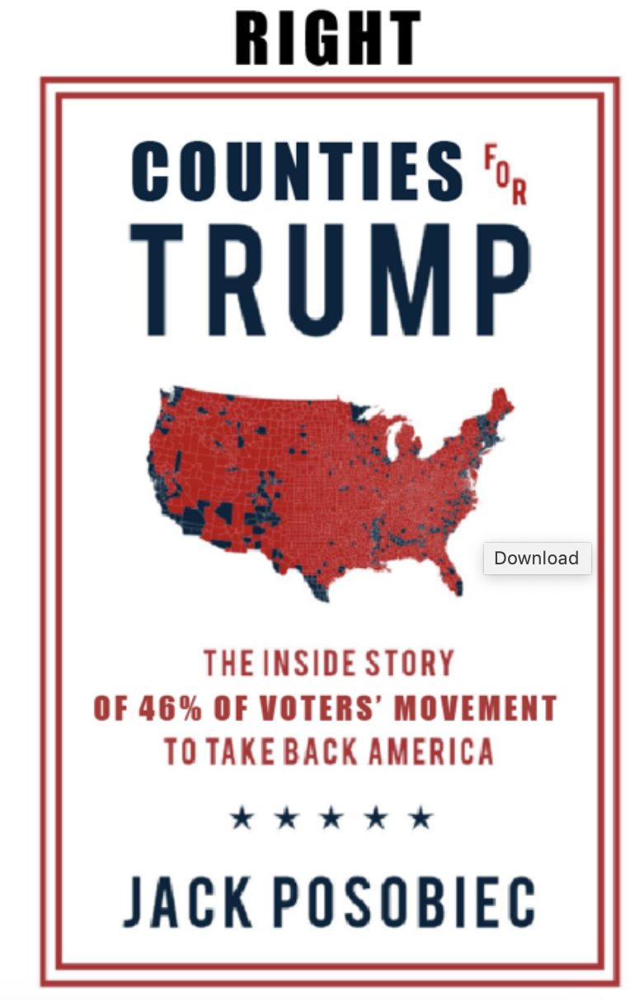{fig-align="center" width="320"}
:::
:::::

::: aside
Alberto Cairo.
[Visual Trumpery talk](https://visualtrumperytour.wordpress.com/).
:::

## Maps and areas - Voting percentages

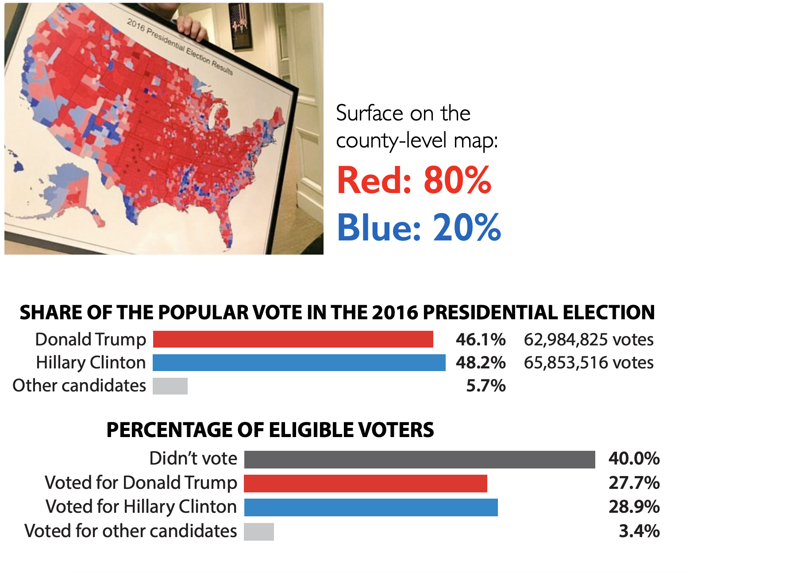{fig-align="center" width="750"}

::: aside
Alberto Cairo.
[Visual Trumpery talk](https://visualtrumperytour.wordpress.com/).
:::

## Maps and areas - Voting percentages

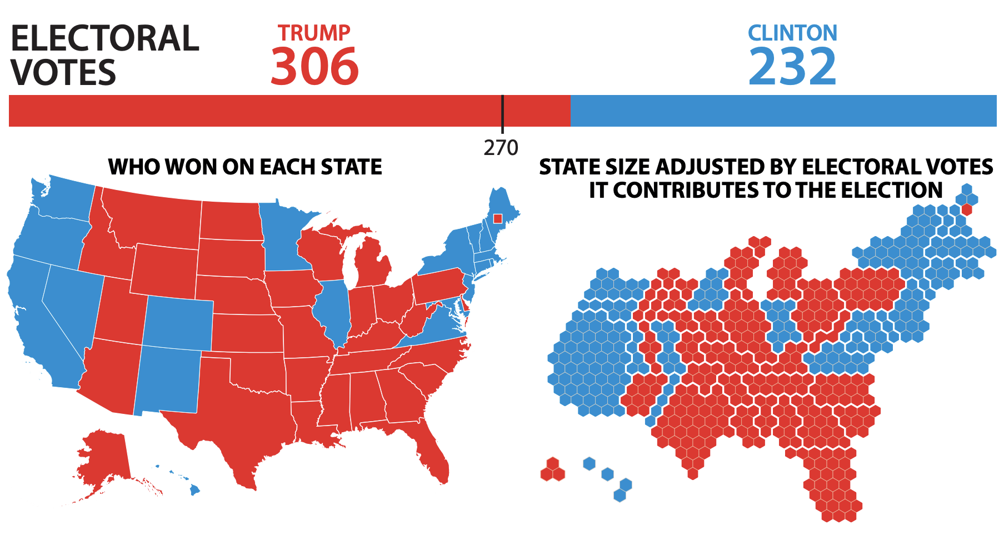{fig-align="center"}

::: aside
Alberto Cairo.
[Visual Trumpery talk](https://visualtrumperytour.wordpress.com/).
:::

## Uncertainty - Catalan independence {.smaller}

On December 19, 2014, the front page of Spanish national newspaper El País read *"Catalan public opinion swings toward 'no' for independence, says survey"*.

```{r}
#| label: catalan-misleading
#| echo: false
#| fig-asp: 0.4
#| out-width: 100%
catalan <- tibble(
  response = c("No", "Yes", "No answer"),
  rate     = c(45.3, 44.5, 10.2)
) |>
  mutate(response = fct_relevel(response, "No", "Yes", "No answer"))

ggplot(catalan, aes(y = fct_rev(response), x = rate, color = response, group = response)) +
  geom_point(size = 3) +
  geom_segment(
    aes(
      x = 0, xend = rate,
      y = fct_rev(response), yend = fct_rev(response)
    ),
    linewidth = 2
  ) +
  scale_color_manual(values = c("#5C8AA9", "#9D303A", "gray")) +
  scale_x_continuous(labels = label_percent(scale = 1)) +
  guides(color = "none") +
  theme_minimal(base_size = 16) +
  labs(
    title = "Do you want Catalonia to become an independent state?",
    caption = "Margin of error: +/-2.95% at 95% confidence level",
    x = NULL, y = NULL
  )
```

::: aside
Alberto Cairo.
[The truthful art: Data, charts, and maps for communication](http://www.thefunctionalart.com/p/the-truthful-art-book.html).
New Riders, 2016.
:::

## Uncertainty - Catalan independence {.smaller}

```{r}
#| label: catalan-corrected
#| echo: false
#| out-width: 100%
#| fig-asp: 0.4
catalan <- catalan |>
  mutate(
    low = rate - 2.95,
    high = rate + 2.95
  )
ggplot(catalan, aes(y = fct_rev(response), x = rate, color = response, group = response)) +
  geom_segment(
    aes(
      x = low, xend = high,
      y = fct_rev(response), 
      yend = fct_rev(response)
    ),
    linewidth = 0.8, color = "black"
  ) +
  geom_point(size = 4) +
  scale_color_manual(values = c("#5C8AA9", "#9D303A", "gray")) +
  scale_x_continuous(labels = label_percent(scale = 1)) +
  guides(color = "none") +
  theme_minimal(base_size = 16) +
  labs(
    title = "Do you want Catalonia to become an independent state?",
    caption = "The probability of the tiny difference between the\n'No' and 'Yes' being just due to random chance is very high.",
    x = NULL, y = NULL
  )
```

::: aside
Alberto Cairo.
["Uncertainty and Graphicacy: How Should Statisticians Journalists and Designers Reveal Uncertainty in Graphics for Public Consumption?"](https://ec.europa.eu/eurostat/cros/powerfromstatistics/OR/PfS-OutlookReport-Cairo.pdf), Power from Statistics: Data Information and Knowledge, 2017.
:::

# Algorithmic bias

## California Proposition 25 (2020) {.smaller}

Popular referendum on 2018's Senate Bill 10:

::: incremental
-   **YES**: replace cash bail with "risk assessment."

    -   Democratic Party, Governor Gavin Newson, League of Women Voters of California, California Medical Association, Democracy for America (progressive PAC), etc.

-   **NO**: keep the cash bail system.

    -   Republican Party, American Bail Coalition, ACLU of Southern California, NAACP, California Asian Pacific Chamber of Commerce, etc.

-   If passed, each county would be empowered to develop a tool that predicts the risk of a suspect reoffending before trial.

-   Judges would consult this prediction to make bail decisions.
:::

## What might "risk assessment" look like? {.smaller}

Something we will study after spring break:

```{r}
#| message: false
#| echo: false
set.seed(20)
n <- 20
cloud1 <- mvrnorm(n, c(-0.5, -0.5), matrix(c(1, 0.5, 0.5, 1), 2, 2))
cloud2 <- mvrnorm(n, c(0.5, 0.5), matrix(c(1, -0.5, -0.5, 1), 2, 2))
X <- rbind(cloud1, cloud2)
y <- c(rep(0, n), rep(1, n))
fit <- glm(y ~ X, family = binomial)

b0 <- fit$coefficients[1]
b1 <- fit$coefficients[2]
b2 <- fit$coefficients[3]

p_thresh <- 0.5

# compute intercept and slope of decision boundary
bd_incpt <- (log(p_thresh / (1 - p_thresh)) - b0) / b2
bd_slp <- -b1 / b2

x_for_poly <- seq(-5, 5, length.out = 500)
y_for_poly <- bd_incpt + bd_slp * x_for_poly

par(mar = c(4, 5, 0.5, 0.5))
plot(X, 
     pch = 19, 
     col = c(rep("orange", n), rep("blue", n)),
     xlab = expression(x[1]),
     ylab = expression(x[2]),
     xlim = c(-4, 4),
     ylim = c(-4, 4),
     cex.lab = 2)
abline(a = bd_incpt, b = bd_slp, lty = 2, lwd = 3)
polygon(c(x_for_poly, rev(x_for_poly)), c(y_for_poly, rep(5, 500)), col = rgb(0, 0, 1, alpha = 0.2), border = NA)
polygon(c(x_for_poly, rev(x_for_poly)), c(y_for_poly, rep(-5, 500)), col = rgb(1, .5, 0, alpha = 0.2), border = NA)
legend("left", expression(hat(y)~" = 0"), text.col = "orange", bty = "n", cex = 2)
legend("right", expression(hat(y)~" = 1"), text.col = "blue", bty = "n", cex = 2)
points(X, pch = 19, 
     col = c(rep("orange", n), rep("blue", n)))
```

Let's say above the line means high risk, which means no bail.
Is this progress?

## What happens when we try "predictive policing"? {.small .scrollable}

2016 ProPublica article on algorithm used for rating a defendant's risk of future crime:

::::: columns
::: {.column width="70%"}
> In forecasting who would re-offend, the algorithm made mistakes with black and white defendants at roughly the same rate but in very different ways.
>
> -   The formula was particularly likely to falsely flag black defendants as future criminals, wrongly labeling them this way at almost twice the rate as white defendants.
>
> -   White defendants were mislabeled as low risk more often than black defendants.
:::

::: {.column width="30%"}
{fig-align="center" width="800"}
:::
:::::

::: aside
Source: [ProPublica](https://www.propublica.org/article/machine-bias-risk-assessments-in-criminal-sentencing)
:::

## Notice anything?

:::::::: columns
:::: {.column width="35%"}
::: question
What is common among the defendants who were assigned a high/low risk score for reoffending?
:::
::::

::: {.column width="5%"}
:::

::: {.column width="30%"}
{fig-align="center" width="300" height="250"} 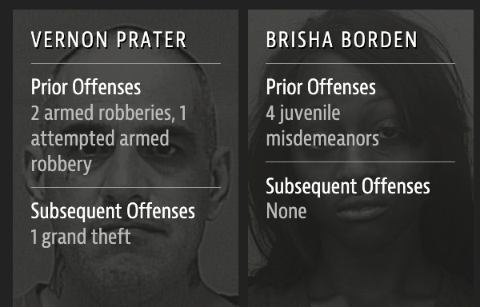{fig-align="center" width="300" height="180"}
:::

::: {.column width="30%"}
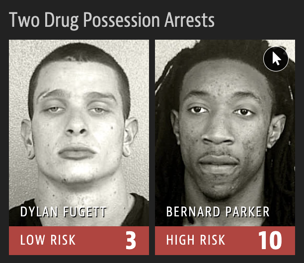{fig-align="center" width="300" height="250"} 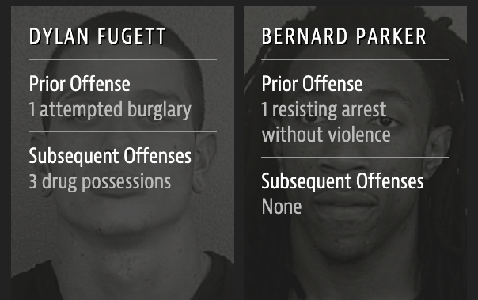{fig-align="center" width="300" height="180"}
:::
::::::::

## "But race wasn't in my model"

::::::: columns
:::: {.column width="35%"}
::: question
How can an algorithm that doesn't use race as input data be racist?
:::
::::

::: {.column width="5%"}
:::

::: {.column width="60%"}
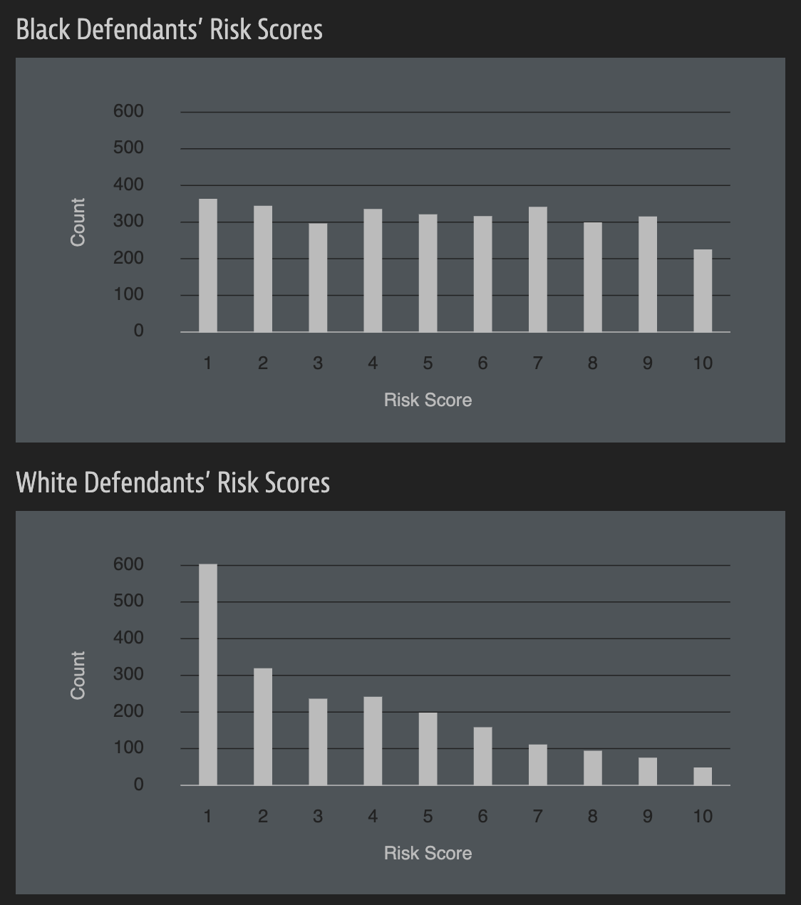{fig-align="center" width="480"}
:::
:::::::

## Predicting ethnicity {.small .scrollable}

[Improving Ecological Inference by Predicting Individual Ethnicity from Voter Registration Record](https://imai.fas.harvard.edu/research/race.html) (Imran and Khan, 2016)

> In both political behavior research and voting rights litigation, turnout and vote choice for different racial groups are often inferred using aggregate election results and racial composition.
> Over the past several decades, many statistical methods have been proposed to address this ecological inference problem.
> We propose an alternative method to reduce aggregation bias by predicting individual-level ethnicity from voter registration records.
> Building on the existing methodological literature, we use Bayes’s rule to combine the Census Bureau’s Surname List with various information from geocoded voter registration records.
> We evaluate the performance of the proposed methodology using approximately nine million voter registration records from Florida, where self-reported ethnicity is available.
> We find that it is possible to reduce the false positive rate among Black and Latino voters to 6% and 3%, respectively, while maintaining the true positive rate above 80%.
> Moreover, we use our predictions to estimate turnout by race and find that our estimates yields substantially less amounts of bias and root mean squared error than standard ecological inference estimates.
> We provide open-source software to implement the proposed methodology.
> The open-source software is available for implementing the proposed methodology.

## **wru** package

The said “source software” is the wru package: <https://github.com/kosukeimai/wru>.

::: question
Do you have any ethical concerns about installing this package?
:::

## **wru** package {.medium}

::: question
Was the publication of this model ethical?
Does the open-source nature of the code affect your answer?
Is it ethical to use this software?
Does your answer change depending on the intended use?
:::

```{r}
#| cache: true
#| message: false
library(wru)
predict_race(voter.file = voters, surname.only = TRUE) |>
  select(surname, pred.whi, pred.bla, pred.his, pred.asi, pred.oth)
```

## **wru** package

```{r}
#| cache: true
#| message: false
#| warning: false

me <- tibble(surname = "Solarz")

predict_race(voter.file = me, surname.only = TRUE)
```

## California Prop 25 did not pass {.smaller}

The cash bail system was retained:

| Choice | Votes         | Percent |
|--------|---------------|---------|
| Yes    | 7,232,380     | 43.59%  |
| **No** | **9,358,226** | 56.41%  |

::: incremental
-   reasonable people can debate if this outcome is good or bad;
-   every Californian was invited to decide whether statistics and data science should be deployed to make decisions with major social consequences. They opted out;
-   This vote was held in the pre-ChatGPT era. What would the outcome be today? Is the case for **YES** stronger or weaker?
:::

## Another algorithmic decision...

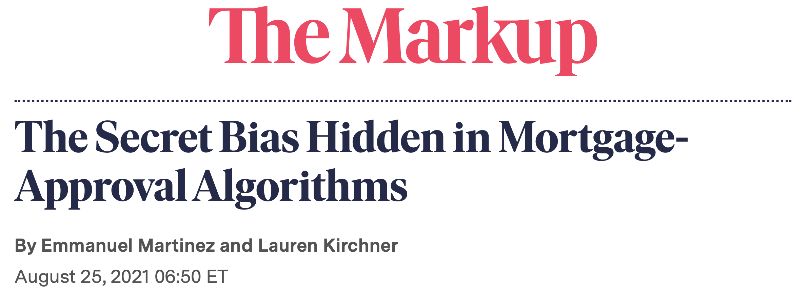 Armies of stats PhDs go to work on these models.
They have no training in the ethics of what they're doing.

## A success story?

. . .

`Data` + `Model` to predict timing of menstrual cycle:

{width="24%"} {width="24%"} {width="24%"} {width="24%"}

. . .

A perfect microcosm of the themes of our course, and maybe one of the real triumphs of data and modeling improving modern life.

. . .

...but what if you learned they were selling your data?

# Data privacy

(aka the reason Tony Soprano ripped the GPS out of this Escalade)

## According to my family members, this would be...very bad for me {.scrollable}

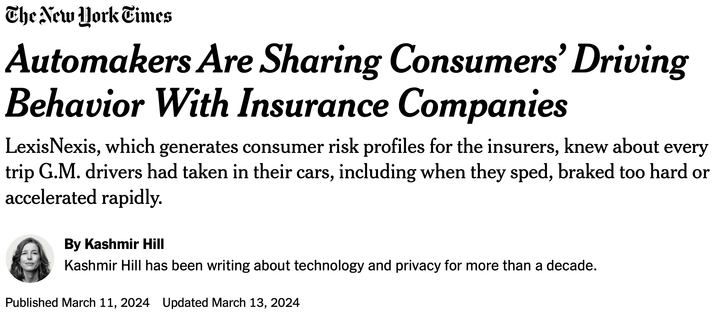

::: aside
Kashmir Hill [Automakers Are Sharing Consumers’ Driving Behavior With Insurance Companies](https://www.nytimes.com/2024/03/11/technology/carmakers-driver-tracking-insurance.html).\
New York Times.
March 11, 2024.
:::

## Yikes... {.scrollable}

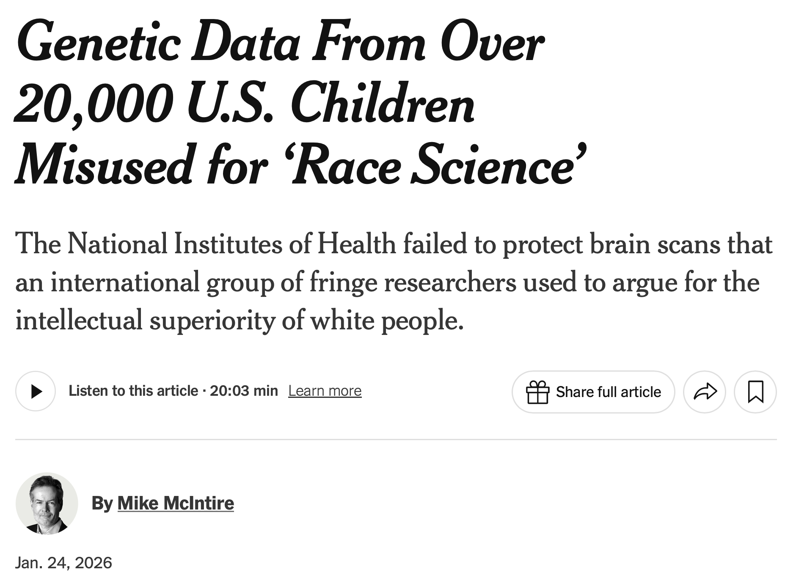{fig-align="center" width="60%"}

::: aside
Mike McIntire [Genetic Data From Over 20,000 U.S. Children Misused for 'Race Science'](https://www.nytimes.com/2026/01/24/us/children-genetics-race-science.html).\
New York Times.
Jan. 24, 2026.
:::

## "Your" data

-   Every time we use apps, websites, and devices, our data is being collected and used or sold to others.

-   More importantly, decisions are made by law enforcement, financial institutions, and governments based on data that directly affect the lives of people.

## Privacy of your data

::: question
What pieces of data have you left on the internet today?
Think through everything you've logged into, clicked on, checked in, either actively or automatically, that might be tracking you.
Do you know where that data is stored?
Who it can be accessed by?
Whether it's shared with others?
:::

## Sharing your data {.smaller}

::: question
What are you OK with sharing?
:::

::::::: columns
:::: {.column width="50%"}
::: incremental
-   Name
-   Age
-   Email
-   Phone Number
-   List of every video you watch
-   List of every video you comment on
:::
::::

:::: {.column width="50%"}
::: incremental
-   How you type: speed, accuracy
-   How long you spend on different content
-   List of all your private messages (date, time, person sent to)
-   Info about your photos: how it was taken, where it was taken (GPS), when it was taken
:::
::::
:::::::

## What does Google think/know about you?

::: question
Have you ever thought about why you're seeing an ad on Google?
Google it!
Try to figure out if you have ad personalization on and how your ads are personalized.
:::

## Your browsing history

::: question
Which of the following are you OK with your browsing history to be used towards?
:::

::: incremental
-   For serving you targeted ads
-   To score you as a candidate for a job
-   To predict your race/ethnicity for voting purposes
:::

## Who else gets to use your data?

::: question
Suppose you create a profile on a social media site and share your personal information on your profile.
Who else gets to use that data?
:::

::: incremental
-   Companies the social media company has a connection to?
-   Companies the social media company sells your data to?
-   Researchers?
:::

## AOL search data leak {.smaller}

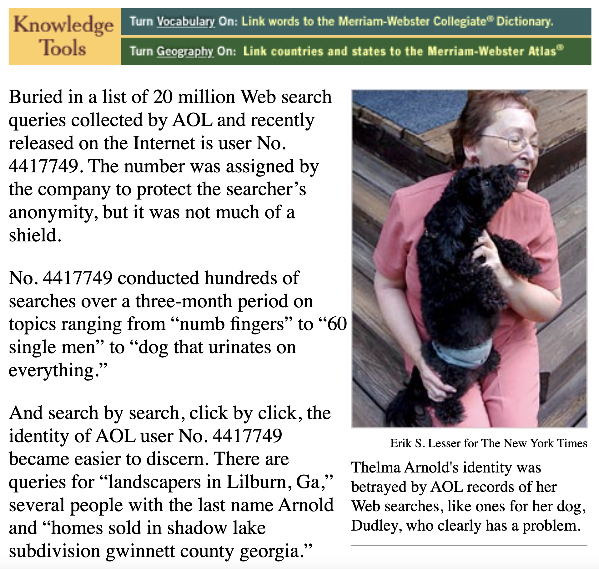{fig-align="center" width="500"}

::: aside
Michael Barbaro and Tom Zeller Jr.
[A Face Is Exposed for AOL Searcher No. 4417749](https://www.nytimes.com/2006/08/09/technology/09aol.html).\
New York Times.
9 August 2006.
:::

## OK Cupid data breach

-   In 2016, researchers published data of 70,000 OkCupid users—including usernames, political leanings, drug usage, and intimate sexual details

-   Researchers didn't release the real names and pictures of OKCupid users, but their identities could easily be uncovered from the details provided, e.g. usernames

## OK Cupid data breach

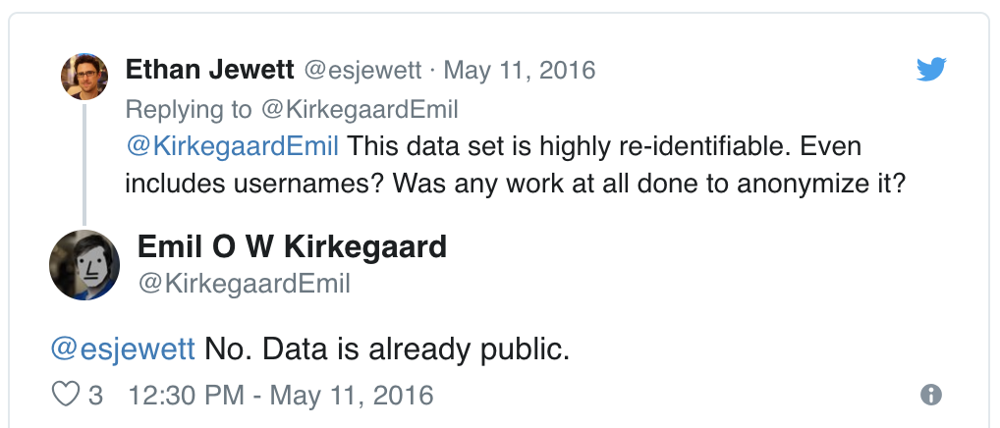

## OK Cupid data breach

> Some may object to the ethics of gathering and releasing this data.
> However, all the data found in the dataset are or were already publicly available, so releasing this dataset merely presents it in a more useful form.
>
> Researchers Emil Kirkegaard and Julius Daugbjerg Bjerrekær

## Data privacy

::: question
In analysis of data that individuals willingly shared publicly on a given platform (e.g. social media), how do you make sure you don't violate reasonable expectations of privacy?
:::

# Some good news?

## Faster, more accurate cancer screening?

Augmenting doctors' diagnostic capacity so that they make fewer mistakes, treat more people, and focus on other aspects of care:

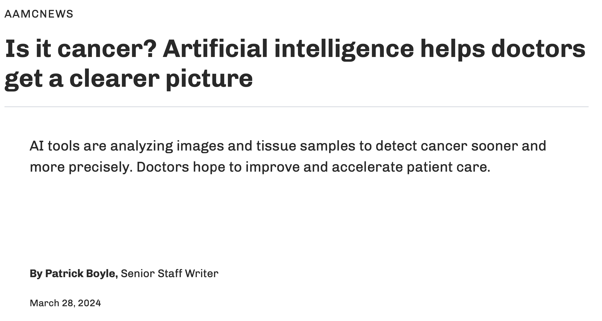{fig-align="center" width="700"}

## Recent Nobel Prize

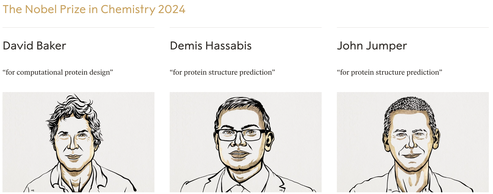{fig-align="center" width="550"}

-   AlphaFold2: "predicting 3D structures \[of proteins\] ($y$) directly from the primary amino acid sequence ($x$)."

-   "researchers can now better understand antibiotic resistance and create images of enzymes that can decompose plastic."

# Further reading

## How Charts Lie

::::: columns
::: column
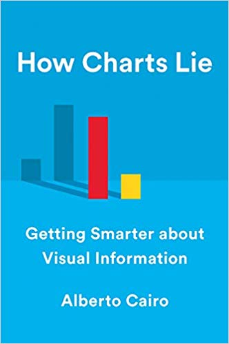{width="400"}
:::

::: column
[How Charts Lie](http://www.thefunctionalart.com/p/reviews.html)

Getting Smarter about Visual Information

by Alberto Cairo
:::
:::::

## Calling Bullshit

::::: columns
::: column
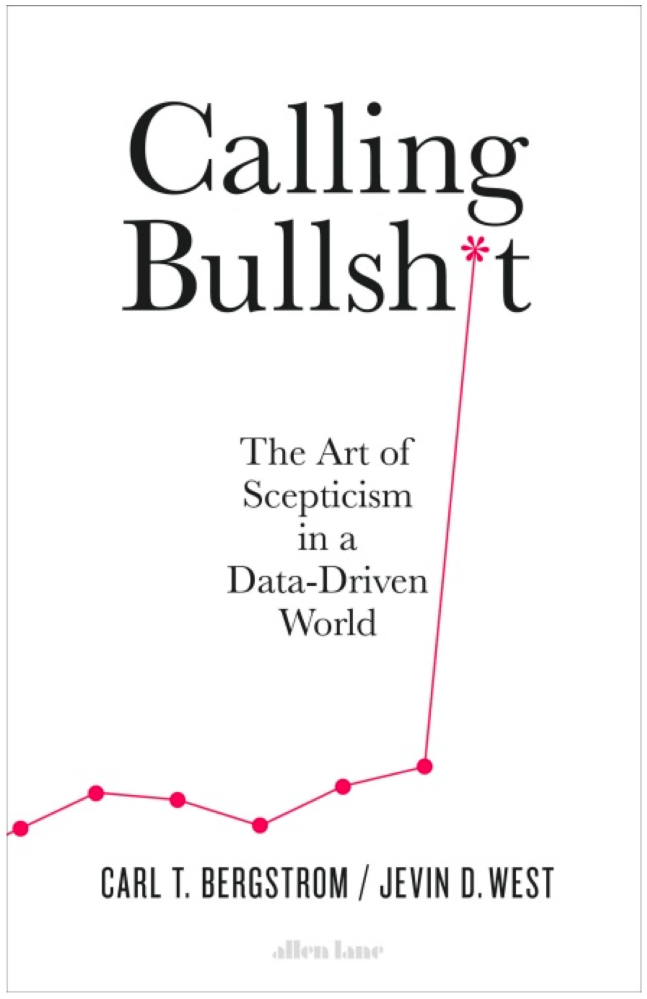{width="400"}
:::

::: column
[Calling Bullshit](https://www.callingbullshit.org/)\
The Art of Skepticism in a\
Data-Driven World

by Carl Bergstrom and Jevin West
:::
:::::

## Machine Bias

::::: columns
::: column
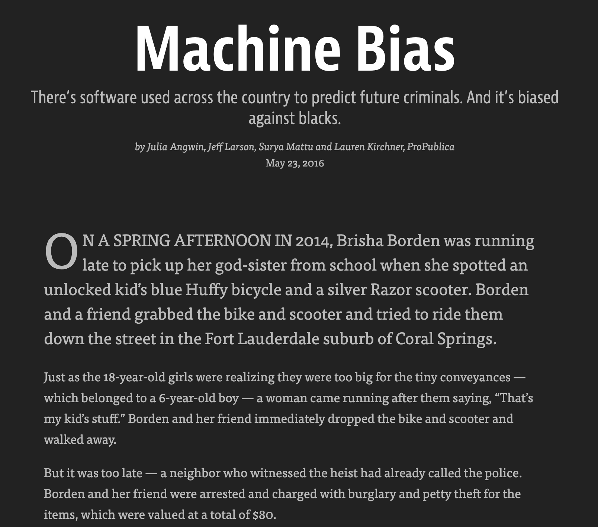{width="400"}
:::

::: column
[Machine Bias](https://www.propublica.org/article/machine-bias-risk-assessments-in-criminal-sentencing)\

by Julia Angwin, Jeff Larson, Surya Mattu, and Lauren Kirchner
:::
:::::

## Ethics and Data Science

::::: columns
::: column
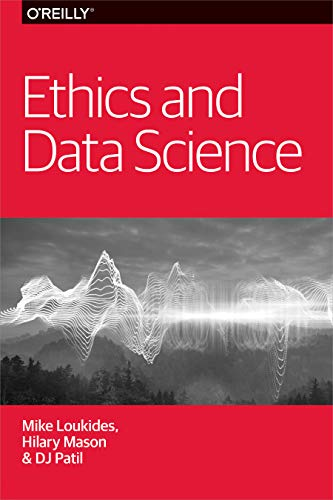{width="400"}
:::

::: column
[Ethics and Data Science](https://www.amazon.com/Ethics-Data-Science-Mike-Loukides-ebook/dp/B07GTC8ZN7)\

by Mike Loukides, Hilary Mason, DJ Patil\
(Free Kindle download)
:::
:::::

## Weapons of Math Destruction

::::: columns
::: column
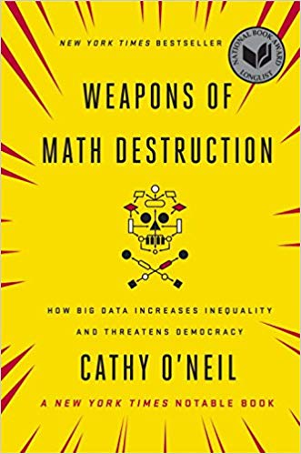{width="400"}
:::

::: column
[Weapons of Math Destruction](https://www.penguin.co.uk/books/304/304513/weapons-of-math-destruction/9780141985411.html)\
How Big Data Increases Inequality and Threatens Democracy\

by Cathy O'Neil
:::
:::::

## Algorithms of Oppression

::::: columns
::: column
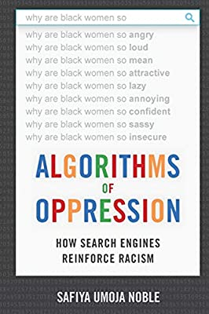{width="400"}
:::

::: column
[Algorithms of Oppression](https://nyupress.org/9781479837243/algorithms-of-oppression/)\
How Search Engines Reinforce Racism\

by Safiya Umoja Noble
:::
:::::

## And more recently...

[How AI discriminates and what that means for your Google habit](https://newsroom.ucla.edu/stories/how-ai-discriminates-and-what-that-means-for-your-google-habit)\
A conversation with UCLA internet studies scholar Safiya Noble\

by Julia Busiek

## Parting thoughts {.scrollable .smaller}

-   At some point during your data science learning journey you will learn tools that can be used unethically

-   You might also be tempted to use your knowledge in a way that is ethically questionable either because of business goals or for the pursuit of further knowledge (or because your boss told you to do so)

::: question
How do you train yourself to make the right decisions (or reduce the likelihood of accidentally making the wrong decisions) at those points?
:::
