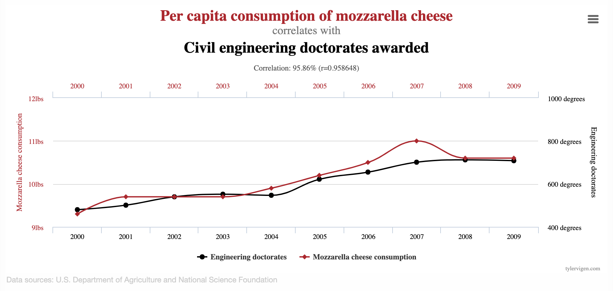
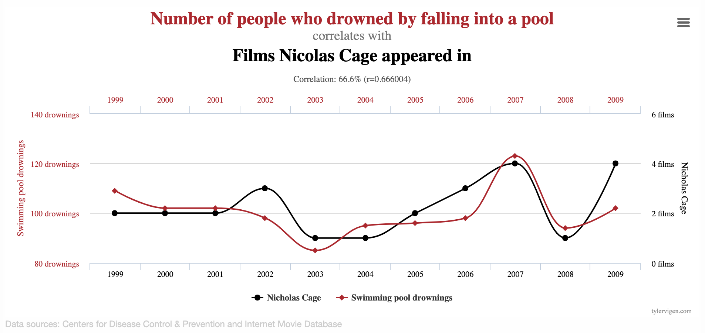

```{r}
#| include: false
library(tidyverse)
library(tidymodels)
library(fivethirtyeight)
movie_scores <- fandango |>
  rename(
    critics = rottentomatoes, 
    audience = rottentomatoes_user
  )
todays_ae <- "ae-13-modeling-penguins"
```

# Correlation vs. causation

## Spurious correlations

{fig-align="center"}

::: aside
Source: [tylervigen.com/spurious-correlations](https://www.tylervigen.com/spurious-correlations)
:::

## Spurious correlations

{fig-align="center"}

::: aside
Source: [tylervigen.com/spurious-correlations](https://www.tylervigen.com/spurious-correlations)
:::

# Simple Linear Regression

## Data prep

-   Rename Rotten Tomatoes columns as `critics` and `audience`
-   Rename the dataset as `movie_scores`

```{r data-prep}
#| echo: true

movie_scores <- fandango |>
  rename(
    critics = rottentomatoes, 
    audience = rottentomatoes_user
  )
```

## Data overview

```{r data-overview}
#| echo: true
movie_scores |>
  select(critics, audience)
```

## Data visualization {.small}

```{r}
#| echo: false
#| fig-height: 4.5
ggplot(movie_scores, aes(x = critics, y = audience)) +
  geom_point(alpha = 0.5) + 
  labs(
    x = "Critics Score" , 
    y = "Audience Score"
  )
```

## Quick aside: which is which? {.smaller}

How do we know which variable "should" be the response and which should be the predictor.
This will depend on the domain and the research question, but in some cases there is a natural choice.
In this example, the critic score for a film is typically available before the audience score.
Critics can often screen the film in advance, and their reviews are published on opening day.
By contrast, the audience score trickles in over the subsequent weeks.
So it's more likely that we would already have the critics score and use it to anticipate the audience score, instead of the other way around.

## Data visualization: linear model {.scrollable .small}

```{r}
#| echo: false
#| message: false
#| fig-height: 4.5
ggplot(movie_scores, aes(x = critics, y = audience)) +
  geom_smooth(method = "lm", color = "cornflowerblue", se = FALSE) +
  geom_point(alpha = 0.5) + 
  labs(
    x = "Critics Score" , 
    y = "Audience Score"
  )
```

::::: columns
::: {.column width="70%"}
```{r}
#| echo: false
#| message: false

tidy(lm(audience ~ critics, data = movie_scores))
```
:::

::: {.column width="40%"}
:::
:::::

## Data visualization: linear model {.scrollable .small}

```{r}
#| echo: false
#| message: false
#| fig-height: 4.5
ggplot(movie_scores, aes(x = critics, y = audience)) +
  geom_smooth(method = "lm", color = "cornflowerblue", se = FALSE) +
  geom_point(alpha = 0.5) + 
  labs(
    x = "Critics Score" , 
    y = "Audience Score"
  )# +
  #stat_ellipse(geom = "polygon", color = "#FE5D26", fill = "#FE5D2630", type = "norm")
```

::::: columns
::: {.column width="70%"}
```{r}
#| echo: false
#| message: false

tidy(lm(audience ~ critics, data = movie_scores))
```
:::

::: {.column width="30%"}
```{r}
#| message: false
#| echo: false

movie_scores |>
  summarize(r = cor(audience, critics))

```
:::
:::::

## Prediction {.small}

::::: columns
::: {.column width="60%"}
```{r}
#| echo: false

audience_critic_fit <- linear_reg() |> fit(audience ~ critics, data = movie_scores)

new_movies <- tibble(
  critics = c(20, 37.5, 88)
)

preds <- predict(audience_critic_fit, new_data = new_movies)

ggplot(movie_scores, aes(x = critics, y = audience)) +
  geom_smooth(method = "lm", color = "cornflowerblue", se = FALSE) +
  geom_point(alpha = 0.5) + 
  labs(
    x = "Critics Score" , 
    y = "Audience Score"
  )  +
  annotate(
    "segment",
    x = new_movies$critics[1], xend = new_movies$critics[1], y = -Inf, yend = preds$.pred[1],
    color = "deeppink"
  ) +
  annotate(
    "segment",
    x = -Inf, xend = new_movies$critics[1], y = preds$.pred[1], yend = preds$.pred[1],
    color = "deeppink"
  )  +
  annotate(
    "segment",
    x = new_movies$critics[2], xend = new_movies$critics[2], y = -Inf, yend = preds$.pred[2],
    color = "deeppink"
  ) +
  annotate(
    "segment",
    x = -Inf, xend = new_movies$critics[2], y = preds$.pred[2], yend = preds$.pred[2],
    color = "deeppink"
  )  +
  annotate(
    "segment",
    x = new_movies$critics[3], xend = new_movies$critics[3], y = -Inf, yend = preds$.pred[3],
    color = "deeppink"
  ) +
  annotate(
    "segment",
    x = -Inf, xend = new_movies$critics[3], y = preds$.pred[3], yend = preds$.pred[3],
    color = "deeppink"
  ) +
  theme_minimal()
```
:::

::: {.column width="40%"}
```{r}
#| message: false
#| echo: false

audience_critic_fit <- linear_reg() |> fit(audience ~ critics, data = movie_scores)

```

```{r}

new_movies <- tibble(
  critics = c(20, 37.5, 88)
)

predict(audience_critic_fit, 
        new_data = new_movies)

augment(audience_critic_fit,
        new_data = new_movies)
```
:::
:::::

# Simple Linear Regression: How R Did It

## Regression model {.scrollable .medium}

A **regression model** is a function that describes the relationship between the outcome, $Y$, and the predictor, $X$.

$$
\begin{aligned} Y &= \color{black}{\textbf{Model}} + \text{Error} \\[8pt]
&= \color{black}{\mathbf{f(X)}} + \epsilon \\[8pt]
&= \color{black}{\boldsymbol{\mu_{Y|X}}} + \epsilon \end{aligned}
$$

$\mu_{Y \mid X}$ is the *expected value* of $Y$, *given* (or, *conditional on*) a particular value of $X$

## Regression model

::::: columns
::: {.column width="30%"}
$$
\begin{aligned} Y &= \color{#6495ED}{\textbf{Model}} + \text{Error} \\[8pt]
&= \color{#6495ED}{\mathbf{f(X)}} + \epsilon \\[8pt]
&= \color{#6495ED}{\boldsymbol{\mu_{Y|X}}} + \epsilon 
\end{aligned}
$$
:::

::: {.column width="70%"}
```{r}
#| echo: false
#| message: false

m <- lm(audience ~ critics, data = movie_scores)
ggplot(data = movie_scores, 
       mapping = aes(x = critics, y = audience)) +
  geom_point(alpha = 0.5) + 
  geom_smooth(method = "lm", color = "#6495ED", se = FALSE, linewidth = 1.5) +
  labs(x = "X", y = "Y") +
  theme_minimal() +
  theme(
    axis.text = element_blank(),
    axis.ticks.x = element_blank(), 
    axis.ticks.y = element_blank()
    )
```
:::
:::::

## Simple linear regression {.smaller}

-   Use **simple linear regression** to model the relationship between a quantitative outcome ($Y$) and a **single** quantitative predictor ($X$)

-   The “idealized” linear regression model, revealed only with **infinite** data:

$$\Large{Y = \beta_0 + \beta_1 X + \epsilon}$$

::: incremental
-   $\beta_1$: True slope of the relationship between $X$ and $Y$
-   $\beta_0$: True intercept of the relationship between $X$ and $Y$
-   $\epsilon$: Error (residual)
:::

## Simple linear regression {.smaller}

-   The "fitted" model, obtained by estimating $\beta_0$ and $\beta_1$ using a finite sample ($x_1, y_1$), ($x_2, y_2$), ..., ($x_n, y_n$)

$$\Large{\widehat{Y} = b_0 + b_1 X}$$

-   $b_1$: Estimated slope of the relationship between $X$ and $Y$; you may also see $\widehat{\beta_1}$

-   $b_0$: Estimated intercept of the relationship between $X$ and $Y$; you may also see $\widehat{\beta_0}$

-   No error term!

-   Ideally, as $n \to \infty$, $b_0 \to \beta_0$ and $b_1 \to \beta_1$

## Why did the notation change? {.small}

You're already familiar with $y=mx+b$, so why did I switch it up on you?
Why the subscripts?
Why the Greek letters?

-   Today, we're studying *simple* linear regression where there is only one predictor. Tomorrow, we will study *multiple* linear regression, where there are \>1 predictors, and each one gets its own coefficient. When you go from 1 predictor to 5 or 10 or 1,000, you run out of letters. So it's easier to add subscripts to the same letter, arbitrarily chosen to be $x$;
-   The Greek letters denote true, idealized, population values. These are unknown. If we had perfect data, we would know them, but we don't.
-   The lowercase roman letters denote estimated values based on a finite, imperfect sample. These are our best guess at the true values based on the data we have.

## Choosing values for $b_1$ and $b_0$

```{r}
#| echo: false
#| message: false
ggplot(movie_scores, aes(x = critics, y = audience)) +
  geom_point(alpha = 0.4) + 
  geom_abline(intercept = 32.3155, slope = 0.5187, color = "deeppink", linewidth = 1.5) +
  geom_abline(intercept = 25, slope = 0.7, color = "gray") +
  geom_abline(intercept = 21, slope = 0.9, color = "gray") +
  geom_abline(intercept = 35, slope = 0.3, color = "gray") +
  labs(x = "Critics Score", y = "Audience Score")
```

## Residuals {.smaller}

```{r}
#| message: false
#| echo: false
#| fig-align: center
ggplot(movie_scores, aes(x = critics, y = audience)) +
  geom_point(alpha = 0.5) +
  geom_smooth(method = "lm", color = "cornflowerblue", se = FALSE, linewidth = 1.5) +
  geom_segment(aes(x = critics, xend = critics, y = audience, yend = predict(m)), color = "steel blue") +
  labs(x = "Critics Score", y = "Audience Score") +
  theme(legend.position = "none")
```

$$\text{residual} = \text{observed} - \text{predicted} = y - \widehat{y}$$

## Notation

::: incremental
-   We have $n$ observations (generally, the number of rows in a df)

-   $i^{th}$ observation ($i$ from $1$ to $n$):

    -   $y_i$ : $i^{th}$ outcome

    -   $x_i$ : $i^{th}$ explanatory variable

    -   $\widehat{y_i}$ : $i^{th}$ predicted outcome

    -   $e_i$ : $i^{th}$ residual
:::

## Least squares line {.smaller}

-   The residual for the $i^{th}$ observation is

$$e_i = \text{observed} - \text{predicted} = y_i - \widehat{y}_i$$

-   The **sum of squared** residuals is

$$e^2_1 + e^2_2 + \dots + e^2_n$$

-   The **least squares line** is the one that **minimizes the sum of squared residuals (SSR)**

## Perhaps more clearly... {.scrollable .smaller}

| **data** |   | **residuals** |
|:----------------------:|:----------------------:|:----------------------:|
| $x_1 \quad y_1$ | $\rightarrow$ | $e_1 = y_1 - \widehat{y_1} = y_1 - (b_0 + b_1 \times x_1)$ |
| $x_2 \quad y_2$ | $\rightarrow$ | $e_2 = y_2 - \widehat{y_2} = y_2 - (b_0 + b_1 \times x_2)$ |
| $x_3 \quad y_3$ | $\rightarrow$ | $e_3 = y_3 - \widehat{y_3} = y_3 - (b_0 + b_1 \times x_3)$ |
| ... | $\rightarrow$ | ... |
| $x_n \quad y_n$ | $\rightarrow$ | $e_n = y_n - \widehat{y_n} = y_n - (b_0 + b_1 \times x_n)$ |

$$
\downarrow
$$

$$
e_1^2 +
e_2^2 +
e_3^2 +
\ldots +
e_n^2
$$

<center>sum of squared residuals</center>

We pick $b_0$ and $b_1$ so that

$$
\sum_{i=1}^{n} e_i^2
$$

is as small as possible ("best fit").

## Why "least-squares" regression? {.scrollable .smaller}

Why do we minimize

$$
\sum_{i=1}^{n} e_i^2,
$$

and not

$$
\sum_{i=1}^{n} e_i,
$$

or

$$
\sum_{i=1}^{n} |e_i| \; ?
$$

## Why not minimize $\sum e_i$? {.scrollable .smaller}

Suppose our residuals are

$$
-4,\; -2,\; 1,\; 2,\; 3
$$

Then

$$
\sum_{i=1}^n e_i
=
(-4)+(-2)+1+2+3
=
0.
$$

But the predictions are clearly **not perfect**!

<br>

**Problem:** Positive and negative residuals cancel each other out.

$$
-4 + 4 = 0
$$

even though both residuals represent prediction errors.

## Why squared errors help {.scrollable .smaller}

Using the same residuals,

$$
-4,\; -2,\; 1,\; 2,\; 3
$$

the sum of squared residuals is

$$
(-4)^2 + (-2)^2 + 1^2 + 2^2 + 3^2
=
34.
$$

Now all prediction errors contribute positively to the summation.

-   Large errors count more heavily (i.e., we are penalizing larger residuals);
-   Positive and negative errors cannot cancel;
-   The "best" line has the smallest total squared error.

## Why not just minimize $\sum |e_i|$? {.scrollable .smaller}

Absolute error solves the cancellation problem:

$$
-4,\; -2,\; 1,\; 2,\; 3
$$

$$
|{-4}| + |{-2}| + |1| + |2| + |3|
=
12
$$

So every prediction error contributes positively.
However, squared error has an important advantage:

$$
e^2
$$

is a smooth curve, while

$$
|e|
$$

has a sharp point at $e=0$.

<br>

As a result:

-   Squared error is easier to optimize mathematically (derivative exists for all points);
-   Squared error leads to a simple formula for the regression line;
-   Large mistakes are penalized more heavily.

Therefore, we usually minimize

$$
\sum_{i=1}^n e_i^2.
$$

## Put in a picture... {.scrollable .smaller}

```{r}
#| echo: false
#| fig-width: 8
#| fig-height: 4.6
#| fig-align: center
#| out-width: "80%"

library(tidyverse)

error_df <- tibble(
  e = seq(-4, 4, length.out = 500),
  `Squared error` = e^2,
  `Absolute error` = abs(e)
) |>
  pivot_longer(
    cols = c(`Squared error`, `Absolute error`),
    names_to = "loss",
    values_to = "value"
  )

ggplot(error_df, aes(x = e, y = value, color = loss)) +
  geom_hline(yintercept = 0, linewidth = 0.4) +
  geom_vline(xintercept = 0, linewidth = 0.4) +
  geom_line(linewidth = 1.3) +
  annotate("point", x = 0, y = 0, size = 3) +
  annotate("text", x = 0.45, y = -0.75, label = "(0, 0)", size = 5) +
  scale_color_manual(
    values = c(
      "Squared error" = "deeppink",
      "Absolute error" = "cornflowerblue"
    ),
    labels = c(
      "Squared error" = expression(e^2),
      "Absolute error" = "|e|")
    ) +
  coord_cartesian(xlim = c(-4, 4), ylim = c(-1, 9), clip = "off") +
  labs(x = NULL, y = NULL, color = NULL) +
  theme_minimal(base_size = 22) +
  theme(
    panel.grid = element_blank(),
    axis.text = element_blank(),
    axis.ticks = element_blank(),
    legend.position = "bottom",
    legend.direction = "horizontal",
    legend.title = element_blank(),
    legend.text = element_text(size = 18),
    plot.margin = margin(5, 20, 5, 20)
  )
```

Squared error gives increasingly more weight to data points that are far away from the others; absolute error is more chill.

## Least squares line {.scrollable}

```{r}
movies_fit <- linear_reg() |>
  fit(audience ~ critics, data = movie_scores)

tidy(movies_fit)
```

## `fit` syntax {.smaller}

If you recall `ggplot`, it takes two arguments: a data frame and an aesthetic mapping that specifies what columns to use and how to use them.
`fit` is similar.
It takes two arguments: a data frame and a *formula* that species what variables to include in the model and how.

```{r}
#| eval: false
linear_reg() |>
  fit(y ~ x, df)
```

The statement `y ~ x` is called a formula in R.
The variable name that appears to the *left* of the tilde (`~`) is treated as the response variable, and the variable(s!) to the *right* of the tilde are treated as explanatory.

## Prediction

A new movie with a critics' score of $x = 20$ is released, and our model predicts that the audience score will be $\widehat{y}\approx 42.69$, on average:

::::: columns
::: {.column width="50%"}
```{r}
#| echo: false
#| message: false
#| fig-asp: 0.8

audience_critic_fit <- linear_reg() |> fit(audience ~ critics, data = movie_scores)

new_movies <- tibble(
  critics = c(20, 37.5, 88)
)

preds <- predict(audience_critic_fit, new_data = new_movies)

ggplot(movie_scores, aes(x = critics, y = audience)) +
  geom_smooth(method = "lm", color = "cornflowerblue", se = FALSE) +
  geom_point(alpha = 0.5) + 
  labs(
    x = "Critics Score" , 
    y = "Audience Score"
  )  +
  annotate(
    "segment",
    x = new_movies$critics[1], xend = new_movies$critics[1], y = -Inf, yend = preds$.pred[1],
    color = "deeppink"
  ) +
  annotate(
    "segment",
    x = -Inf, xend = new_movies$critics[1], y = preds$.pred[1], yend = preds$.pred[1],
    color = "deeppink"
  )
```
:::

::: {.column width="50%"}
```{r}
new_movie <- tibble(
  critics = c(20)
)

predict(movies_fit, 
        new_data = new_movie)
```
:::
:::::

# Interpreting the slope and intercept

## Correct {.smaller}

$$\widehat{\text{audience}} = 32.3 + 0.519 \times \text{critics}$$

-   Slope: for every one point increase in the critics' score, **we expect** the audience score to be higher by 0.519 points, **on average**;
-   Intercept: for movies with a critics' score of 0 points, **we expect** the audience score to be 32.3 points, **on average**.

The "we expect" and "on average" are a bit redundant, but let's go belt and suspenders in this class.

## Things to watch out for {.smaller}

When interpreting coefficient estimates in a regression:

-   **avoid** causal-sounding language;
    -   bad: "a one unit increase in `x` **makes** `y` go up by 0.519"
-   **don't** make guarantees;
    -   bad: "if `x = 0`, **then** `y` will be 32.3"
-   **do** be explicitly predictive;
    -   good: "if `x` increases by one unit, **we expect / predict** that `y` will be higher by 0.519, on average."

In general, our models give imperfect predictions about average behavior.
The predictions are not guarantees, and the relationship may or may not be causal.
Establishing that is an entire class in and of itself (causal inference).

## Is the intercept meaningful? {.scrollable .medium}

✅ The intercept is meaningful in context of the data if

-   the predictor can feasibly take values equal to / near zero, or
-   the predictor has values near zero in the observed data

. . .

🛑 Otherwise, it might not be meaningful!

. . .

For example...

::: incremental
-   It doesn't make sense to predict the mpg of a car that weighs 0 pounds;
-   It *does* make sense to predict the ice duration of a lake at 0 degree temp;
-   It *does* make sense to predict audience score if the critics gave the movie a 0%.
:::

## Properties of least squares regression {.scrollable}

::: incremental
-   The regression line goes through the center of mass point (the coordinates corresponding to average $X$ and average $Y$ i.e., ($\bar{x}, \bar{y}$))

    -   Why? Under LSR (least-squares regression), $b_0 = \bar{y} - b_1~\bar{x}$; plugging in $x =\bar{x}$ to the fitted eq., $\widehat{y} = b_0 + b_1~\bar{x} = (\bar{y} - b_1~\bar{x}) + b_1~\bar{x} = \bar{y}$

    -   $\Rightarrow \widehat{y} = \bar{y} \text{ when } x = \bar{x}$

-   Slope has the same sign as the correlation coefficient: $b_1 = r \frac{s_Y}{s_X}$

-   Sum of the residuals is zero: $\sum_{i = 1}^n \epsilon_i = 0$

-   Residuals and $X$ values are uncorrelated
:::

## Goodness-of-fit {.scrollable}

::: incremental
-   Correlation is a number between -1 and 1 measuring the strength *and direction* of the linear association between two numerical variables ($X$ and $Y$);
-   If you square it, you get $R^2$ ("$R$ squared") or the *coefficient of determination*;
-   This is a number between 0 and 1 measuring how well the linear model fits the data:
    -   $R^2=1$ means linear fit is perfect;
    -   $R^2=0$ means linear fit is perfectly wretched;
-   Technically, $R^2$ measures the fraction of the variation in the response $Y$ explained by the model (more on this later).
:::

## Correlation and $R^2$

::::: columns
::: {.column width="60%"}
```{r}
#| echo: false
#| fig-asp: 1

set.seed(34567)

n <- 50
sx <- 1
sy <- 1
r <- -1

df <- tibble(
  x = rnorm(n, mean = 0, sd = sx),
  y = x * r * sy / sx + rnorm(n, mean = 0, (1 - r^2) * sy)
)

ggplot(df, aes(x = x, y = y)) + 
  geom_point() + 
  geom_smooth(method = "lm")
```
:::

::: {.column width="40%"}
```{r}
#| warning: false
df |>
  summarize(
    r = cor(x, y)
  )

linear_reg() |>
  fit(y ~ x, df) |>
  glance() |>
  select(r.squared)
```
:::
:::::

## Correlation and $R^2$

::::: columns
::: {.column width="60%"}
```{r}
#| echo: false
#| fig-asp: 1

set.seed(34567)

n <- 50
sx <- 1
sy <- 1
r <- -0.8

df <- tibble(
  x = rnorm(n, mean = 0, sd = sx),
  y = x * r * sy / sx + rnorm(n, mean = 0, (1 - r^2) * sy)
)

ggplot(df, aes(x = x, y = y)) + 
  geom_point() + 
  geom_smooth(method = "lm")
```
:::

::: {.column width="40%"}
```{r}
#| warning: false
df |>
  summarize(
    r = cor(x, y)
  )

linear_reg() |>
  fit(y ~ x, df) |>
  glance() |>
  select(r.squared)
```
:::
:::::

## Correlation and $R^2$

::::: columns
::: {.column width="60%"}
```{r}
#| echo: false
#| fig-asp: 1

set.seed(34567)

n <- 50
sx <- 1
sy <- 1
r <- -0.5

df <- tibble(
  x = rnorm(n, mean = 0, sd = sx),
  y = x * r * sy / sx + rnorm(n, mean = 0, (1 - r^2) * sy)
)

ggplot(df, aes(x = x, y = y)) + 
  geom_point() + 
  geom_smooth(method = "lm")
```
:::

::: {.column width="40%"}
```{r}
#| warning: false
df |>
  summarize(
    r = cor(x, y)
  )

linear_reg() |>
  fit(y ~ x, df) |>
  glance() |>
  select(r.squared)
```
:::
:::::

## Correlation and $R^2$

::::: columns
::: {.column width="60%"}
```{r}
#| echo: false
#| fig-asp: 1

set.seed(34567)

n <- 50
sx <- 1
sy <- 1
r <- -0.2

df <- tibble(
  x = rnorm(n, mean = 0, sd = sx),
  y = x * r * sy / sx + rnorm(n, mean = 0, (1 - r^2) * sy)
)

ggplot(df, aes(x = x, y = y)) + 
  geom_point() + 
  geom_smooth(method = "lm")
```
:::

::: {.column width="40%"}
```{r}
#| warning: false
df |>
  summarize(
    r = cor(x, y)
  )

linear_reg() |>
  fit(y ~ x, df) |>
  glance() |>
  select(r.squared)
```
:::
:::::

## Correlation and $R^2$

::::: columns
::: {.column width="60%"}
```{r}
#| echo: false
#| fig-asp: 1

set.seed(34567)

n <- 50
sx <- 1
sy <- 1
r <- 0

df <- tibble(
  x = rnorm(n, mean = 0, sd = sx),
  y = x * r * sy / sx + rnorm(n, mean = 0, (1 - r^2) * sy)
)

ggplot(df, aes(x = x, y = y)) + 
  geom_point() + 
  geom_smooth(method = "lm")
```
:::

::: {.column width="40%"}
```{r}
#| warning: false
df |>
  summarize(
    r = cor(x, y)
  )

linear_reg() |>
  fit(y ~ x, df) |>
  glance() |>
  select(r.squared)
```
:::
:::::

## Correlation and $R^2$

::::: columns
::: {.column width="60%"}
```{r}
#| echo: false
#| fig-asp: 1

set.seed(34567)

n <- 50
sx <- 1
sy <- 1
r <- 0.2

df <- tibble(
  x = rnorm(n, mean = 0, sd = sx),
  y = x * r * sy / sx + rnorm(n, mean = 0, (1 - r^2) * sy)
)

ggplot(df, aes(x = x, y = y)) + 
  geom_point() + 
  geom_smooth(method = "lm")
```
:::

::: {.column width="40%"}
```{r}
#| warning: false
df |>
  summarize(
    r = cor(x, y)
  )

linear_reg() |>
  fit(y ~ x, df) |>
  glance() |>
  select(r.squared)
```
:::
:::::

## Correlation and $R^2$

::::: columns
::: {.column width="60%"}
```{r}
#| echo: false
#| fig-asp: 1

set.seed(34567)

n <- 50
sx <- 1
sy <- 1
r <- 0.5

df <- tibble(
  x = rnorm(n, mean = 0, sd = sx),
  y = x * r * sy / sx + rnorm(n, mean = 0, (1 - r^2) * sy)
)

ggplot(df, aes(x = x, y = y)) + 
  geom_point() + 
  geom_smooth(method = "lm")
```
:::

::: {.column width="40%"}
```{r}
#| warning: false
df |>
  summarize(
    r = cor(x, y)
  )

linear_reg() |>
  fit(y ~ x, df) |>
  glance() |>
  select(r.squared)
```
:::
:::::

## Correlation and $R^2$

::::: columns
::: {.column width="60%"}
```{r}
#| echo: false
#| fig-asp: 1

set.seed(34567)

n <- 50
sx <- 1
sy <- 1
r <- 0.8

df <- tibble(
  x = rnorm(n, mean = 0, sd = sx),
  y = x * r * sy / sx + rnorm(n, mean = 0, (1 - r^2) * sy)
)

ggplot(df, aes(x = x, y = y)) + 
  geom_point() + 
  geom_smooth(method = "lm")
```
:::

::: {.column width="40%"}
```{r}
#| warning: false
df |>
  summarize(
    r = cor(x, y)
  )

linear_reg() |>
  fit(y ~ x, df) |>
  glance() |>
  select(r.squared)
```
:::
:::::

## Correlation and $R^2$

::::: columns
::: {.column width="60%"}
```{r}
#| echo: false
#| fig-asp: 1

set.seed(34567)

n <- 50
sx <- 1
sy <- 1
r <- 1

df <- tibble(
  x = rnorm(n, mean = 0, sd = sx),
  y = x * r * sy / sx + rnorm(n, mean = 0, (1 - r^2) * sy)
)

ggplot(df, aes(x = x, y = y)) + 
  geom_point() + 
  geom_smooth(method = "lm")
```
:::

::: {.column width="40%"}
```{r}
#| warning: false
df |>
  summarize(
    r = cor(x, y)
  )

linear_reg() |>
  fit(y ~ x, df) |>
  glance() |>
  select(r.squared)
```
:::
:::::

# AE-13

## `{r} todays_ae` {.smaller}

::: appex
-   Go to your ae project in RStudio.

-   If you haven't yet done so, make sure all of your changes up to this point are committed and pushed, i.e., there's nothing left in your Git pane.

-   If you haven't yet done so, click Pull to get today's application exercise file: *`{r} paste0(todays_ae, ".qmd")`*.

-   Work through the application exercise in class, and render, commit, and push your edits.
:::
