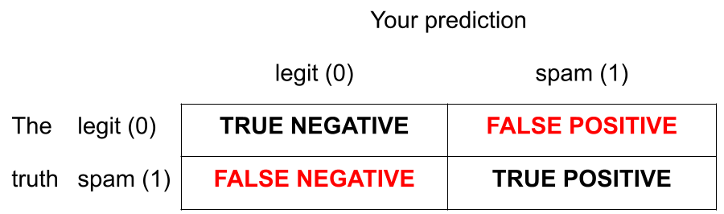

```{r}
#| label: load-packages
#| message: false
#| echo: false
library(tidyverse)
library(tidymodels)
library(openintro)
library(fivethirtyeight)
library(palmerpenguins)
library(MASS)
hp_spam <- read_csv("data/hp-spam.csv")
todays_ae <- "ae-15-spam-filter"
```

```{r}
#| label: cartoon-settings
#| message: false
#| echo: false

set.seed(8675309)
n <- 50
x <- rnorm(n, mean = 0, sd = 1)
b0 <- 0  
b1 <- 5
prob <- 1 / (1 + exp(-(b0 + b1 * x)))
y <- rbinom(n, 1, prob)
fit <- glm(y ~ x, family = binomial)
seq_x = seq(1.2 * min(x), 1.2 * max(x), length.out = 500)
y_vals <- 1 / (1 + exp(-(fit$coefficients[1] + fit$coefficients[2] * seq_x)))
```

# So where were we...

## Thus far...

We have been studying regression:

-   What combinations of data types have we seen?

-   What did the picture look like?

## Recap: simple linear regression

Numerical response and one numerical predictor:

```{r}
#| label: slr-1
#| message: false
#| echo: false
movie_scores <- fandango |>
  rename(
    critics = rottentomatoes, 
    audience = rottentomatoes_user
  )
ggplot(movie_scores, aes(x = critics, y = audience)) +
  geom_point(alpha = 0.5) + 
  geom_smooth(method = "lm", se = FALSE) + 
  labs(
    x = "Critics Score" , 
    y = "Audience Score",
    title = "Rotten Tomatoes Scores"
  )
```

## Recap: simple linear regression

Numerical response and one categorical predictor (two levels):

```{r}
#| echo: false 
#| warning: false
#| message: false
card_krueger <- read_csv("data/card-krueger.csv")
card_krueger_wide <- card_krueger |>
  mutate(
    state = fct_relevel(state, "PA", "NJ"),
    time = fct_relevel(time, "before", "after")
  ) |>
  pivot_wider(
    names_from = time,
    values_from = c(wage, fte)
  ) |>
  mutate(
    emp_diff = fte_after - fte_before,
    statebin = if_else(state == "PA", 0, 1)
  )

ggplot(card_krueger_wide, aes(x = statebin, y = emp_diff)) + 
  geom_point() +
  geom_smooth(method = "lm", se = FALSE) + 
  xlim(-0.5, 1.5) + 
  scale_x_continuous(breaks = c(0, 1),
                   labels = c("PA (0)", "NJ (1)")) +
  labs(
    title = "Card and Krueger data from Lab 4",
    y = "Employment difference",
    x = "State"
  )
```

## Recap: multiple linear regression

Numerical response; numerical and categorical predictors:

```{r}
#| label: additive-interaction-viz
#| layout-ncol: 2
#| echo: false
#| fig-asp: 1
#| warning: false
#| message: false

# Plot A
bm_fl_island_fit <- linear_reg() |>
  fit(body_mass_g ~ flipper_length_mm + island, data = penguins)
bm_fl_island_aug <- augment(bm_fl_island_fit, new_data = penguins)
ggplot(
  bm_fl_island_aug, 
  aes(x = flipper_length_mm, y = body_mass_g, color = island)
  ) +
  geom_point(alpha = 0.5) +
  geom_smooth(aes(y = .pred), method = "lm") +
  labs(title = "Plot A - Additive model",
       x = "Flipper Length (mm)",
       y = "Body Mass (g)",
       color = "Island") +
  theme(legend.position = "bottom")

# Plot B
ggplot(
  penguins, 
  aes(x = flipper_length_mm, y = body_mass_g, color = island)
  ) +
  geom_point(alpha = 0.5) +
  geom_smooth(method = "lm", se = FALSE) +
  labs(title = "Plot B - Interaction model",
       x = "Flipper Length (mm)",
       y = "Body Mass (g)",
       color = "Island") +
  theme(legend.position = "bottom")
```

## Today: a *binary* response {.smaller}

$$
y = 
\begin{cases}
1 & &&\text{eg. Yes, Win, True, Heads, Success}\\
0 & &&\text{eg. No, Lose, False, Tails, Failure}.
\end{cases}
$$

```{r}
#| message: false
#| echo: false
par(mar = c(5, 5, 0.5, 0.5))
plot(x, y, pch = 19, cex = 0.5, ylim = c(-0.25, 1.25), cex.lab = 1.5,
     ylab = "y",
     xlab = "x")
```

## Who cares?

If we can model the relationship between predictors ($x$) and a binary response ($y$), we can use the model to do a special kind of prediction called *classification*.

## Example: is the e-mail spam or not? {.smaller}

$$
\mathbf{x}: \text{word and character counts in an e-mail.}
$$

{fig-align="center" width="65%"}

$$
y
= 
\begin{cases}
1 & \text{it's spam}\\
0 & \text{it's legit}
\end{cases}
$$

## Example: is it cancer or not? {.smaller}

$$
\mathbf{x}: \text{features in a medical image.}
$$

{fig-align="center"}

$$
y
= 
\begin{cases}
1 & \text{it's cancer}\\
0 & \text{it's healthy}
\end{cases}
$$

## Example: will they default? {.smaller}

$$
\mathbf{x}: \text{financial and demographic info about a loan applicant.}
$$

{fig-align="center" width="60%"}

$$
y
= 
\begin{cases}
1 & \text{applicant is at risk of defaulting on loan}\\
0 & \text{applicant is safe}
\end{cases}
$$

## Example: Who said it: Taylor Swift, or Shakespeare? {.smaller}

$$
\mathbf{x}: \text{word counts (e.g., thou, love, heartbreak), stylistic features}
$$

{fig-align="center" width="40%"}

$$
y
= 
\begin{cases}
1 & \text{Taylor Swift}\\
0 & \text{William Shakespeare}
\end{cases}
$$

## How do we model this type of data?

```{r}
#| message: false
#| echo: false
par(mar = c(5, 5, 0.5, 0.5))
plot(x, y, pch = 19, cex = 0.5, ylim = c(-0.25, 1.25), cex.lab = 1.5,
     ylab = "y",
     xlab = "x")
```

## Straight line of best fit is a little silly

```{r}
#| message: false
#| echo: false
par(mar = c(5, 5, 0.5, 0.5))
plot(x, y, pch = 19, cex = 0.5, ylim = c(-0.25, 1.25), cex.lab = 1.5,
     ylab = "y",
     xlab = "x")
abline(lm(y ~ x), col = "red", lwd = 3)
```

## Instead: S-curve of best fit {.smaller}

Instead of modeling $y$ directly, we model the probability that $y=1$:

```{r}
#| message: false
#| echo: false
#| fig-asp: 0.4
par(mar = c(5, 5, 0.5, 0.5))
plot(x, y, pch = 19, cex = 0.5, ylim = c(-0.25, 1.25), cex.lab = 1.5,
     ylab = "Prob(y = 1)",
     xlab = "x")
lines(seq_x, y_vals, col = "red", lwd = 3)
points(x, y, pch = 19, cex = 0.75)
```

-   "Given new email, what's the probability that it's spam?''
-   "Given new image, what's the probability that it's cancer?''
-   "Given new loan application, what's the probability that they default?''

## Why don't we model y directly?

-   **Recall regression with a numerical response**:

    -   Our models do not output *guarantees* for $y$, they output predictions that describe behavior *on average*;

-   **Similar when modeling a binary response**:

    -   Our models cannot directly guarantee that $y$ will be zero or one. The correct analog to "on average" for a 0/1 response is "what's the probability?"

## So, what is this S-curve, anyway?

It's the *logistic function*:

$$
\text{Prob}(y = 1)
=
\frac{e^{\beta_0+\beta_1x}}{1+e^{\beta_0+\beta_1x}}.
$$

If you set $p = \text{Prob}(y = 1)$ and do some algebra, you get the simple linear model for the *log-odds*:

$$
\log\left(\frac{p}{1-p}\right)
=
\beta_0+\beta_1x.
$$

This is called the *logistic regression* model.

## Log-odds? {.medium .scrollable}

-   $p = \text{Prob}(y = 1)$ is a probability.
    A number between 0 and 1;

-   $p / (1 - p)$ is the odds.
    A number between 0 and $\infty$;

> "The odds of this lecture going well are 10 to 1."

-   The log odds $\log(p / (1 - p))$ is a number between $-\infty$ and $\infty$, which is suitable for the linear model.

-   Why does this "transformation" work?
    The log function maps positive numbers $(0, \infty)$ to all real numbers $(-\infty, \infty)$.

## Probability to odds

```{r}
#| echo: false
#| fig-asp: 0.6

curve(x/(1 - x), from = 0, to = 1, n = 500,
      xlab = "Probability: p", ylab = "Odds: p / (1 - p)",
      lwd = 2, col = "red", bty = "n")
```

## Zooming in

```{r}
#| echo: false
#| fig-asp: 0.6

curve(x/(1 - x), from = 0.10, to = 0.90, n = 500,
      xlab = "Probability: p", ylab = "Odds: p / (1 - p)",
      lwd = 2, col = "red", bty = "n")
```

## Odds to log odds

```{r}
#| echo: false
#| fig-asp: 0.6

curve(log(x), from = 0, to = 10, n = 1000,
      lwd = 2, col = "red", xaxt = "n", bty = "n",
      xlab = "Odds: p / (1 - p)", ylab = "Log-odds: log[p / (1 - p)]")
axis(1, pos = 0)
```

## Logistic regression

$$
\log\left(\frac{p}{1-p}\right)
=
\beta_0+\beta_1x.
$$

-   The *logit* function $\log(p / (1-p))$ is an example of a *link function* that transforms the linear model to have an appropriate range;

-   This is an example of a *generalized linear model*

## Estimation

-   We estimate the parameters $\beta_0,\,\beta_1$ using *maximum likelihood* (don't worry about it) to get the "best fitting" S-curve;

-   The fitted model is

$$
\log\left(\frac{\widehat{p}}{1-\widehat{p}}\right)
=
b_0+b_1x.
$$

## Today's data {.smaller}

```{r}
email |> 
  dplyr::select(c(spam, dollar, viagra, winner, password, exclaim_mess)) |> 
  glimpse()
```

## Fitting a logistic model

```{r}
logistic_fit <- logistic_reg() |>
  fit(spam ~ exclaim_mess, data = email)

tidy(logistic_fit)
```

Fitted equation for the log-odds:

$$
\log\left(\frac{\hat{p}}{1-\hat{p}}\right)
=
-2.27
+
0.000272\times exclaim~mess
$$

## Interpreting the intercept

If `exclaim_mess = 0`, then

$$
\widehat{p}=\widehat{P(y=1)}=\frac{e^{-2.27}}{1+e^{-2.27}}\approx 0.09.
$$

So, our model predicts that an email with no exclamation marks has a 9% probability of being spam.

## Interpreting the slope is tricky {.scrollable}

Recall:

$$
\log\left(\frac{\widehat{p}}{1-\widehat{p}}\right)
=
b_0+b_1x.
$$

. . .

Alternatively:

$$
\frac{\widehat{p}}{1-\widehat{p}}
=
e^{b_0+b_1x}
=
\color{blue}{e^{b_0}e^{b_1x}}
.
$$

. . .

If we increase $x$ by one unit, we have:

$$
\frac{\widehat{p}}{1-\widehat{p}}
=
e^{b_0}e^{b_1(x+1)}
=
e^{b_0}e^{b_1x+b_1}
=
{\color{blue}{e^{b_0}e^{b_1x}}}{\color{red}{e^{b_1}}}
.
$$

. . .

A one unit increase in $x$ is associated with a change in odds by a factor of $e^{b_1}$.
Gross!

## Back to the example...

$$
\log\left(\frac{\hat{p}}{1-\hat{p}}\right)
=
-2.27
+
0.000272\times exclaim~mess
$$

If the email has an additional exclamation mark, we predict the odds of an email being spam to be **higher** by a multiplicative factor of $e^{0.000272}\approx 1.000272$ on average.

## Logistic regression -\> classification?

## Step 0: fit the model {.small .scrollable}

Select a number $0 < p^* < 1$:

```{r}
#| label: step-0
#| message: false
#| echo: false
threshold <- 0.7
cutoff <- (log(threshold / (1 - threshold)) - fit$coefficients[1]) / fit$coefficients[2]
par(mar = c(5, 10, 0.5, 0.5))
plot(x, y, pch = 19, cex = 0.5, ylim = c(-0.25, 1.25), cex.lab = 1.5,
     #xlim = c(1.2 * min(x), 1.2 * max(x)),
     ylab = "",
     xlab = "")
lines(seq_x, y_vals, col = "red", lwd = 3)
points(x, y, pch = 19, cex = 0.75)
mtext("Prob(y = 1)", side = 2, line = 8, at = 0.5, cex = 2)
mtext("x", side = 1, line = 4, at = 0, cex = 2)
#mtext(paste("p* =", threshold), side = 2, line = 1, las = 2, at = threshold, cex = 1.5)
#segments(1.2 * min(x), threshold, cutoff, threshold, lty = 2, lwd = 2)
```

-   if $\text{Prob}(y=1)\leq p^*$, then predict $\widehat{y}=0$;
-   if $\text{Prob}(y=1)> p^*$, then predict $\widehat{y}=1$.

## Step 1: pick a threshold {.small .scrollable}

Select a number $0 < p^* < 1$:

```{r}
#| label: step-1
#| message: false
#| echo: false

cutoff <- (log(threshold / (1 - threshold)) - fit$coefficients[1]) / fit$coefficients[2]
par(mar = c(5, 10, 0.5, 0.5))
plot(x, y, pch = 19, cex = 0.5, ylim = c(-0.25, 1.25), cex.lab = 1.5,
     #xlim = c(1.2 * min(x), 1.2 * max(x)),
     ylab = "",
     xlab = "")
lines(seq_x, y_vals, col = "red", lwd = 3)
points(x, y, pch = 19, cex = 0.75)
mtext("Prob(y = 1)", side = 2, line = 8, at = 0.5, cex = 2)
mtext("x", side = 1, line = 4, at = 0, cex = 2)
mtext(paste("p* =", threshold), side = 2, line = 1, las = 2, at = threshold, cex = 1.5)
segments(1.2 * min(x), threshold, cutoff, threshold, lty = 2, lwd = 2)
```

-   if $\text{Prob}(y=1)\leq p^*$, then predict $\widehat{y}=0$;
-   if $\text{Prob}(y=1)> p^*$, then predict $\widehat{y}=1$.

## Step 2: find the "decision boundary" {.small .scrollable}

Solve for the x-value that matches the threshold:

```{r}
#| label: step-2
#| message: false
#| echo: false

cutoff <- (log(threshold / (1 - threshold)) - fit$coefficients[1]) / fit$coefficients[2]
par(mar = c(5, 10, 0.5, 0.5))
plot(x, y, pch = 19, cex = 0.5, ylim = c(-0.25, 1.25), cex.lab = 1.5,
     #xlim = c(1.2 * min(x), 1.2 * max(x)),
     ylab = "",
     xlab = "")
lines(seq_x, y_vals, col = "red", lwd = 3)
points(x, y, pch = 19, cex = 0.75)
mtext("Prob(y = 1)", side = 2, line = 8, at = 0.5, cex = 2)
mtext("x", side = 1, line = 4, at = 0, cex = 2)
mtext(paste("p* =", threshold), side = 2, line = 1, las = 2, at = threshold, cex = 1.5)
segments(1.2 * min(x), threshold, cutoff, threshold, lty = 2, lwd = 2)
abline(v = cutoff, lty = 2, lwd = 2)
mtext("x*", side = 1, line = 1, at = cutoff, cex = 2)
```

-   if $\text{Prob}(y=1)\leq p^*$, then predict $\widehat{y}=0$;
-   if $\text{Prob}(y=1)> p^*$, then predict $\widehat{y}=1$.

## Step 3: classify a new arrival {.small .scrollable}

A new person shows up with $x_{\text{new}}$.
Which side of the boundary are they on?

```{r}
#| label: step-3
#| message: false
#| echo: false

cutoff <- (log(threshold / (1 - threshold)) - fit$coefficients[1]) / fit$coefficients[2]
par(mar = c(5, 10, 0.5, 0.5))
plot(x, y, pch = 19, cex = 0.5, ylim = c(-0.25, 1.25), cex.lab = 1.5,
     #xlim = c(1.2 * min(x), 1.2 * max(x)),
     ylab = "",
     xlab = "")
lines(seq_x, y_vals, col = "red", lwd = 3)
points(x, y, pch = 19, cex = 0.75)
mtext("Prob(y = 1)", side = 2, line = 8, at = 0.5, cex = 2)
mtext("x", side = 1, line = 4, at = 0, cex = 2)
mtext(paste("p* =", threshold), side = 2, line = 1, las = 2, at = threshold, cex = 1.5)
segments(1.2 * min(x), threshold, cutoff, threshold, lty = 2, lwd = 2)
abline(v = cutoff, lty = 2, lwd = 2)
mtext("x*", side = 1, line = 1, at = cutoff, cex = 2)
polygon(c(-20, cutoff, cutoff, -20), c(-1, -1, 2, 2), col = rgb(1, .5, 0, alpha = 0.2), border = NA)
polygon(c(cutoff, 20, 20, cutoff), c(-1, -1, 2, 2), col = rgb(0, 0, 1, alpha = 0.2), border = NA)
text(-1, 0.5, expression(hat(y)~" = 0"), col = "orange", cex = 2)
text(1, 0.5, expression(hat(y)~" = 1"), col = "blue", cex = 2)
```

-   if $x_{\text{new}} \leq x^\star$, then $\text{Prob}(y=1)\leq p^*$, so predict $\widehat{y}=0$ for the new person;
-   if $x_{\text{new}} > x^\star$, then $\text{Prob}(y=1)> p^*$, so predict $\widehat{y}=1$ for the new person.

## Let's change the threshold {.small .scrollable}

A new person shows up with $x_{\text{new}}$.
Which side of the boundary are they on?

```{r}
#| label: lower-threshold
#| message: false
#| echo: false
threshold <- 0.15
cutoff <- (log(threshold / (1 - threshold)) - fit$coefficients[1]) / fit$coefficients[2]
par(mar = c(5, 10, 0.5, 0.5))
plot(x, y, pch = 19, cex = 0.5, ylim = c(-0.25, 1.25), cex.lab = 1.5,
     #xlim = c(1.2 * min(x), 1.2 * max(x)),
     ylab = "",
     xlab = "")
lines(seq_x, y_vals, col = "red", lwd = 3)
points(x, y, pch = 19, cex = 0.75)
mtext("Prob(y = 1)", side = 2, line = 8, at = 0.5, cex = 2)
mtext("x", side = 1, line = 4, at = 0, cex = 2)
mtext(paste("p* =", threshold), side = 2, line = 1, las = 2, at = threshold, cex = 1.5)
segments(1.2 * min(x), threshold, cutoff, threshold, lty = 2, lwd = 2)
abline(v = cutoff, lty = 2, lwd = 2)
mtext("x*", side = 1, line = 1, at = cutoff, cex = 2)
polygon(c(-20, cutoff, cutoff, -20), c(-1, -1, 2, 2), col = rgb(1, .5, 0, alpha = 0.2), border = NA)
polygon(c(cutoff, 20, 20, cutoff), c(-1, -1, 2, 2), col = rgb(0, 0, 1, alpha = 0.2), border = NA)
text(-1, 0.5, expression(hat(y)~" = 0"), col = "orange", cex = 2)
text(1, 0.5, expression(hat(y)~" = 1"), col = "blue", cex = 2)
```

-   if $x_{\text{new}} \leq x^\star$, then $\text{Prob}(y=1)\leq p^*$, so predict $\widehat{y}=0$ for the new person;
-   if $x_{\text{new}} > x^\star$, then $\text{Prob}(y=1)> p^*$, so predict $\widehat{y}=1$ for the new person.

## Let's change the threshold {.small .scrollable}

A new person shows up with $x_{\text{new}}$.
Which side of the boundary are they on?

```{r}
#| label: higher-threshold
#| message: false
#| echo: false
threshold <- 0.9
cutoff <- (log(threshold / (1 - threshold)) - fit$coefficients[1]) / fit$coefficients[2]
par(mar = c(5, 10, 0.5, 0.5))
plot(x, y, pch = 19, cex = 0.5, ylim = c(-0.25, 1.25), cex.lab = 1.5,
     #xlim = c(1.2 * min(x), 1.2 * max(x)),
     ylab = "",
     xlab = "")
lines(seq_x, y_vals, col = "red", lwd = 3)
points(x, y, pch = 19, cex = 0.75)
mtext("Prob(y = 1)", side = 2, line = 8, at = 0.5, cex = 2)
mtext("x", side = 1, line = 4, at = 0, cex = 2)
mtext(paste("p* =", threshold), side = 2, line = 1, las = 2, at = threshold, cex = 1.5)
segments(1.2 * min(x), threshold, cutoff, threshold, lty = 2, lwd = 2)
abline(v = cutoff, lty = 2, lwd = 2)
mtext("x*", side = 1, line = 1, at = cutoff, cex = 2)
polygon(c(-20, cutoff, cutoff, -20), c(-1, -1, 2, 2), col = rgb(1, .5, 0, alpha = 0.2), border = NA)
polygon(c(cutoff, 20, 20, cutoff), c(-1, -1, 2, 2), col = rgb(0, 0, 1, alpha = 0.2), border = NA)
text(-1, 0.5, expression(hat(y)~" = 0"), col = "orange", cex = 2)
text(1, 0.5, expression(hat(y)~" = 1"), col = "blue", cex = 2)
```

-   if $x_{\text{new}} \leq x^\star$, then $\text{Prob}(y=1)\leq p^*$, so predict $\widehat{y}=0$ for the new person;
-   if $x_{\text{new}} > x^\star$, then $\text{Prob}(y=1)> p^*$, so predict $\widehat{y}=1$ for the new person.

## Nothing special about one predictor... {.smaller}

Two numerical predictors and one binary response:

```{r}
#| message: false
#| echo: false
set.seed(20)
n <- 20
cloud1 <- mvrnorm(n, c(-0.5, -0.5) + 4, matrix(c(1, 0.5, 0.5, 1), 2, 2))
cloud2 <- mvrnorm(n, c(0.5, 0.5) + 4, matrix(c(1, -0.5, -0.5, 1), 2, 2))
X <- rbind(cloud1, cloud2)
y <- c(rep(0, n), rep(1, n))
par(mar = c(5, 5, 0.5, 0.5))
plot(X, 
     pch = 19, 
     col = c(rep("orange", n), rep("blue", n)),
     xlab = expression(x[1]),
     ylab = expression(x[2]),
     xlim = c(-4, 4) + 4,
     ylim = c(-4, 4) + 4,
     cex.lab = 2)
legend("bottomright", c("y = 0", "y = 1"), pch = 19, col = c("orange", "blue"), bty = "n", cex = 2)
```

## "Multiple" logistic regression

For the log-odds, a *multiple* linear regression:

$$
\log\left(\frac{p}{1-p}\right)
=
\beta_0+\beta_1x_1+\beta_2x_2+...+\beta_mx_m.
$$ On the probability scale:

$$
\text{Prob}(y = 1)
=
\frac{e^{\beta_0+\beta_1x_1+\beta_2x_2+...+\beta_mx_m}}{1+e^{\beta_0+\beta_1x_1+\beta_2x_2+...+\beta_mx_m}}.
$$

## Decision boundary, again {.small .scrollable}

It's linear!
Consider two numerical predictors:

```{r}
#| message: false
#| echo: false
#| fig-align: "center"
fit <- glm(y ~ X, family = binomial)

b0 <- fit$coefficients[1]
b1 <- fit$coefficients[2]
b2 <- fit$coefficients[3]

p_thresh <- 0.5

# compute intercept and slope of decision boundary
bd_incpt <- (log(p_thresh / (1 - p_thresh)) - b0) / b2
bd_slp <- -b1 / b2

x_for_poly <- seq(-10, 10, length.out = 1000)
y_for_poly <- bd_incpt + bd_slp * x_for_poly

par(mar = c(4, 5, 0.5, 0.5))
plot(X, 
     pch = 19, 
     col = c(rep("orange", n), rep("blue", n)),
     xlab = expression(x[1]),
     ylab = expression(x[2]),
     xlim = c(-4, 4) + 4,
     ylim = c(-4, 4) + 4,
     cex.lab = 2)
abline(a = bd_incpt, b = bd_slp, lty = 2, lwd = 3)
polygon(c(x_for_poly, rev(x_for_poly)), c(y_for_poly, rep(10, 1000)), col = rgb(0, 0, 1, alpha = 0.2), border = NA)
polygon(c(x_for_poly, rev(x_for_poly)), c(y_for_poly, rep(-10, 1000)), col = rgb(1, .5, 0, alpha = 0.2), border = NA)
legend("left", expression(hat(y)~" = 0"), text.col = "orange", bty = "n", cex = 2)
legend("right", expression(hat(y)~" = 1"), text.col = "blue", bty = "n", cex = 2)
points(X, pch = 19, 
     col = c(rep("orange", n), rep("blue", n)))
legend("topright", "p* = 0.5", cex = 2, bty = "n")
```

-   if new $(x_1,\,x_2)$ below, $\text{Prob}(y=1)\leq p^*$. Predict $\widehat{y}=0$ for the new person;
-   if new $(x_1,\,x_2)$ above, $\text{Prob}(y=1)> p^*$. Predict $\widehat{y}=1$ for the new person.

## Decision boundary, again {.small .scrollable}

It's linear!
Consider two numerical predictors:

```{r}
#| message: false
#| echo: false
#| fig-align: "center"
fit <- glm(y ~ X, family = binomial)

b0 <- fit$coefficients[1]
b1 <- fit$coefficients[2]
b2 <- fit$coefficients[3]

p_thresh <- 0.15

# compute intercept and slope of decision boundary
bd_incpt <- (log(p_thresh / (1 - p_thresh)) - b0) / b2
bd_slp <- -b1 / b2

x_for_poly <- seq(-10, 10, length.out = 1000)
y_for_poly <- bd_incpt + bd_slp * x_for_poly

par(mar = c(4, 5, 0.5, 0.5))
plot(X, 
     pch = 19, 
     col = c(rep("orange", n), rep("blue", n)),
     xlab = expression(x[1]),
     ylab = expression(x[2]),
     xlim = c(-4, 4) + 4,
     ylim = c(-4, 4) + 4,
     cex.lab = 2)
abline(a = bd_incpt, b = bd_slp, lty = 2, lwd = 3)
polygon(c(x_for_poly, rev(x_for_poly)), c(y_for_poly, rep(10, 1000)), col = rgb(0, 0, 1, alpha = 0.2), border = NA)
polygon(c(x_for_poly, rev(x_for_poly)), c(y_for_poly, rep(-10, 1000)), col = rgb(1, .5, 0, alpha = 0.2), border = NA)
legend("left", expression(hat(y)~" = 0"), text.col = "orange", bty = "n", cex = 2)
legend("right", expression(hat(y)~" = 1"), text.col = "blue", bty = "n", cex = 2)
points(X, pch = 19, 
     col = c(rep("orange", n), rep("blue", n)))
legend("topright", "p* = 0.15", cex = 2, bty = "n")
```

-   if new $(x_1,\,x_2)$ below, $\text{Prob}(y=1)\leq p^*$. Predict $\widehat{y}=0$ for the new person;
-   if new $(x_1,\,x_2)$ above, $\text{Prob}(y=1)> p^*$. Predict $\widehat{y}=1$ for the new person.

## Decision boundary, again {.small .scrollable}

It's linear!
Consider two numerical predictors:

```{r}
#| message: false
#| echo: false
#| fig-align: "center"
fit <- glm(y ~ X, family = binomial)

b0 <- fit$coefficients[1]
b1 <- fit$coefficients[2]
b2 <- fit$coefficients[3]

p_thresh <- 0.9

# compute intercept and slope of decision boundary
bd_incpt <- (log(p_thresh / (1 - p_thresh)) - b0) / b2
bd_slp <- -b1 / b2

x_for_poly <- seq(-10, 10, length.out = 1000)
y_for_poly <- bd_incpt + bd_slp * x_for_poly

par(mar = c(4, 5, 0.5, 0.5))
plot(X, 
     pch = 19, 
     col = c(rep("orange", n), rep("blue", n)),
     xlab = expression(x[1]),
     ylab = expression(x[2]),
     xlim = c(-4, 4) + 4,
     ylim = c(-4, 4) + 4,
     cex.lab = 2)
abline(a = bd_incpt, b = bd_slp, lty = 2, lwd = 3)
polygon(c(x_for_poly, rev(x_for_poly)), c(y_for_poly, rep(10, 1000)), col = rgb(0, 0, 1, alpha = 0.2), border = NA)
polygon(c(x_for_poly, rev(x_for_poly)), c(y_for_poly, rep(-10, 1000)), col = rgb(1, .5, 0, alpha = 0.2), border = NA)
legend("left", expression(hat(y)~" = 0"), text.col = "orange", bty = "n", cex = 2)
legend("right", expression(hat(y)~" = 1"), text.col = "blue", bty = "n", cex = 2)
points(X, pch = 19, 
     col = c(rep("orange", n), rep("blue", n)))
legend("topright", "p* = 0.9", cex = 2, bty = "n")
```

-   if new $(x_1,\,x_2)$ below, $\text{Prob}(y=1)\leq p^*$. Predict $\widehat{y}=0$ for the new person;
-   if new $(x_1,\,x_2)$ above, $\text{Prob}(y=1)> p^*$. Predict $\widehat{y}=1$ for the new person.

## Note: the classifier isn't perfect {.small .scrollable}

```{r}
#| message: false
#| echo: false
#| fig-asp: 0.45
#| fig-align: "center"

fit <- glm(y ~ X, family = binomial)

b0 <- fit$coefficients[1]
b1 <- fit$coefficients[2]
b2 <- fit$coefficients[3]

p_thresh <- 0.5

# compute intercept and slope of decision boundary
bd_incpt <- (log(p_thresh / (1 - p_thresh)) - b0) / b2
bd_slp <- -b1 / b2

x_for_poly <- seq(-10, 10, length.out = 1000)
y_for_poly <- bd_incpt + bd_slp * x_for_poly

par(mar = c(4, 5, 0.5, 0.5))
plot(X, 
     pch = 19, 
     col = c(rep("orange", n), rep("blue", n)),
     xlab = expression(x[1]),
     ylab = expression(x[2]),
     xlim = c(-4, 4) + 4,
     ylim = c(-4, 4) + 4,
     cex.lab = 2)
abline(a = bd_incpt, b = bd_slp, lty = 2, lwd = 3)
polygon(c(x_for_poly, rev(x_for_poly)), c(y_for_poly, rep(10, 1000)), col = rgb(0, 0, 1, alpha = 0.2), border = NA)
polygon(c(x_for_poly, rev(x_for_poly)), c(y_for_poly, rep(-10, 1000)), col = rgb(1, .5, 0, alpha = 0.2), border = NA)
legend("left", expression(hat(y)~" = 0"), text.col = "orange", bty = "n", cex = 2)
legend("right", expression(hat(y)~" = 1"), text.col = "blue", bty = "n", cex = 2)
points(X, pch = 19, 
     col = c(rep("orange", n), rep("blue", n)))
legend("topright", "p* = 0.5", cex = 2, bty = "n")
```

-   There are blue points in the orange region: spam (1) emails misclassified as legit (0);
-   There are orange points in the blue region: legit (0) emails misclassified as spam (1).

## How do you pick the threshold? {.smaller}

To balance out the two kinds of errors:



-   High threshold \>\> Hard to classify as 1 \>\> FP less likely; FN more likely
-   Low threshold \>\> Easy to classify as 1 \>\> FP more likely; FN less likely

## Silly examples

-   Set p\* = 0

    -   Classify every email as spam (1);
    -   No false negatives, but *a lot* of false positives;

-   Set p\* = 1

    -   Classify every email as legit (0);
    -   No false positives, but *a lot* of false negatives.

You pick a threshold in between to strike a balance.
The exact number depends on context.

## `{r} todays_ae`

::: appex
-   Go to your ae project in RStudio.

-   If you haven't yet done so, make sure all of your changes up to this point are committed and pushed, i.e., there's nothing left in your Git pane.

-   If you haven't yet done so, click Pull to get today's application exercise file: *`{r} paste0(todays_ae, ".qmd")`*.

-   Work through the application exercise in class, and render, commit, and push your edits.
:::
