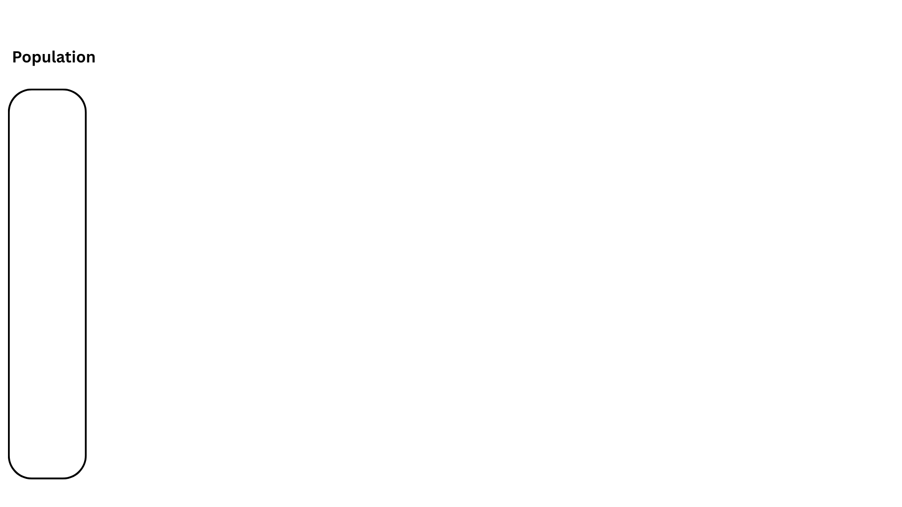
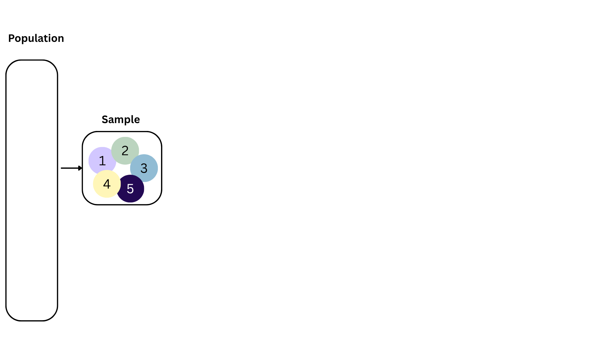
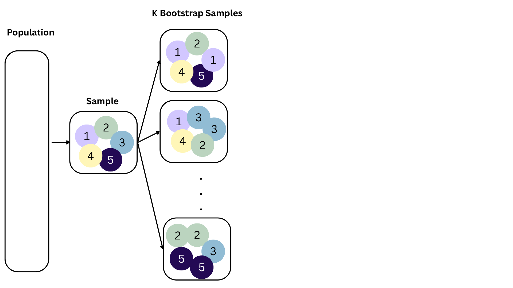
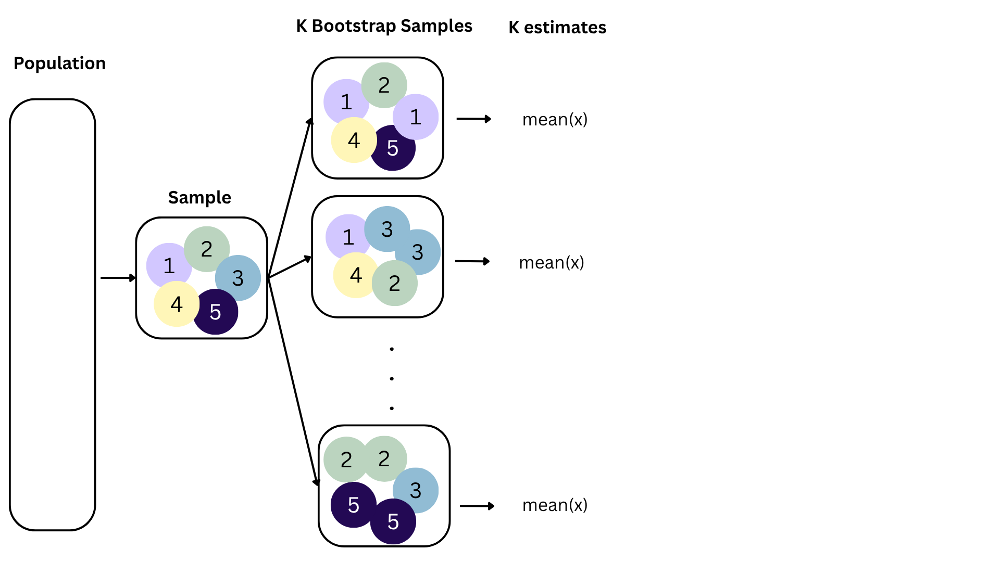
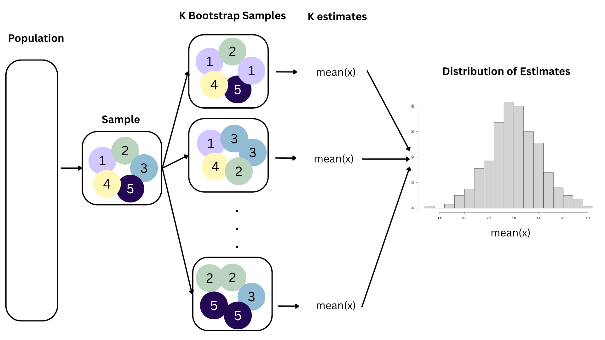
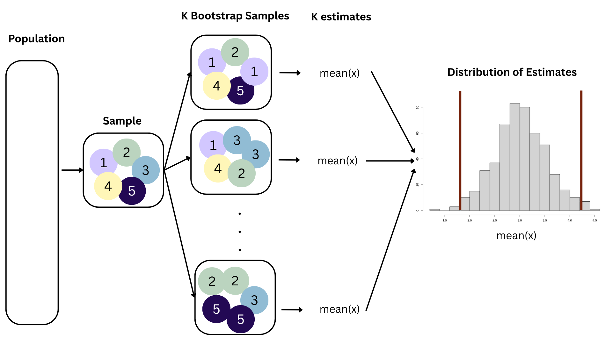
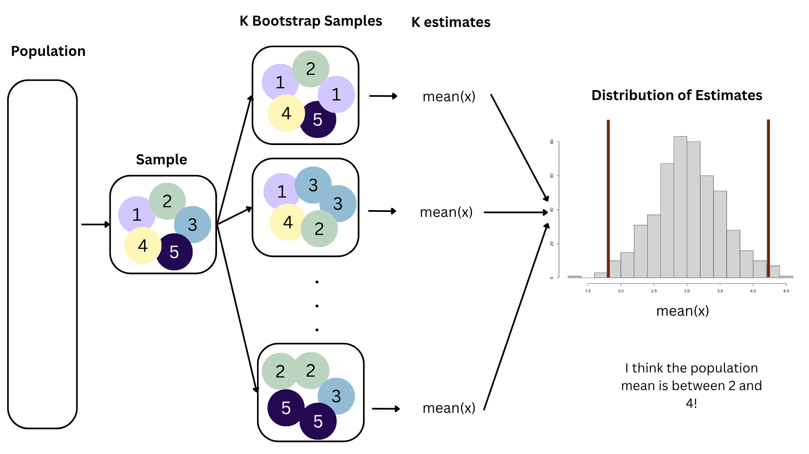
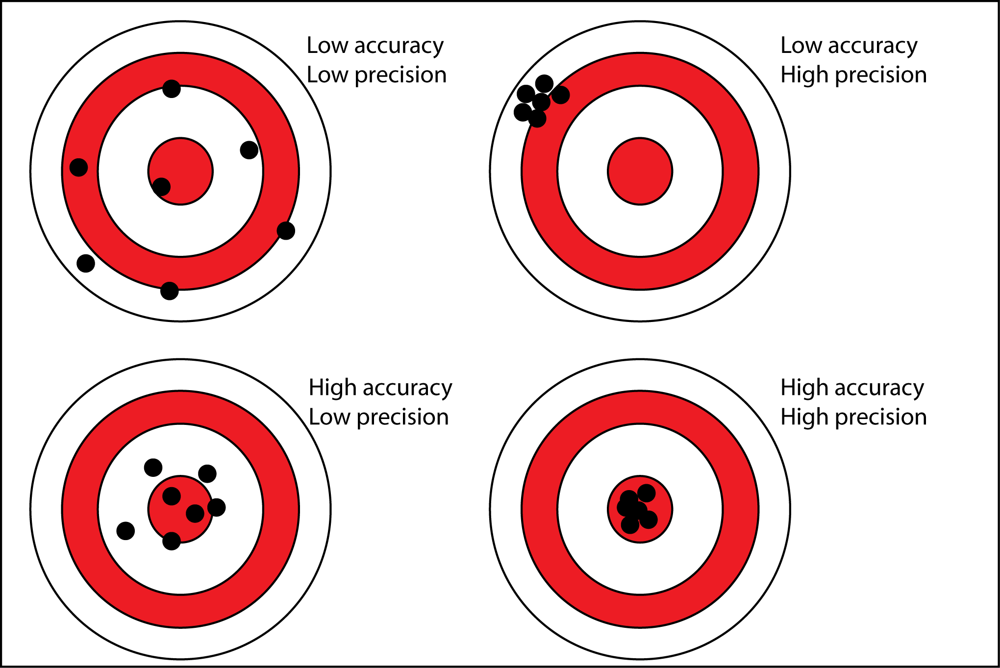

```{r}
#| label: load-packages
#| message: false
#| echo: false
library(tidyverse)
library(tidymodels)
library(openintro)
library(scales)      # for pretty axis labels
library(glue)        # for constructing character strings
library(knitr)       # for neatly formatted tables
todays_ae <- "ae-17-duke-forest-bootstrap"
```

# Admin

## The home stretch {.small .scrollable}

::: incremental
-   Today: lecture on confidence intervals;
-   Tomorrow: lecture on hypothesis testing;
-   Thursday: Lab 6 (last one!), due Sunday by 11:59pm (deadline firm if you want graded feedback by the final);
-   Wednesday: wrap-up lecture on inference;
-   Thursday: lecture on TBD, depending on general vibes / exam readiness this week;
-   Friday: no class -- Juneteenth!
:::

# Statistics

## Our goal: quantify uncertainty to help make **informed** decisions

-   What kind of uncertainty?
-   *How* do you quantify it?
-   These are surprisingly spicy and controversial questions in statistics!
-   With the short time remaining, we will focus on quantifying one specific type of uncertainty...

# Classical sampling uncertainty

## Sampling uncertainty {.small .scrollable}

> Different data give different estimates.
> How different?

-   In reality, we have *one* (sample) dataset, and it gives *one* set of results. How reliable are those results?
-   A thought experiment: if I collected a whole new dataset and redid my analysis, do I get the same results, or different results?
    -   if the results vary wildly from dataset to dataset, uncertainty is high and reliability is low;
    -   if the results are stable from one dataset to another, uncertainty is low and reliability is high.

That's the main idea in a nutshell.

## A running example {.medium .scrollable}

The `openintro::loans_full_schema` data frame contains loan data from the peer-to-peer lender, Lending Club, available in the openintro package.

::: incremental
-   `{r} nrow(loans_full_schema)` rows;

-   each row is an *approved* loan applicant;

-   the columns contain financial info about the loan applicant, including...

    -   annual income (in \$);
    -   amount of non-mortgage debt outstanding (in \$).

-   What would you guess is the direction of association between these two variables?
:::

## Model fit with five observations

```{r}
#| echo: false
#| message: false
n = 5
loans_full_schema |>
  drop_na(annual_income, total_credit_utilized) |>
  filter(log(annual_income) > 0) |>
  filter(log(total_credit_utilized) > 0) |>
  slice_head(n = n) |>
  ggplot(aes(x = log(annual_income), y = log(total_credit_utilized))) + 
  geom_point() + 
  geom_smooth(method = "lm") + 
  xlim(7, 15) + 
  ylim(0, 15) + 
  labs(
    x = "Annual income (log $)",
    y = "Credit utilization (log $)",
    title = paste("Model fit with random sample of size ", n, " people", sep = "")
  ) + 
  theme(title = element_text(size = 14, face = "bold"))
```

(I just took logs to make the picture prettier.)

## Double the sample size

```{r}
#| echo: false
#| message: false
n = 5*2
loans_full_schema |>
  drop_na(annual_income, total_credit_utilized) |>
  filter(log(annual_income) > 0) |>
  filter(log(total_credit_utilized) > 0) |>
  slice_head(n = n) |>
  ggplot(aes(x = log(annual_income), y = log(total_credit_utilized))) + 
  geom_point() + 
  geom_smooth(method = "lm") + 
  xlim(7, 15) + 
  ylim(0, 15) + 
  labs(
    x = "Annual income (log $)",
    y = "Credit utilization (log $)",
    title = paste("Model fit with random sample of size ", n, " people", sep = "")
  ) + 
  theme(title = element_text(size = 14, face = "bold"))
```

## Double the sample size again

```{r}
#| echo: false
#| message: false
n = 5*2*2
loans_full_schema |>
  drop_na(annual_income, total_credit_utilized) |>
  filter(log(annual_income) > 0) |>
  filter(log(total_credit_utilized) > 0) |>
  slice_head(n = n) |>
  ggplot(aes(x = log(annual_income), y = log(total_credit_utilized))) + 
  geom_point() + 
  geom_smooth(method = "lm") + 
  xlim(7, 15) + 
  ylim(0, 15) + 
  labs(
    x = "Annual income (log $)",
    y = "Credit utilization (log $)",
    title = paste("Model fit with random sample of size ", n, " people", sep = "")
  ) + 
  theme(title = element_text(size = 14, face = "bold"))
```

## Double the sample size again

```{r}
#| echo: false
#| message: false
n = 5*2*2*2
loans_full_schema |>
  drop_na(annual_income, total_credit_utilized) |>
  filter(log(annual_income) > 0) |>
  filter(log(total_credit_utilized) > 0) |>
  slice_head(n = n) |>
  ggplot(aes(x = log(annual_income), y = log(total_credit_utilized))) + 
  geom_point() + 
  geom_smooth(method = "lm") + 
  xlim(7, 15) + 
  ylim(0, 15) + 
  labs(
    x = "Annual income (log $)",
    y = "Credit utilization (log $)",
    title = paste("Model fit with random sample of size ", n, " people", sep = "")
  ) + 
  theme(title = element_text(size = 14, face = "bold"))
```

## Double the sample size again

```{r}
#| echo: false
#| message: false
n = 5*2*2*2*2
loans_full_schema |>
  drop_na(annual_income, total_credit_utilized) |>
  filter(log(annual_income) > 0) |>
  filter(log(total_credit_utilized) > 0) |>
  slice_head(n = n) |>
  ggplot(aes(x = log(annual_income), y = log(total_credit_utilized))) + 
  geom_point() + 
  geom_smooth(method = "lm") + 
  xlim(7, 15) + 
  ylim(0, 15) + 
  labs(
    x = "Annual income (log $)",
    y = "Credit utilization (log $)",
    title = paste("Model fit with random sample of size ", n, " people", sep = "")
  ) + 
  theme(title = element_text(size = 14, face = "bold"))
```

## Double the sample size again

```{r}
#| echo: false
#| message: false
n = 5*2*2*2*2*2
loans_full_schema |>
  drop_na(annual_income, total_credit_utilized) |>
  filter(log(annual_income) > 0) |>
  filter(log(total_credit_utilized) > 0) |>
  slice_head(n = n) |>
  ggplot(aes(x = log(annual_income), y = log(total_credit_utilized))) + 
  geom_point() + 
  geom_smooth(method = "lm") + 
  xlim(7, 15) + 
  ylim(0, 15) + 
  labs(
    x = "Annual income (log $)",
    y = "Credit utilization (log $)",
    title = paste("Model fit with random sample of size ", n, " people", sep = "")
  ) + 
  theme(title = element_text(size = 14, face = "bold"))
```

## Double the sample size again

```{r}
#| echo: false
#| message: false
n = 5*2*2*2*2*2*2
loans_full_schema |>
  drop_na(annual_income, total_credit_utilized) |>
  filter(log(annual_income) > 0) |>
  filter(log(total_credit_utilized) > 0) |>
  slice_head(n = n) |>
  ggplot(aes(x = log(annual_income), y = log(total_credit_utilized))) + 
  geom_point() + 
  geom_smooth(method = "lm") + 
  xlim(7, 15) + 
  ylim(0, 15) + 
  labs(
    x = "Annual income (log $)",
    y = "Credit utilization (log $)",
    title = paste("Model fit with random sample of size ", n, " people", sep = "")
  ) + 
  theme(title = element_text(size = 14, face = "bold"))
```

## Double the sample size again

```{r}
#| echo: false
#| message: false
n = 5*2*2*2*2*2*2*2
loans_full_schema |>
  drop_na(annual_income, total_credit_utilized) |>
  filter(log(annual_income) > 0) |>
  filter(log(total_credit_utilized) > 0) |>
  slice_head(n = n) |>
  ggplot(aes(x = log(annual_income), y = log(total_credit_utilized))) + 
  geom_point() + 
  geom_smooth(method = "lm") + 
  xlim(7, 15) + 
  ylim(0, 15) + 
  labs(
    x = "Annual income (log $)",
    y = "Credit utilization (log $)",
    title = paste("Model fit with random sample of size ", n, " people", sep = "")
  ) + 
  theme(title = element_text(size = 14, face = "bold"))
```

## Double the sample size again

```{r}
#| echo: false
#| message: false
n = 5*2*2*2*2*2*2*2*2
loans_full_schema |>
  drop_na(annual_income, total_credit_utilized) |>
  filter(log(annual_income) > 0) |>
  filter(log(total_credit_utilized) > 0) |>
  slice_head(n = n) |>
  ggplot(aes(x = log(annual_income), y = log(total_credit_utilized))) + 
  geom_point() + 
  geom_smooth(method = "lm") + 
  xlim(7, 15) + 
  ylim(0, 15) + 
  labs(
    x = "Annual income (log $)",
    y = "Credit utilization (log $)",
    title = paste("Model fit with random sample of size ", n, " people", sep = "")
  ) + 
  theme(title = element_text(size = 14, face = "bold"))
```

## Double the sample size yet again

```{r}
#| echo: false
#| message: false
n = 5*2*2*2*2*2*2*2*2*2
loans_full_schema |>
  drop_na(annual_income, total_credit_utilized) |>
  filter(log(annual_income) > 0) |>
  filter(log(total_credit_utilized) > 0) |>
  slice_head(n = n) |>
  ggplot(aes(x = log(annual_income), y = log(total_credit_utilized))) + 
  geom_point() + 
  geom_smooth(method = "lm") + 
  xlim(7, 15) + 
  ylim(0, 15) + 
  labs(
    x = "Annual income (log $)",
    y = "Credit utilization (log $)",
    title = paste("Model fit with random sample of size ", n, " people", sep = "")
  ) + 
  theme(title = element_text(size = 14, face = "bold"))
```

## Double the sample size one more time

```{r}
#| echo: false
#| message: false
n = 5*2*2*2*2*2*2*2*2*2*2
loans_full_schema |>
  drop_na(annual_income, total_credit_utilized) |>
  filter(log(annual_income) > 0) |>
  filter(log(total_credit_utilized) > 0) |>
  slice_head(n = n) |>
  ggplot(aes(x = log(annual_income), y = log(total_credit_utilized))) + 
  geom_point() + 
  geom_smooth(method = "lm") + 
  xlim(7, 15) + 
  ylim(0, 15) + 
  labs(
    x = "Annual income (log $)",
    y = "Credit utilization (log $)",
    title = paste("Model fit with random sample of size ", n, " people", sep = "")
  ) + 
  theme(title = element_text(size = 14, face = "bold"))
```

## Use all the data we have

```{r}
#| echo: false
#| message: false
new_loans <- loans_full_schema |>
  drop_na(annual_income, total_credit_utilized) |>
  filter(log(annual_income) > 0) |>
  filter(log(total_credit_utilized) > 0)

n_loans <- nrow(new_loans)

new_loans |>
  ggplot(aes(x = log(annual_income), y = log(total_credit_utilized))) + 
  geom_point() + 
  geom_smooth(method = "lm") + 
  xlim(7, 15) + 
  ylim(0, 15) + 
  labs(
    x = "Annual income (log $)",
    y = "Credit utilization (log $)",
    title = paste("Model fit with sample of size ", 
                  n_loans, 
                  " people", 
                  sep = "")
  ) + 
  theme(title = element_text(size = 14, face = "bold"))
```

## What did we notice? {.scrollable}

::: incremental
-   As the sample size grew, the best fit line stabilized;

-   As the sample size grew, the grey uncertainty band shrank;

-   As the sample size grew, we observed a larger range of income values, and the computer displayed more of the line;

-   As the sample size grows, the picture the data paint becomes clearer:

    -   positive relationship;
    -   linear relationship;
    -   pretty strong
:::

## A silly question

::: callout_note
Which would you rather have for your data analysis?
5 people in your dataset or 9947?
Why?
:::

## Here's the deal

-   We do not know what the "true" line is;

-   Our estimates are a best guess based on noisy, incomplete, imperfect data;

-   The more data we have, the more "certain" and "reliable" the estimates are;

-   What do we mean by "uncertainty" here?

## Sampling uncertainty

-   **Fact**: different data set $\rightarrow$ different estimates;

-   How much would our estimate vary across alternative datasets?

    -   If the answer is "a lot," uncertainty is high, and our estimates are not super reliable;
    -   If the answer is "a little," uncertainty is low, and maybe we can take our estimates to the bank;

## Here's one dataset we could have seen

```{r}
#| echo: false
#| message: false

n = 5
set.seed(12345)

loans_full_schema |>
  drop_na(annual_income, total_credit_utilized) |>
  filter(log(annual_income) > 0) |>
  filter(log(total_credit_utilized) > 0) |>
  slice(sample(1:n_loans, n, replace = "FALSE")) |>
  ggplot(aes(x = log(annual_income), y = log(total_credit_utilized))) + 
  geom_point() + 
  geom_smooth(method = "lm") + 
  xlim(7, 15) + 
  ylim(0, 15) + 
  labs(
    x = "Annual income (log $)",
    y = "Credit utilization (log $)",
    title = paste("Model fit with random sample of size ", n, " people", sep = "")
  ) + 
  theme(title = element_text(size = 14, face = "bold"))
```

## Here's another

```{r}
#| echo: false
#| message: false

n = 5
set.seed(345678)

loans_full_schema |>
  drop_na(annual_income, total_credit_utilized) |>
  filter(log(annual_income) > 0) |>
  filter(log(total_credit_utilized) > 0) |>
  slice(sample(1:n_loans, n, replace = "FALSE")) |>
  ggplot(aes(x = log(annual_income), y = log(total_credit_utilized))) + 
  geom_point() + 
  geom_smooth(method = "lm") + 
  xlim(7, 15) + 
  ylim(0, 15) + 
  labs(
    x = "Annual income (log $)",
    y = "Credit utilization (log $)",
    title = paste("Model fit with random sample of size ", n, " people", sep = "")
  ) + 
  theme(title = element_text(size = 14, face = "bold"))
```

## Here's yet one more

```{r}
#| echo: false
#| message: false

n = 5
set.seed(1)

loans_full_schema |>
  drop_na(annual_income, total_credit_utilized) |>
  filter(log(annual_income) > 0) |>
  filter(log(total_credit_utilized) > 0) |>
  slice(sample(1:n_loans, n, replace = "FALSE")) |>
  ggplot(aes(x = log(annual_income), y = log(total_credit_utilized))) + 
  geom_point() + 
  geom_smooth(method = "lm") + 
  xlim(7, 15) + 
  ylim(0, 15) + 
  labs(
    x = "Annual income (log $)",
    y = "Credit utilization (log $)",
    title = paste("Model fit with random sample of size ", n, " people", sep = "")
  ) + 
  theme(title = element_text(size = 14, face = "bold"))
```

## Different data set $\rightarrow$ different estimates

-   These tiny data sets can't even agree on if the line should slope up or down.
    Uncertainty is high, hence the large bands.

-   If we repeat the process with a larger sample size, things are more stable

## Alternative 1

```{r}
#| echo: false
#| message: false

n = 500
set.seed(1)

loans_full_schema |>
  drop_na(annual_income, total_credit_utilized) |>
  filter(log(annual_income) > 0) |>
  filter(log(total_credit_utilized) > 0) |>
  slice(sample(1:n_loans, n, replace = "FALSE")) |>
  ggplot(aes(x = log(annual_income), y = log(total_credit_utilized))) + 
  geom_point() + 
  geom_smooth(method = "lm") + 
  xlim(7, 15) + 
  ylim(0, 15) + 
  labs(
    x = "Annual income (log $)",
    y = "Credit utilization (log $)",
    title = paste("Model fit with random sample of size ", n, " people", sep = "")
  ) + 
  theme(title = element_text(size = 14, face = "bold"))
```

## Alternative 2

```{r}
#| echo: false
#| message: false

n = 500
set.seed(34567)

loans_full_schema |>
  drop_na(annual_income, total_credit_utilized) |>
  filter(log(annual_income) > 0) |>
  filter(log(total_credit_utilized) > 0) |>
  slice(sample(1:n_loans, n, replace = "FALSE")) |>
  ggplot(aes(x = log(annual_income), y = log(total_credit_utilized))) + 
  geom_point() + 
  geom_smooth(method = "lm") + 
  xlim(7, 15) + 
  ylim(0, 15) + 
  labs(
    x = "Annual income (log $)",
    y = "Credit utilization (log $)",
    title = paste("Model fit with random sample of size ", n, " people", sep = "")
  ) + 
  theme(title = element_text(size = 14, face = "bold"))
```

## Alternative 3

```{r}
#| echo: false
#| message: false

n = 500
set.seed(09876543)

loans_full_schema |>
  drop_na(annual_income, total_credit_utilized) |>
  filter(log(annual_income) > 0) |>
  filter(log(total_credit_utilized) > 0) |>
  slice(sample(1:n_loans, n, replace = "FALSE")) |>
  ggplot(aes(x = log(annual_income), y = log(total_credit_utilized))) + 
  geom_point() + 
  geom_smooth(method = "lm") + 
  xlim(7, 15) + 
  ylim(0, 15) + 
  labs(
    x = "Annual income (log $)",
    y = "Credit utilization (log $)",
    title = paste("Model fit with random sample of size  ", n, " people", sep = "")
  ) + 
  theme(title = element_text(size = 14, face = "bold"))
```

```{r}
#| echo: false
#| message: false

df_boot_samples_5 <- new_loans |>
  mutate(
    log_cred = log(total_credit_utilized),
    log_inc = log(annual_income)
  ) |>
  specify(log_cred ~ log_inc) |>
  generate(reps = 10, type = "bootstrap")
```

## Let's visualize how the estimates vary

## Different data set $\rightarrow$ different estimates

::::: columns
::: {.column width="49%"}
```{r}
#| echo: false
#| message: false
#| fig-asp: 0.8
replicate_no = 1
n = 100
set.seed(1)

toy_data <- df_boot_samples_5 |> 
  filter(replicate == replicate_no) |>
  slice(sample(1:n_loans, n, replace = "FALSE")) 


toy_data |>
  ggplot(aes(x = log_inc, y = log_cred)) + 
  geom_point() + 
  geom_smooth(method = "lm") + 
  xlim(7, 15) + 
  ylim(0, 15) + 
  labs(
    x = "Annual income (log $)",
    y = "Credit utilization (log $)",
    title = paste("Model fit with random sample of size  ", n, " people", sep = "")
  ) + 
  theme(title = element_text(size = 20, face = "bold"))


model_fit <- linear_reg() |>
  fit(log_cred ~ log_inc, data = toy_data)

model_fit |> 
  tidy() |>
  select(term, estimate)

estimates <- tibble(
  estimate = model_fit |> tidy() |> filter(term == "log_inc") |> pull(estimate)
)
```
:::

::: {.column width="49%"}
```{r}
#| echo: false
#| message: false
#| warning: false
#| fig-asp: 0.8

estimates |>
  ggplot(aes(x = estimate)) +
  geom_histogram() + 
  xlim(0, 2) + 
  ylim(0, 5) + 
  labs(
    x = "Slope estimate",
    y = "Count",
    title = "Histogram of alternative estimates"
  ) + 
  theme(title = element_text(size = 20, face = "bold"))
```
:::
:::::

## Different data set $\rightarrow$ different estimates

::::: columns
::: {.column width="49%"}
```{r}
#| echo: false
#| message: false
#| fig-asp: 0.8
replicate_no = 2
n = 100
set.seed(2345)

toy_data <- df_boot_samples_5 |> 
  filter(replicate == replicate_no) |>
  slice(sample(1:n_loans, n, replace = "FALSE")) 


toy_data |>
  ggplot(aes(x = log_inc, y = log_cred)) + 
  geom_point() + 
  geom_smooth(method = "lm") + 
  xlim(7, 15) + 
  ylim(0, 15) + 
  labs(
    x = "Annual income (log $)",
    y = "Credit utilization (log $)",
    title = paste("Model fit with random sample of size  ", n, " people", sep = "")
  ) + 
  theme(title = element_text(size = 20, face = "bold"))


model_fit <- linear_reg() |>
  fit(log_cred ~ log_inc, data = toy_data)

model_fit |> 
  tidy() |>
  select(term, estimate)

estimates <- estimates |> add_row(
  estimate = model_fit |> tidy() |> filter(term == "log_inc") |> pull(estimate)
)
```
:::

::: {.column width="49%"}
```{r}
#| echo: false
#| message: false
#| warning: false
#| fig-asp: 0.8

estimates |>
  ggplot(aes(x = estimate)) +
  geom_histogram() + 
  xlim(0, 2) + 
  ylim(0, 5) + 
  labs(
    x = "Slope estimate",
    y = "Count",
    title = "Histogram of alternative estimates"
  ) + 
  theme(title = element_text(size = 20, face = "bold"))
```
:::
:::::

## Different data set $\rightarrow$ different estimates

::::: columns
::: {.column width="49%"}
```{r}
#| echo: false
#| message: false
#| fig-asp: 0.8
replicate_no = 3
n = 100
set.seed(2345)

toy_data <- df_boot_samples_5 |> 
  filter(replicate == replicate_no) |>
  slice(sample(1:n_loans, n, replace = "FALSE")) 


toy_data |>
  ggplot(aes(x = log_inc, y = log_cred)) + 
  geom_point() + 
  geom_smooth(method = "lm") + 
  xlim(7, 15) + 
  ylim(0, 15) + 
  labs(
    x = "Annual income (log $)",
    y = "Credit utilization (log $)",
    title = paste("Model fit with random sample of size  ", n, " people", sep = "")
  ) + 
  theme(title = element_text(size = 20, face = "bold"))


model_fit <- linear_reg() |>
  fit(log_cred ~ log_inc, data = toy_data)

model_fit |> 
  tidy() |>
  select(term, estimate)

estimates <- estimates |> add_row(
  estimate = model_fit |> tidy() |> filter(term == "log_inc") |> pull(estimate)
)
```
:::

::: {.column width="49%"}
```{r}
#| echo: false
#| message: false
#| warning: false
#| fig-asp: 0.8

estimates |>
  ggplot(aes(x = estimate)) +
  geom_histogram() + 
  xlim(0, 2) + 
  ylim(0, 5) + 
  labs(
    x = "Slope estimate",
    y = "Count",
    title = "Histogram of alternative estimates"
  ) + 
  theme(title = element_text(size = 20, face = "bold"))
```
:::
:::::

## Different data set $\rightarrow$ different estimates

::::: columns
::: {.column width="49%"}
```{r}
#| echo: false
#| message: false
#| fig-asp: 0.8
replicate_no = 4
n = 100
set.seed(2345)

toy_data <- df_boot_samples_5 |> 
  filter(replicate == replicate_no) |>
  slice(sample(1:n_loans, n, replace = "FALSE")) 


toy_data |>
  ggplot(aes(x = log_inc, y = log_cred)) + 
  geom_point() + 
  geom_smooth(method = "lm") + 
  xlim(7, 15) + 
  ylim(0, 15) + 
  labs(
    x = "Annual income (log $)",
    y = "Credit utilization (log $)",
    title = paste("Model fit with random sample of size  ", n, " people", sep = "")
  ) + 
  theme(title = element_text(size = 20, face = "bold"))


model_fit <- linear_reg() |>
  fit(log_cred ~ log_inc, data = toy_data)

model_fit |> 
  tidy() |>
  select(term, estimate)

estimates <- estimates |> add_row(
  estimate = model_fit |> tidy() |> filter(term == "log_inc") |> pull(estimate)
)
```
:::

::: {.column width="49%"}
```{r}
#| echo: false
#| message: false
#| warning: false
#| fig-asp: 0.8

estimates |>
  ggplot(aes(x = estimate)) +
  geom_histogram() + 
  xlim(0, 2) + 
  ylim(0, 5) + 
  labs(
    x = "Slope estimate",
    y = "Count",
    title = "Histogram of alternative estimates"
  ) + 
  theme(title = element_text(size = 20, face = "bold"))
```
:::
:::::

## Different data set $\rightarrow$ different estimates

::::: columns
::: {.column width="49%"}
```{r}
#| echo: false
#| message: false
#| fig-asp: 0.8
replicate_no = 5
n = 100
set.seed(2345)

toy_data <- df_boot_samples_5 |> 
  filter(replicate == replicate_no) |>
  slice(sample(1:n_loans, n, replace = "FALSE")) 


toy_data |>
  ggplot(aes(x = log_inc, y = log_cred)) + 
  geom_point() + 
  geom_smooth(method = "lm") + 
  xlim(7, 15) + 
  ylim(0, 15) + 
  labs(
    x = "Annual income (log $)",
    y = "Credit utilization (log $)",
    title = paste("Model fit with random sample of size  ", n, " people", sep = "")
  ) + 
  theme(title = element_text(size = 20, face = "bold"))


model_fit <- linear_reg() |>
  fit(log_cred ~ log_inc, data = toy_data)

model_fit |> 
  tidy() |>
  select(term, estimate)

estimates <- estimates |> add_row(
  estimate = model_fit |> tidy() |> filter(term == "log_inc") |> pull(estimate)
)
```
:::

::: {.column width="49%"}
```{r}
#| echo: false
#| message: false
#| warning: false
#| fig-asp: 0.8

estimates |>
  ggplot(aes(x = estimate)) +
  geom_histogram() + 
  xlim(0, 2) + 
  ylim(0, 5) + 
  labs(
    x = "Slope estimate",
    y = "Count",
    title = "Histogram of alternative estimates"
  ) + 
  theme(title = element_text(size = 20, face = "bold"))
```
:::
:::::

## Different data set $\rightarrow$ different estimates

::::: columns
::: {.column width="49%"}
```{r}
#| echo: false
#| message: false
#| fig-asp: 0.8
replicate_no = 6
n = 100
set.seed(2345)

toy_data <- df_boot_samples_5 |> 
  filter(replicate == replicate_no) |>
  slice(sample(1:n_loans, n, replace = "FALSE")) 


toy_data |>
  ggplot(aes(x = log_inc, y = log_cred)) + 
  geom_point() + 
  geom_smooth(method = "lm") + 
  xlim(7, 15) + 
  ylim(0, 15) + 
  labs(
    x = "Annual income (log $)",
    y = "Credit utilization (log $)",
    title = paste("Model fit with random sample of size  ", n, " people", sep = "")
  ) + 
  theme(title = element_text(size = 20, face = "bold"))


model_fit <- linear_reg() |>
  fit(log_cred ~ log_inc, data = toy_data)

model_fit |> 
  tidy() |>
  select(term, estimate)

estimates <- estimates |> add_row(
  estimate = model_fit |> tidy() |> filter(term == "log_inc") |> pull(estimate)
)
```
:::

::: {.column width="49%"}
```{r}
#| echo: false
#| message: false
#| warning: false
#| fig-asp: 0.8

estimates |>
  ggplot(aes(x = estimate)) +
  geom_histogram() + 
  xlim(0, 2) + 
  ylim(0, 5) + 
  labs(
    x = "Slope estimate",
    y = "Count",
    title = "Histogram of alternative estimates"
  ) + 
  theme(title = element_text(size = 20, face = "bold"))
```
:::
:::::

## You get the idea

{fig-align="center"}

## Variation in estimates across alternative datasets {.small}

```{r}
#| echo: false
#| message: false
#| warning: false
df_boot_samples_100 <- new_loans |>
  mutate(
    log_cred = log(total_credit_utilized),
    log_inc = log(annual_income)
  ) |> 
  slice(sample(1:9000, 100)) |>
  specify(log_cred ~ log_inc) |>
  generate(reps = 200, type = "bootstrap")
```

::::: columns
::: {.column width="49%"}
```{r}
#| echo: false
#| message: false
#| warning: false
#| fig-asp: 1
p_df_boot_samples_100 <- ggplot(df_boot_samples_100, aes(x = log_inc, y = log_cred, group = replicate)) +
  geom_line(stat = "smooth", method = "lm", se = FALSE, alpha = 0.05) +
  labs(
    x = "Annual income (log $)",
    y = "Credit utilization (log $)",
  ) +
  xlim(7, 15) + 
  ylim(0, 15) + 
  theme(title = element_text(size = 20, face = "bold"))

p_df_boot_samples_100
```
:::

::: {.column width="49%"}
```{r}
#| echo: false
#| message: false
#| warning: false
#| fig-asp: 1
df_boot_samples_100_fit <- df_boot_samples_100 |>
  fit()

df_boot_samples_100_hist <- ggplot(df_boot_samples_100_fit |> filter(term == "log_inc"), aes(x = estimate)) +
  geom_histogram(color = "white") +
  #geom_vline(xintercept = slope, color = "deeppink", linewidth = 1) +
  labs(x = "Slope estimate", y = "Count",
       title = "Histogram of alternative estimates") + 
  theme(title = element_text(size = 20, face = "bold"))

df_boot_samples_100_hist
```
:::
:::::

The amount of variation (i.e., "spread") in the histogram tells us something about the uncertainty, and gives us a range of likely values.

## Summary {.medium .scrollable}

::: incremental
-   The notion of uncertainty we seek to quantify is "variability of estimates across datasets;"
    -   If the estimates vary a lot across datasets, reliability is low and uncertainty is high;
    -   If the estimates vary only a little across datasets, reliability is high and uncertainty is low;
-   We can visualizes this with a histogram of estimates, and quantify it with the *spread* of that histogram (sd, var, IQR, etc);
-   Sampling uncertainty is influenced by the underlying noisiness of the data and the sample size.
:::

. . .

In order to *do* this in practice, we need multiple datasets.
But in practice, we only have access to one.
So now what?

# The bootstrap

## Reality check {.medium .scrollable}

::: incremental
-   Contemplating alternative datasets is a cute thought experiment, but in reality we cannot collect completely new data;
-   Data collection is costly!
    -   Collecting new survey responses;
    -   Recruiting new subjects;
    -   Running new experiments;
    -   Firing up the Large Hadron Collider for one more go;
-   Given the *one* dataset we actually have, how can we approximate the idea of alternative datasets and use them to assess the variability of results?
:::

## Bootstrapping {.medium .scrollable}

::: incremental
-   We approximate this idea of "alternative, hypothetical datasets I could have observed" by resampling our data *with replacement*;

-   We construct a new dataset of the same size by randomly picking rows out of the original one:

    -   Some rows will be duplicated;
    -   Some rows will not appear at all;
    -   Hence, the new dataset is different from the original;
    -   Different dataset $\rightarrow$ different estimate;

-   Repeat this processes hundred or thousands of times, and observe how the estimates vary as you refit the model on these hypothetical alternative datasets;

-   This gives you a sense of the sampling variability of your estimates.
:::

## Bootstrapping

{fig-align="center"}

## Bootstrapping

{fig-align="center"}

## Bootstrapping

{fig-align="center"}

## Bootstrapping

{fig-align="center"}

## Bootstrapping

{fig-align="center"}

## Bootstrapping

{fig-align="center"}

## Bootstrapping

{fig-align="center"}

## Toy: Bootstrap samples 1 {.scrollable}

::::: columns
::: {.column width="44%"}
Original data

```{r}
#| echo: false
n = 6
set.seed(34567)
x = rnorm(n)
y = 2 + .5 * x + rnorm(n)
df <- tibble(
  id = 1:6,
  x = x,
  y = y
)
df
```

Original estimates:

```{r}
#| echo: false
linear_reg() |>
  fit(y ~ x, data = df) |>
  tidy() |>
  select(term, estimate)
```
:::

::: {.column width="55%"}
Sample with replacement:

```{r}
#| echo: false
bf <- df[sample(1:n, n, replace = TRUE), ]
bf
```

Different data $\rightarrow$ new estimates:

```{r}
#| echo: false
linear_reg() |>
  fit(y ~ x, data = bf) |>
  tidy() |>
  select(term, estimate)
```
:::
:::::

## Bootstrap samples 2 {.scrollable}

::::: columns
::: {.column width="44%"}
Original data

```{r}
#| echo: false
df
```

Original estimates:

```{r}
#| echo: false
linear_reg() |>
  fit(y ~ x, data = df) |>
  tidy() |>
  select(term, estimate)
```
:::

::: {.column width="55%"}
Sample with replacement:

```{r}
#| echo: false
bf <- df[sample(1:n, n, replace = TRUE), ]
bf
```

Different data $\rightarrow$ new estimates:

```{r}
#| echo: false
linear_reg() |>
  fit(y ~ x, data = bf) |>
  tidy() |>
  select(term, estimate)
```
:::
:::::

## Bootstrap samples 3 {.scrollable}

::::: columns
::: {.column width="44%"}
Original data

```{r}
#| echo: false
df
```

Original estimates:

```{r}
#| echo: false
linear_reg() |>
  fit(y ~ x, data = df) |>
  tidy() |>
  select(term, estimate)
```
:::

::: {.column width="55%"}
Sample with replacement:

```{r}
#| echo: false
bf <- df[sample(1:n, n, replace = TRUE), ]
bf
```

Different data \>\> new estimates:

```{r}
#| echo: false
linear_reg() |>
  fit(y ~ x, data = bf) |>
  tidy() |>
  select(term, estimate)
```
:::
:::::

# Interval estimation

## Data: Houses in Duke Forest {.smaller}

::::: columns
::: {.column width="50%"}
-   Data on houses that were sold in the Duke Forest neighborhood of Durham, NC around November 2020
-   Scraped from Zillow
-   Source: [`openintro::duke_forest`](http://openintrostat.github.io/openintro/reference/duke_forest.html)
:::

::: {.column width="50%"}
{fig-alt="Home in Duke Forest"}
:::
:::::

**Goal**: Use the area (in square feet) to understand variability in the price of houses in Duke Forest.

## Exploratory data analysis

```{r}
#| code-fold: true
ggplot(duke_forest, aes(x = area, y = price)) +
  geom_point(alpha = 0.7) +
  labs(
    x = "Area (square feet)",
    y = "Sale price (USD)",
    title = "Price and area of houses in Duke Forest"
  ) +
  scale_y_continuous(labels = label_dollar()) 
```

## Modeling {.smaller}

```{r}
#| echo: true
#| code-line-numbers: "|5|6"

df_fit <- linear_reg() |>
  fit(price ~ area, data = duke_forest)

tidy(df_fit) |>
  kable(digits = 2) # neatly format table to 2 digits
```

. . .

```{r}
#| echo: false
intercept <- tidy(df_fit) |> filter(term == "(Intercept)") |> pull(estimate) |> round()
slope <- tidy(df_fit) |> filter(term == "area") |> pull(estimate) |> round()
```

-   **Intercept:** Duke Forest houses that are 0 square feet are expected to sell for `r dollar(intercept)`, on average.
    -   Is this interpretation useful?
-   **Slope:** For each additional square foot, we expect the sale price of Duke Forest houses to be higher by `r dollar(slope)`, on average.

## From sample to population {.smaller}

> For each additional square foot, we expect the sale price of Duke Forest houses to be higher by `r dollar(slope)`, on average.

<br>

-   This estimate is valid for the single sample of `r nrow(duke_forest)` houses.
-   But what if we're not interested quantifying the relationship between the size and price of a house in this single sample?
-   What if we want to say something about the relationship between these variables for all houses in Duke Forest?

## Statistical inference {.smaller}

-   **Statistical inference** provide methods and tools so we can use the single observed sample to make valid statements (inferences) about the population it comes from

-   For our inferences to be valid, the sample should be random and representative of the population we're interested in

## Inference for simple linear regression

-   Calculate a confidence interval for the slope, $\beta_1$ (today)

-   Conduct a hypothesis test for the slope, $\beta_1$ (tomorrow)

## Confidence interval {.smaller}

::: incremental
-   A plausible range of values for a population parameter is called a **confidence interval**
-   Using only a single point estimate is like fishing in a murky lake with a spear, and using a confidence interval is like fishing with a net
    -   We can throw a spear where we saw a fish but we will probably miss, if we toss a net in that area, we have a good chance of catching the fish
    -   Similarly, if we report a point estimate, we probably will not hit the exact population parameter, but if we report a range of plausible values we have a good shot at capturing the parameter
:::

## Confidence interval for the slope {.smaller}

A confidence interval will allow us to make a statement like "*For each additional square foot, the model predicts the sale price of Duke Forest houses to be higher, on average, by `r dollar(slope)`, plus or minus X dollars.*"

. . .

-   Should X be \$10?
    \$100?
    \$1000?

-   If we were to take another sample of `r nrow(duke_forest)` would we expect the slope calculated based on that sample to be exactly `r dollar(slope)`?
    Off by \$10?
    \$100?
    \$1000?

-   The answer depends on how variable (from one sample to another sample) the sample statistic (the slope) is

-   We need a way to quantify the variability of the sample statistic

## Quantify the variability of the slope {.smaller}

**for estimation**

::: incremental
-   Two approaches:
    1.  Via simulation (what we'll do in this course)
    2.  Via mathematical models (what you can learn about in future courses)
-   **Bootstrapping** to quantify the variability of the slope for the purpose of estimation:
    -   Bootstrap new samples from the original sample
    -   Fit models to each of the samples and estimate the slope
    -   Use features of the distribution of the bootstrapped slopes to construct a confidence interval
:::

```{r}
#| echo: false
set.seed(119)

df_boot_samples_5 <- duke_forest |>
  specify(price ~ area) |>
  generate(reps = 5, type = "bootstrap")
```

## Bootstrap sample 1

::::: columns
::: {.column width="50%"}
```{r}
#| echo: false
#| out-width: "100%"
#| message: false
p_df_obs <- ggplot(duke_forest, aes(x = area, y = price)) +
  geom_point() +
  geom_smooth(method = "lm", se = FALSE, color = "deeppink") +
  labs(
    x = "Area (square feet)",
    y = "Sale price (USD)",
    title = "Price and area of houses in Duke Forest"
  ) +
  scale_y_continuous(limits = c(90000, 1550000), labels = label_dollar()) +
  scale_x_continuous(limits = c(1000, 6500), labels = label_number())

p_df_obs
```
:::

::: {.column width="50%"}
```{r}
#| echo: false
#| out-width: "100%"
#| message: false
replicate_no = 1

ggplot(df_boot_samples_5 |> filter(replicate == replicate_no), 
       aes(x = area, y = price)) +
  geom_point(alpha = 0.5) +
  geom_line(stat = "smooth", method = "lm", se = FALSE, alpha = 0.8) +
  labs(
    x = "Area (square feet)",
    y = "Sale price (USD)",
    title = glue("Bootstrap sample {replicate_no}")
  ) +
  scale_y_continuous(limits = c(90000, 1550000), labels = label_dollar()) +
  scale_x_continuous(limits = c(1000, 6500), labels = label_number())
```
:::
:::::

## Bootstrap sample 2

::::: columns
::: {.column width="50%"}
```{r}
#| echo: false
#| out-width: "100%"
#| message: false
p_df_obs
```
:::

::: {.column width="50%"}
```{r}
#| echo: false
#| out-width: "100%"
#| message: false
replicate_no = 2

ggplot(df_boot_samples_5 |> filter(replicate == replicate_no), 
       aes(x = area, y = price)) +
  geom_point(alpha = 0.5) +
  geom_line(stat = "smooth", method = "lm", se = FALSE, alpha = 0.8) +
  labs(
    x = "Area (square feet)",
    y = "Sale price (USD)",
    title = glue("Bootstrap sample {replicate_no}")
  ) +
  scale_y_continuous(limits = c(90000, 1550000), labels = label_dollar()) +
  scale_x_continuous(limits = c(1000, 6500), labels = label_number())
```
:::
:::::

## Bootstrap sample 3

::::: columns
::: {.column width="50%"}
```{r}
#| echo: false
#| out-width: "100%"
#| message: false
p_df_obs
```
:::

::: {.column width="50%"}
```{r}
#| echo: false
#| out-width: "100%"
#| message: false
replicate_no = 3

ggplot(df_boot_samples_5 |> filter(replicate == replicate_no), 
       aes(x = area, y = price)) +
  geom_point(alpha = 0.5) +
  geom_line(stat = "smooth", method = "lm", se = FALSE, alpha = 0.8) +
  labs(
    x = "Area (square feet)",
    y = "Sale price (USD)",
    title = glue("Bootstrap sample {replicate_no}")
  ) +
  scale_y_continuous(limits = c(90000, 1550000), labels = label_dollar()) +
  scale_x_continuous(limits = c(1000, 6500), labels = label_number())
```
:::
:::::

## Bootstrap sample 4

::::: columns
::: {.column width="50%"}
```{r}
#| echo: false
#| out-width: "100%"
#| message: false
p_df_obs
```
:::

::: {.column width="50%"}
```{r}
#| echo: false
#| out-width: "100%"
#| message: false
replicate_no = 4

ggplot(df_boot_samples_5 |> filter(replicate == replicate_no), 
       aes(x = area, y = price)) +
  geom_point(alpha = 0.5) +
  geom_line(stat = "smooth", method = "lm", se = FALSE, alpha = 0.8) +
  labs(
    x = "Area (square feet)",
    y = "Sale price (USD)",
    title = glue("Bootstrap sample {replicate_no}")
  ) +
  scale_y_continuous(limits = c(90000, 1550000), labels = label_dollar()) +
  scale_x_continuous(limits = c(1000, 6500), labels = label_number())
```
:::
:::::

## Bootstrap sample 5

::::: columns
::: {.column width="50%"}
```{r}
#| echo: false
#| out-width: "100%"
#| message: false
p_df_obs
```
:::

::: {.column width="50%"}
```{r}
#| echo: false
#| out-width: "100%"
#| message: false
replicate_no = 5

ggplot(df_boot_samples_5 |> filter(replicate == replicate_no), 
       aes(x = area, y = price)) +
  geom_point(alpha = 0.5) +
  geom_line(stat = "smooth", method = "lm", se = FALSE, alpha = 0.8) +
  labs(
    x = "Area (square feet)",
    y = "Sale price (USD)",
    title = glue("Bootstrap sample {replicate_no}")
  ) +
  scale_y_continuous(limits = c(90000, 1550000), labels = label_dollar()) +
  scale_x_continuous(limits = c(1000, 6500), labels = label_number())
```
:::
:::::

. . .

*so on and so forth...*

## Bootstrap samples 1 - 5

::::: columns
::: {.column width="50%"}
```{r}
#| echo: false
#| out-width: "100%"
#| message: false
p_df_obs
```
:::

::: {.column width="50%"}
```{r}
#| echo: false
#| out-width: "100%"
#| message: false
ggplot(df_boot_samples_5, aes(x = area, y = price, group = replicate)) +
  geom_line(stat = "smooth", method = "lm", se = FALSE, alpha = 0.5) +
  labs(
    x = "Area (square feet)",
    y = "Sale price (USD)",
    title = glue("Bootstrap samples 1 - 5")
  ) +
  scale_y_continuous(limits = c(90000, 1550000), labels = label_dollar()) +
  scale_x_continuous(limits = c(1000, 6500), labels = label_number())
```
:::
:::::

## Bootstrap samples 1 - 100

```{r}
#| echo: false
#| message: false
set.seed(119)

df_boot_samples_100 <- duke_forest |>
  specify(price ~ area) |>
  generate(reps = 100, type = "bootstrap")
```

::::: columns
::: {.column width="50%"}
```{r}
#| echo: false
#| out-width: "100%"
#| message: false
p_df_obs
```
:::

::: {.column width="50%"}
```{r}
#| echo: false
#| out-width: "100%"
#| message: false
p_df_boot_samples_100 <- ggplot(df_boot_samples_100, aes(x = area, y = price, group = replicate)) +
  geom_line(stat = "smooth", method = "lm", se = FALSE, alpha = 0.05) +
  labs(
    x = "Area (square feet)",
    y = "Sale price (USD)",
    title = glue("Bootstrap samples 1 - 100")
  ) +
  scale_y_continuous(limits = c(90000, 1550000), labels = label_dollar()) +
  scale_x_continuous(limits = c(1000, 6500), labels = label_number())

p_df_boot_samples_100
```
:::
:::::

## Slopes of bootstrap samples {.small .scrollable}

::: task
**Fill in the blank:** For each additional square foot, the model predicts the sale price of Duke Forest houses to be higher, on average, by `r dollar(slope)`, plus or minus \_\_\_ dollars.
:::

```{r}
#| echo: false
#| message: false
p_df_boot_samples_100 +
  geom_abline(intercept = intercept, slope = slope, color = "deeppink")
```

## Slopes of bootstrap samples {.small .scrollable}

::: task
**Fill in the blank:** For each additional square foot, we expect the sale price of Duke Forest houses to be higher, on average, by `r dollar(slope)`, plus or minus \_\_\_ dollars.
:::

```{r}
#| echo: false
df_boot_samples_100_fit <- df_boot_samples_100 |>
  fit()

df_boot_samples_100_hist <- ggplot(df_boot_samples_100_fit |> filter(term == "area"), aes(x = estimate)) +
  geom_histogram(binwidth = 10, color = "white") +
  geom_vline(xintercept = slope, color = "deeppink", linewidth = 1) +
  labs(x = "Slope", y = "Count",
       title = "Slopes of 100 bootstrap samples") +
  scale_x_continuous(labels = label_dollar())

df_boot_samples_100_hist
```

## Confidence level {.smaller .scrollable}

::: task
How confident are you that the true slope is between \$0 and \$250?
How about \$150 and \$170?
How about \$90 and \$210?
:::

```{r}
#| echo: false
df_boot_samples_100_hist
```

## 95% confidence interval {.smaller .scrollable}

```{r}
#| echo: false
lower <- df_boot_samples_100_fit |>
  ungroup() |>
  filter(term == "area") |>
  summarise(quantile(estimate, 0.025)) |>
  pull()

upper <- df_boot_samples_100_fit |>
  ungroup() |>
  filter(term == "area") |>
  summarise(quantile(estimate, 0.975)) |>
  pull()

df_boot_samples_100_hist +
  geom_vline(xintercept = lower, color = "cornflowerblue", lwd = 1, linetype = "dashed") +
  geom_vline(xintercept = upper, color = "cornflowerblue", lwd = 1, linetype = "dashed")
```

::: incremental
-   A 95% confidence interval is bounded by the middle 95% of the bootstrap distribution
-   "We are 95% confident that for each additional square foot, the model predicts the sale price of Duke Forest houses to be higher, on average, by `r dollar(lower)` to `r dollar(upper)`."
:::

## Where do the bounds come from? {.scrollable}

Quantiles!

::: incremental
-   Think IQR!
    50% of the bootstrap distribution is between the 25% quantile on the left and the 75% quantile on the right.
    But we want more than 50%

-   90% of the bootstrap distribution is between the 5% quantile on the left and the 95% quantile on the right;

-   95% of the bootstrap distribution is between the 2.5% quantile on the left and the 97.5% quantile on the right;

-   And so on.
:::

# Application exercise

## `{r} todays_ae` {.smaller}

::: appex
-   Go to your ae project in RStudio.

-   If you haven't yet done so, make sure all of your changes up to this point are committed and pushed, i.e., there's nothing left in your Git pane.

-   If you haven't yet done so, click Pull to get today's application exercise file: *`{r} paste0(todays_ae, ".qmd")`*.

-   Work through the application exercise in class, and render, commit, and push your edits.
:::

## Computing the CI for the slope I {.scrollable}

Calculate the observed slope:

```{r}
#| echo: true

observed_fit <- duke_forest |>
  specify(price ~ area) |>
  fit()

observed_fit
```

> Aside: I don't know why, but one quirk of `tidymodels` is that, when you are fitting a model for use in CI construction, you'll use `df |> specify(y ~ x) |> fit()`; when you're fitting a model for general inference, you'll use `linear_reg |> fit(y ~ x, data = df)`

## Computing the CI for the slope II {.smaller .scrollable}

Take `100` bootstrap samples and have R fit models to each one:

```{r}
#| echo: true
#| code-line-numbers: "1,5,6"

set.seed(1120)

boot_fits <- duke_forest |>
  specify(price ~ area) |>
  generate(reps = 100, type = "bootstrap") |>
  fit()

boot_fits
```

## Computing the CI for the slope III

**Percentile method:** Compute the 95% CI as the middle 95% of the bootstrap distribution:

```{r}
#| echo: true
#| code-line-numbers: "4,5"

get_confidence_interval(
  boot_fits, 
  point_estimate = observed_fit, 
  level = 0.95,
  type = "percentile" # default method
)
```

## Precision vs. accuracy {.smaller}

::: task
If we want to be very certain that we capture the population parameter, should we use a wider or a narrower interval?
What drawbacks are associated with using a wider interval?
:::

. . .

{fig-align="center"}

## Precision vs. accuracy {.smaller}

::: task
How can we get best of both worlds -- high precision and high accuracy?
:::

{fig-align="center" width="70%"}

## Changing confidence level {.smaller}

::: task
How would you modify the following code to calculate a 90% confidence interval?
How would you modify it for a 99% confidence interval?
:::

```{r}
#| echo: true
#| code-line-numbers: "|4"

get_confidence_interval(
  boot_fits, 
  point_estimate = observed_fit, 
  level = 0.95,
  type = "percentile"
)
```

## Changing confidence level {.smaller}

```{r}
#| echo: true

## confidence level: 90%
get_confidence_interval(
  boot_fits, point_estimate = observed_fit, 
  level = 0.90, type = "percentile"
)

## confidence level: 99%
get_confidence_interval(
  boot_fits, point_estimate = observed_fit, 
  level = 0.99, type = "percentile"
)
```

## Recap {.small .scrollable}

-   **Population:** Complete set of observations of whatever we are studying, e.g., people, tweets, photographs, etc. (population size = $N$)

-   **Sample:** Subset of the population, ideally random and representative (sample size = $n$)

-   Sample statistic $\ne$ population parameter, but if the sample is good, it can be a good estimate

-   **Statistical inference:** Discipline that concerns itself with the development of procedures, methods, and theorems that allow us to extract meaning and information from data that has been generated by stochastic (random) process

-   We report the estimate with a confidence interval, and the width of this interval depends on the variability of sample statistics from different samples from the population

-   Since we can't continue sampling from the population, we bootstrap from the one sample we have to estimate sampling variability
