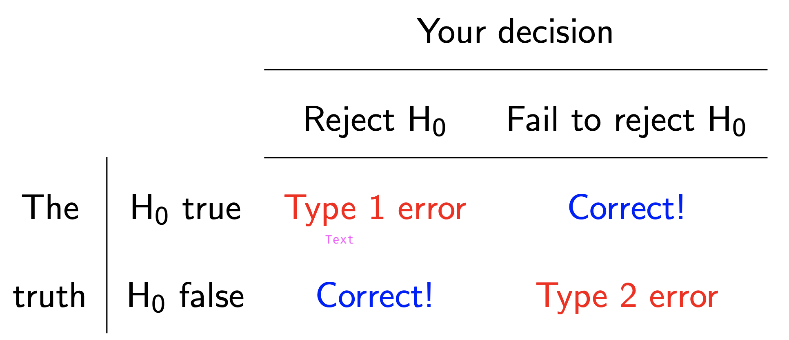
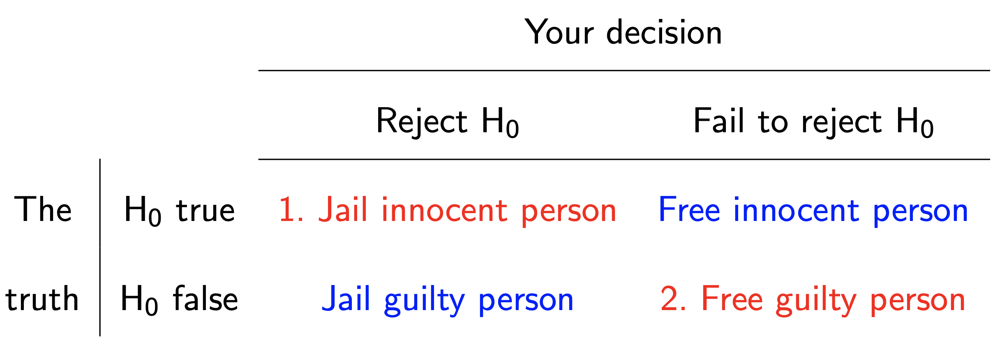
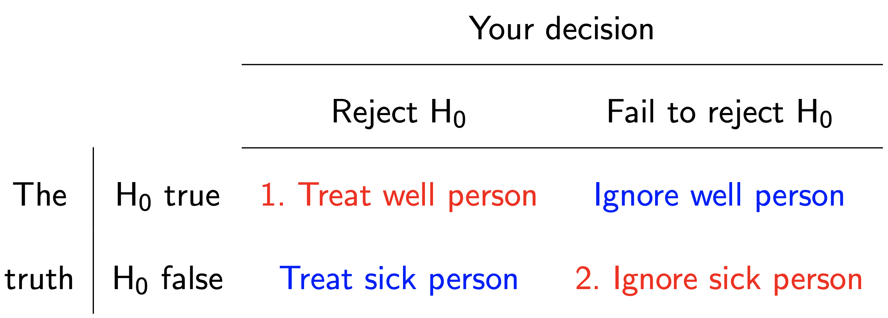

## While you wait... {.smaller}

```{r}
#| label: load-packages
#| message: false
#| echo: false
#| include: false

library(tidyverse)
library(tidymodels)
library(openintro)
library(scales)      # for pretty axis labels
library(glue)        # for constructing character strings
library(knitr)       # for neatly formatted tables
todays_ae <- "ae-17-hypothesis-testing"
new_loans <- loans_full_schema |>
  drop_na(annual_income, total_credit_utilized) |>
  filter(log(annual_income) > 0) |>
  filter(log(total_credit_utilized) > 0) |>
  mutate(
    log_cred = log(total_credit_utilized),
    log_inc = log(annual_income)
  )
```

::: appex
-   Go to your `ae` project in RStudio.

-   Make sure all of your changes up to this point are committed and pushed, i.e., there's nothing left in your Git pane.

-   Click Pull to get today's application exercise file: *`{r} paste0(todays_ae, ".qmd")`*.

-   Wait till the you're prompted to work on the application exercise during class before editing the file.
:::

# Recap: sampling uncertainty

## What if this was my dataset?

::::: columns
::: {.column width="49%"}
```{r}
#| echo: false
#| message: false
#| fig-asp: 0.8

n = 50
set.seed(1234)

toy_data <- new_loans |>
  slice(sample(1:nrow(new_loans), n, replace = TRUE))


toy_data |>
  ggplot(aes(x = log_inc, y = log_cred)) + 
  geom_point() + 
  geom_smooth(method = "lm") + 
  xlim(7, 15) + 
  ylim(0, 15) + 
  labs(
    x = "x",
    y = "y",
    title = paste("Model fit with sample size of ", n, " people", sep = "")
  ) + 
  theme(title = element_text(size = 20, face = "bold"))


model_fit <- linear_reg() |>
  fit(log_cred ~ log_inc, data = toy_data)

model_fit |> 
  tidy() |>
  select(term, estimate)

estimates <- tibble(
  estimate = model_fit |> tidy() |> filter(term == "log_inc") |> pull(estimate)
)
```
:::

::: {.column width="49%"}
```{r}
#| echo: false
#| message: false
#| warning: false
#| fig-asp: 0.8

estimates |>
  ggplot(aes(x = estimate)) +
  geom_histogram() + 
  xlim(0.4, 1.75) + 
  ylim(0, 5) + 
  labs(
    x = "Slope estimate",
    y = "Count",
    title = "Histogram of alternative estimates"
  ) + 
  theme(title = element_text(size = 20, face = "bold"))
```
:::
:::::

## What if this was my dataset instead?

::::: columns
::: {.column width="49%"}
```{r}
#| echo: false
#| message: false
#| fig-asp: 0.8


toy_data <- new_loans |>
  slice(sample(1:nrow(new_loans), n, replace = TRUE))


toy_data |>
  ggplot(aes(x = log_inc, y = log_cred)) + 
  geom_point() + 
  geom_smooth(method = "lm") + 
  xlim(7, 15) + 
  ylim(0, 15) + 
  labs(
    x = "Annual income (log $)",
    y = "Credit utilization (log $)",
    title = paste("Model fit with sample size of ", n, " people", sep = "")
  ) + 
  theme(title = element_text(size = 20, face = "bold"))


model_fit <- linear_reg() |>
  fit(log_cred ~ log_inc, data = toy_data)

model_fit |> 
  tidy() |>
  select(term, estimate)

estimates <- estimates |> add_row(
  estimate = model_fit |> tidy() |> filter(term == "log_inc") |> pull(estimate)
)
```
:::

::: {.column width="49%"}
```{r}
#| echo: false
#| message: false
#| warning: false
#| fig-asp: 0.8

estimates |>
  ggplot(aes(x = estimate)) +
  geom_histogram() + 
  xlim(0.4, 1.75) + 
  ylim(0, 5) + 
  labs(
    x = "Slope estimate",
    y = "Count",
    title = "Histogram of alternative estimates"
  ) + 
  theme(title = element_text(size = 20, face = "bold"))
```
:::
:::::

## What if this was my dataset instead?

::::: columns
::: {.column width="49%"}
```{r}
#| echo: false
#| message: false
#| fig-asp: 0.8


toy_data <- new_loans |>
  slice(sample(1:nrow(new_loans), n, replace = TRUE))


toy_data |>
  ggplot(aes(x = log_inc, y = log_cred)) + 
  geom_point() + 
  geom_smooth(method = "lm") + 
  xlim(7, 15) + 
  ylim(0, 15) + 
  labs(
    x = "Annual income (log $)",
    y = "Credit utilization (log $)",
    title = paste("Model fit with sample size of ", n, " people", sep = "")
  ) + 
  theme(title = element_text(size = 20, face = "bold"))


model_fit <- linear_reg() |>
  fit(log_cred ~ log_inc, data = toy_data)

model_fit |> 
  tidy() |>
  select(term, estimate)

estimates <- estimates |> add_row(
  estimate = model_fit |> tidy() |> filter(term == "log_inc") |> pull(estimate)
)
```
:::

::: {.column width="49%"}
```{r}
#| echo: false
#| message: false
#| warning: false
#| fig-asp: 0.8
estimates |>
  ggplot(aes(x = estimate)) +
  geom_histogram() + 
  xlim(0.4, 1.75) + 
  ylim(0, 5) + 
  labs(
    x = "Slope estimate",
    y = "Count",
    title = "Histogram of alternative estimates"
  ) + 
  theme(title = element_text(size = 20, face = "bold"))
```
:::
:::::

## Rinse and repeat 1000 times...

## Sampling uncertainty {.smaller}

::: task
How sensitive are the estimates to the data they are based on?
:::

```{r}
#| echo: false
#| message: false
#| warning: false
df_boot_samples_100 <- new_loans |> 
  slice(sample(1:9000, n)) |>
  specify(log_cred ~ log_inc) |>
  generate(reps = 1000, type = "bootstrap")
```

```{r}
#| echo: false
#| message: false
#| warning: false
#| fig-asp: 0.7
#| layout-ncol: 2
#| out-width: 80%
p_df_boot_samples_100 <- ggplot(df_boot_samples_100, aes(x = log_inc, y = log_cred, group = replicate)) +
  geom_line(stat = "smooth", method = "lm", se = FALSE, alpha = 0.01) +
  labs(
    x = "Annual income (log $)",
    y = "Credit utilization (log $)",
  ) +
  xlim(7, 15) + 
  ylim(0, 15) + 
  theme(title = element_text(size = 30, face = "bold"))

p_df_boot_samples_100

df_boot_samples_100_fit <- df_boot_samples_100 |>
  fit()

df_boot_samples_100_hist <- ggplot(df_boot_samples_100_fit |> filter(term == "log_inc"), aes(x = estimate)) +
  geom_histogram(color = "white") +
  #geom_vline(xintercept = slope, color = "#8F2D56", linewidth = 1) +
  labs(x = "Slope estimate", y = "Count",
       title = "Histogram of alternative estimates") + 
  theme(title = element_text(size = 30, face = "bold")) +
  xlim(0.4, 1.75)

df_boot_samples_100_hist
```

. . .

- Very? Then uncertainty is high, results are unreliable;
- Not very? Uncertainty is low, results are more reliable.

## That was for n = 50. What if I was starting with n = 1000?

## Sampling uncertainty decreased!

```{r}
#| echo: false
#| message: false
#| warning: false
df_boot_samples_100 <- new_loans |> 
  slice(sample(1:9000, 1000)) |>
  specify(log_cred ~ log_inc) |>
  generate(reps = 1000, type = "bootstrap")
```

::::: columns
::: {.column width="49%"}
```{r}
#| echo: false
#| message: false
#| warning: false
#| fig-asp: 1
p_df_boot_samples_100 <- ggplot(df_boot_samples_100, aes(x = log_inc, y = log_cred, group = replicate)) +
  geom_line(stat = "smooth", method = "lm", se = FALSE, alpha = 0.01) +
  labs(
    x = "Annual income (log $)",
    y = "Credit utilization (log $)",
  ) +
  xlim(7, 15) + 
  ylim(0, 15) + 
  theme(title = element_text(size = 30, face = "bold"))

p_df_boot_samples_100
```
:::

::: {.column width="49%"}
```{r}
#| echo: false
#| message: false
#| warning: false
#| fig-asp: 1
df_boot_samples_100_fit <- df_boot_samples_100 |>
  fit()

df_boot_samples_100_hist <- ggplot(df_boot_samples_100_fit |> filter(term == "log_inc"), aes(x = estimate)) +
  geom_histogram(color = "white") +
  #geom_vline(xintercept = slope, color = "#8F2D56", linewidth = 1) +
  labs(x = "Slope estimate", y = "Count",
       title = "Histogram of alternative estimates") + 
  theme(title = element_text(size = 30, face = "bold")) +
  xlim(0.4, 1.75)

df_boot_samples_100_hist
```
:::
:::::

## Bootstrapping {.smaller}

::: incremental
-   Data collection is costly, so we have to do our best with what we already have;

-   We approximate this idea of "alternative, hypothetical datasets I could have observed" by resampling our data *with replacement*;

-   We construct a new dataset of the same size by randomly picking rows out of the original one:

    -   Some rows will be duplicated;
    -   Some rows will not appear at all;
    -   The new dataset is different from the original;
    -   Different dataset \>\> different estimate

-   Repeat this processes hundred or thousands of times, and observe how the estimates vary as you refit the model on alternative datasets.

-   This gives you a sense of the sampling variability of your estimates.
:::

## Bootstrapping Procedure

{fig-align="center"}

## Bootstrapping

{fig-align="center"}

## Bootstrapping

{fig-align="center"}

## Bootstrapping

{fig-align="center"}

## Bootstrapping

{fig-align="center"}

## Bootstrapping

{fig-align="center"}

## Bootstrapping

{fig-align="center"}

## Confidence intervals {.smaller}

::: incremental
-   **Point estimation**: report your single number *best guess* for the unknown quantity;

-   **Interval estimation**: report a range, or interval, or values where you think the unknown quantity is likely to live;

    -   Interval should be wide enough to capture the truth with high probability;
    -   Interval should be narrow enough to be informative;

-   Unfortunately, there is a trade-off.
    You adjust the **confidence level** to try to negotiate the trade-off;

-   Common choices: 90%, 95%, 99%.
:::

## Precision vs. accuracy {.smaller}


# Recap: Computing Confidence Interval

## Friday's Data: Houses in Duke Forest {.smaller}

::::: columns
::: {.column width="50%"}
-   Data on houses that were sold in the Duke Forest neighborhood of Durham, NC around November 2020
-   Scraped from Zillow
-   Source: [`openintro::duke_forest`](http://openintrostat.github.io/openintro/reference/duke_forest.html)
:::

::: {.column width="50%"}
{fig-alt="Home in Duke Forest"}
:::
:::::

**Goal**: Use the area (in square feet) to understand variability in the price of houses in Duke Forest.

## Point Estimate {.smaller}

```{r}
#| echo: true
observed_fit <- duke_forest |>
  specify(price ~ area) |>
  fit()

observed_fit

```

## Slopes of bootstrap samples {.smaller}

::: task
**Fill in the blank:** For each additional square foot, the model predicts the sale price of Duke Forest houses to be higher, on average, by between \_\_\_ and \_\_\_ dollars.
:::

```{r}
#| include: false
df_fit <- linear_reg() |>
  fit(price ~ area, data = duke_forest)

tidy(df_fit) 

intercept <- tidy(df_fit) |> filter(term == "(Intercept)") |> pull(estimate) |> round()
slope <- tidy(df_fit) |> filter(term == "area") |> pull(estimate) |> round()

df_boot_samples_100 <- duke_forest |>
  specify(price ~ area) |>
  generate(reps = 100, type = "bootstrap")

p_df_boot_samples_100 <- ggplot(df_boot_samples_100, aes(x = area, y = price, group = replicate)) +
  geom_line(stat = "smooth", method = "lm", se = FALSE, alpha = 0.05) +
  labs(
    x = "Area (square feet)",
    y = "Sale price (USD)",
    title = glue("Bootstrap samples 1 - 100")
  ) +
  scale_y_continuous(limits = c(90000, 1550000), labels = label_dollar()) +
  scale_x_continuous(limits = c(1000, 6500), labels = label_number())
```

```{r}
#| echo: false
#| message: false
#| fig-asp: 0.5
#| fig-width: 8
p_df_boot_samples_100 +
  geom_abline(intercept = intercept, slope = slope, color = "#8F2D56")
```

## Slopes of bootstrap samples {.smaller}

::: task
**Fill in the blank:** For each additional square foot, we expect the sale price of Duke Forest houses to be higher, on average, by between \_\_\_ and \_\_\_ dollars.
:::

```{r}
#| echo: false
#| fig-asp: 0.55
#| fig-width: 8
df_boot_samples_100_fit <- df_boot_samples_100 |>
  fit()

df_boot_samples_100_hist <- ggplot(df_boot_samples_100_fit |> filter(term == "area"), aes(x = estimate)) +
  geom_histogram(binwidth = 10, color = "white") +
  geom_vline(xintercept = slope, color = "#8F2D56", linewidth = 1) +
  labs(x = "Slope", y = "Count",
       title = "Slopes of 100 bootstrap samples") +
  scale_x_continuous(labels = label_dollar())

df_boot_samples_100_hist
```

## 95% confidence interval {.xsmall}

```{r}
#| echo: false
lower <- df_boot_samples_100_fit |>
  ungroup() |>
  filter(term == "area") |>
  summarise(quantile(estimate, 0.025)) |>
  pull()

upper <- df_boot_samples_100_fit |>
  ungroup() |>
  filter(term == "area") |>
  summarise(quantile(estimate, 0.975)) |>
  pull()

df_boot_samples_100_hist +
  geom_vline(xintercept = lower, color = "steelblue", linewidth = 1, linetype = "dashed") +
  geom_vline(xintercept = upper, color = "steelblue", linewidth = 1, linetype = "dashed")
```

::: incremental
-   A 95% confidence interval is bounded by the middle 95% of the bootstrap distribution
-   We are 95% confident that for each additional square foot, the model predicts the sale price of Duke Forest houses to be higher, on average, by `r dollar(lower)` to `r dollar(upper)`.
:::

## Where do the bounds come from? {.smaller}

::: incremental
-   Think IQR!
    50% of the bootstrap distribution is between the 25% quantile on the left and the 75% quantile on the right.
    But we want more than 50%

-   90% of the bootstrap distribution is between the 5% quantile on the left and the 95% quantile on the right;

-   95% of the bootstrap distribution is between the 2.5% quantile on the left and the 97.5% quantile on the right;

-   And so on.
:::

## Recap (again!!) {.xsmall .scrollable}

::: incremental
-   **Population:** Complete set of observations of whatever we are studying, e.g., people, tweets, photographs, etc. (population size = $N$)

-   **Sample:** Subset of the population, ideally random and representative (sample size = $n$)

-   Sample statistic $\ne$ population parameter, but if the sample is good, it can be a good estimate

-   **Statistical inference:** Discipline that concerns itself with the development of procedures, methods, and theorems that allow us to extract meaning and information from data that has been generated by stochastic (random) process

-   We report the estimate with a confidence interval, and the width of this interval depends on the variability of sample statistics from different samples from the population

-   Since we can't continue sampling from the population, we bootstrap from the one sample we have to estimate sampling variability
:::

# Hypothesis testing

## Hypothesis testing {.smaller}

A hypothesis test is a statistical technique used to evaluate *competing claims* using data

::: incremental
-   **Null hypothesis,** $H_0$: An assumption about the population.
    "There is nothing going on."

-   **Alternative hypothesis,** $H_A$: A research question about the population.
    "There is something going on".
:::

. . .

Note: Hypotheses are always at the population level!

## Setting hypotheses {.smaller}

-   **Null hypothesis,** $H_0$: "There is nothing going on." The slope of the model for predicting the prices of houses in Duke Forest from their areas is 0, $\beta_1 = 0$.

-   **Alternative hypothesis,** $H_A$: "There is something going on".
    The slope of the model for predicting the prices of houses in Duke Forest from their areas is different than, $\beta_1 \ne 0$.

## Hypothesis testing "mindset" {.smaller}

-   Assume you live in a world where null hypothesis is true: $\beta_1 = 0$.

-   Ask yourself how likely you are to observe the sample statistic, or something even more extreme, in this world: $P(b_1 \leq 159.48~or~b_1 \geq 159.48 | \beta_1 = 0)$ = ?

## Hypothesis testing as a court trial {.smaller}

-   **Null hypothesis**, $H_0$: Defendant is innocent

-   **Alternative hypothesis**, $H_A$: Defendant is guilty

. . .

-   **Present the evidence:** Collect data

. . .

-   **Judge the evidence:** "Could these data plausibly have happened by chance if the null hypothesis were true?"
    -   Yes: Fail to reject $H_0$
    -   No: Reject $H_0$

## Hypothesis testing as medical diagnosis {.smaller}

-   **Null hypothesis**, $H_0$: patient is fine

-   **Alternative hypothesis**, $H_A$: patient is sick

. . .

-   **Present the evidence:** Collect data

. . .

-   **Judge the evidence:** "Could these data plausibly have happened by chance if the null hypothesis were true?"
    -   Yes: Fail to reject $H_0$
    -   No: Reject $H_0$

## Hypothesis testing framework {.smaller}

::: incremental
-   Start with a null hypothesis, $H_0$, that represents the status quo

-   Set an alternative hypothesis, $H_A$, that represents the research question, i.e. what we're testing for

-   Conduct a hypothesis test under the assumption that the null hypothesis is true and calculate a **p-value** (probability of observed or more extreme outcome given that the null hypothesis is true)

    -   if the test results suggest that the data do not provide convincing evidence for the alternative hypothesis, stick with the null hypothesis
    -   if they do, then reject the null hypothesis in favor of the alternative
:::

## Calculate observed slope

...
which we have already done:

```{r}
observed_fit <- duke_forest |>
  specify(price ~ area) |>
  fit()

observed_fit
```

## Simulate null distribution

```{r}
#| code-line-numbers: "|1|2|3|4|5|6"
set.seed(20250616)
null_dist <- duke_forest |>
  specify(price ~ area) |>
  hypothesize(null = "independence") |>
  generate(reps = 100, type = "permute") |>
  fit()
```

## View null distribution

```{r}
null_dist
```

## Visualize null distribution

```{r}
#| fig-asp: 0.55
#| fig-width: 8
null_dist |>
  filter(term == "area") |>
  ggplot(aes(x = estimate)) +
  geom_histogram(binwidth = 15)
```

## Visualize null distribution (alternative)

```{r}
visualize(null_dist) +
  shade_p_value(obs_stat = observed_fit, direction = "two-sided")
```

## Get p-value

```{r}
#| warning: false
null_dist |>
  get_p_value(obs_stat = observed_fit, direction = "two-sided")
```

## Make a decision

::: task
Based on the p-value calculated, what is the conclusion of the hypothesis test?
:::

## Sometimes the test will be wrong {.smaller}

- Type 1 error: False positive

- Type 2 error: False negative

{width=700 fig-align="center"}

## Think about the judge {.smaller}

::: task
Which is worse, Type 1 or Type 2 error?

**Note:** $H_0$ person innocent vs $H_A$ person guilty.
:::

{width=700 fig-align="center"}

. . .

Aspects of the American trial system regard a Type 1 error as worse than a Type 2 error (reasonable doubt standard, unanimous juries, presumption of innocence, etc).

## Think about the doctor {.smaller}

::: task
Which is worse, Type 1 or Type 2 error? Which are doctors more prone to?

**Note:** $H_0$ person well vs $H_A$ person sick.
:::

{width=700 fig-align="center"}

## How do we negotiate the trade-off? {.smaller}

::: incremental
Pick a threshold $\alpha\in[0,\,1]$ called the **discernibility level** and threshold the $p$-value:

-   If $p\text{-value} < \alpha$, reject null and find evidence for the alternative;
-   If $p\text{-value} \geq \alpha$, fail to reject null;
:::

. . .

- $\alpha$ $\uparrow$ $\rightarrow$ easier to reject $H_0$ $\rightarrow$ Type 1 $\uparrow$ Type 2 $\downarrow$

- $\alpha$ $\downarrow$ $\rightarrow$ harder to reject $H_0$ $\rightarrow$ Type 1 $\downarrow$ Type 2 $\uparrow$

- Typical choices: $\alpha$ = 0.01, 0.05, 0.10.
