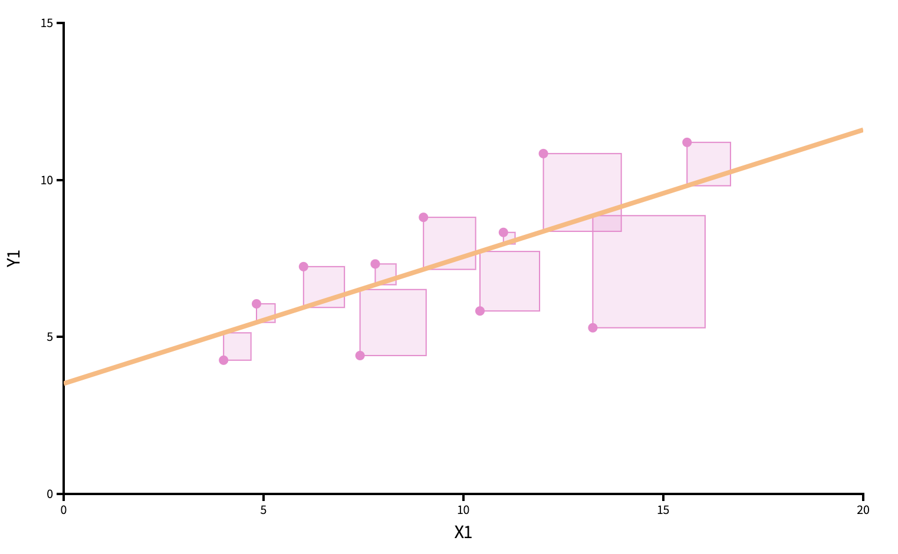

```{r}
#| label: load-packages
#| message: false
#| echo: false
library(tidyverse)
library(tidymodels)
library(openintro)
library(distr)
library(glue)
todays_ae <- "ae-19-card-krueger"
```

# Recap: statistical inference

## The bottom line, at the top

-   Data science is the messy, real-world *art* of converting data into knowledge;
-   Statistics is the mathematical study of quantifying uncertainty about that knowledge to help guide decision-making.

## The population model (greek letters, no hats) {.scrollable}

::: incremental
-   This is an *idealized* representation of the data: 
$$
y = \beta_0+\beta_1x +\varepsilon;
$$

-   There is some "true line" floating out there with a "true slope" $\beta_1$ and "true intercept" $\beta_0$;

-   With infinite amounts of perfectly measured data, we could know $\beta_0$ and $\beta_1$ exactly;

-   We don't have that, so we must use finite amounts of imperfect data to *estimate*;

-   We are especially interested in $\beta_1$ because is characterizes the association between $x$ and $y$, which is useful for *prediction*.
:::

## "Three branches of statistical government" {.scrollable}

$\beta_1$ is an unknown quantity we are trying to learn about using noisy, imperfect data.
Learning comes in three flavors:

::: incremental
-   **POINT ESTIMATION**: get a single-number best guess for $\beta_1$;

-   **INTERVAL ESTIMATION**: get a range of likely values for $\beta_1$ that characterizes (sampling) uncertainty;

-   **HYPOTHESIS TESTING**: use the data to evaluate competing claims about $\beta_1$.
:::

## Point estimation (roman letters, hats!) {.scrollable}

We estimate $\beta_0$ and $\beta_1$ with the coefficients of the best fit line:

$$
\widehat{y}=b_0+b_1x.
$$

"Best" means "least squares." We pick the estimates so that the sum of squared residuals is as small as possible.
[Play around!](https://seeing-theory.brown.edu/regression-analysis/index.html)

{width="50%" fig-align="center"}

## Point estimation {.scrollable}

```{r}
#| message: false
ggplot(mtcars, aes(x = wt, y = mpg)) + 
  geom_point() +
  geom_smooth(method = "lm")
```

## Point estimation {.scrollable}

```{r}
linear_reg() |>
  fit(mpg ~ wt, data = mtcars) |>
  tidy()
```

## Sampling uncertainty {.scrollable}

::: incremental
-   How do our point estimates vary across alternative, hypothetical datasets?

    -   If they vary alot, uncertainty is high, and results are unreliable;
    -   if they vary only a little, uncertainty is low, and results are more reliable.

-   We can use the *bootstrap* to construct alternative datasets and assess the sensitivity of our estimates to changes in the data.
:::

## Bootstrap distribution {.medium .scrollable}

This histogram displays variation in the slope estimate across alternative datasets.

-   Large spread $\rightarrow$ high uncertainty;
-   Small spread $\rightarrow$ lower uncertainty.

```{r}
#| echo: false

df_fit <- linear_reg() |>
  fit(price ~ area, data = duke_forest)

intercept <- tidy(df_fit) |> filter(term == "(Intercept)") |> pull(estimate) |> round()
slope <- tidy(df_fit) |> filter(term == "area") |> pull(estimate) |> round()

set.seed(119)

df_boot_samples_100 <- duke_forest |>
  specify(price ~ area) |>
  generate(reps = 100, type = "bootstrap")

df_boot_samples_100_fit <- df_boot_samples_100 |>
  fit()

df_boot_samples_100_hist <- ggplot(df_boot_samples_100_fit |> filter(term == "area"), aes(x = estimate)) +
  geom_histogram(binwidth = 10, color = "white") +
  geom_vline(xintercept = slope, color = "deeppink", linewidth = 1) +
  labs(x = "Slope", y = "Count",
       title = "Slopes of 100 bootstrap samples") +
  scale_x_continuous(labels = label_dollar())

df_boot_samples_100_hist
```

## Confidence interval {.scrollable}

Pick a range that swallows up a large % of the histogram:

```{r}
#| echo: false
lower <- df_boot_samples_100_fit |>
  ungroup() |>
  filter(term == "area") |>
  summarise(quantile(estimate, 0.025)) |>
  pull()

upper <- df_boot_samples_100_fit |>
  ungroup() |>
  filter(term == "area") |>
  summarise(quantile(estimate, 0.975)) |>
  pull()

df_boot_samples_100_hist +
  geom_vline(xintercept = lower, color = "cornflowerblue", linewidth = 1, linetype = "dashed") +
  geom_vline(xintercept = upper, color = "cornflowerblue", linewidth = 1, linetype = "dashed")
```

We use quantiles (think IQR), but there are other ways.

## Hypothesis testing {.scrollable}

::: incremental
-   Two competing claims about $\beta_1$: $$
    \begin{aligned}
    H_0&: \beta_1=0\quad(\text{nothing going on})\\
    H_A&: \beta_1\neq0\quad(\text{something going on})
    \end{aligned}
    $$

-   In words: "is there sufficient evidence that x and y are correlated, or not?"

-   Do the data strongly favor one or the other?

-   How can we quantify this?
:::

## Hypothesis testing {.scrollable}

::: incremental
-   Think hypothetically: if the null hypothesis were in fact true, would my results be out of the ordinary?

    -   if no, then the null could be true;
    -   if yes, then the null might be bogus;

-   My results represent the reality of actual data.
    If they conflict with the null, then you throw out the null and stick with reality;

-   How do we *quantify* "would my results be out of the ordinary"?
:::

## Null distribution {.medium .scrollable}

If the null happened to be true, how would we expect our results to vary across datasets?
We can use simulation to answer this:

```{r}
#| echo: false
#| message: false
#| warning: false

set.seed(34)
fake_draws <- tibble(
  replicate = 1:500,
  x = rnorm(500),
  stat = x,
  estimate = x,
) 

fake_draws |>
  ggplot(aes(x = x)) + 
  geom_histogram() + 
  labs(
    title = "Null distribution: variation in the slope estimate if the null were true",
    x = "hypothetical slope estimates",
    y = "count"
  ) + 
  xlim(-5, 5)
```

This is how the world should look *if the null is true*.

## Null distribution versus reality {.medium .scrollable}

Locate the *actual* results of your *actual* data analysis under the null distribution.
Are they in the middle?
Are they in the tails?

```{r}
#| echo: false
#| message: false
#| warning: false
#| fig-asp: 0.4

fake_draws |>
  ggplot(aes(x = x)) + 
  geom_histogram() + 
  geom_vline(xintercept = 0.5, color = "red", size = 2) + 
  annotate("text", x = 2, y = 65, label = "Your actual\nslope estimate", color = "red", size = 3*.pt) + 
  labs(
    title = "Null distribution: variation in the slope estimate if the null were true",
    x = "hypothetical slope estimates",
    y = "count"
  ) + 
  xlim(-5, 5)
```

Are these results in harmony or conflict with the null?

## Null distribution versus reality {.medium .scrollable}

Locate the *actual* results of your *actual* data analysis under the null distribution.
Are they in the middle?
Are they in the tails?

```{r}
#| echo: false
#| message: false
#| warning: false
#| fig-asp: 0.4

fake_draws |>
  ggplot(aes(x = x)) + 
  geom_histogram() + 
  geom_vline(xintercept = 5, color = "red", size = 2) + 
  annotate("text", x = 3.5, y = 65, label = "Your actual\nslope estimate", color = "red", size = 3*.pt) + 
  labs(
    title = "Null distribution: variation in the slope estimate if the null were true",
    x = "hypothetical slope estimates",
    y = "count"
  ) + 
  xlim(-5, 5)
```

Are these results in harmony or in conflict with the null?

## Null distribution versus reality {.medium .scrollable}

Locate the *actual* results of your *actual* data analysis under the null distribution.
Are they in the middle?
Are they in the tails?

```{r}
#| echo: false
#| message: false
#| warning: false
#| fig-asp: 0.4

fake_draws |>
  ggplot(aes(x = x)) + 
  geom_histogram() + 
  geom_vline(xintercept = 1.75, color = "red", size = 2) + 
  annotate("text", x = 3.5, y = 65, label = "Your actual\nslope estimate", color = "red", size = 3*.pt) + 
  labs(
    title = "Null distribution: variation in the slope estimate if the null were true",
    x = "hypothetical slope estimates",
    y = "count"
  ) + 
  xlim(-5, 5)
```

Are these results in harmony or in conflict with the null?

## The main idea {.scrollable}

-   The point estimate is *reality*. That's what the data say;
-   The null distribution is *hypothetical*;
-   Are the reality and the hypothetical in harmony or conflict?
    -   If harmony, the null remains plausible and cannot be dismissed;
    -   If conflict, go with reality (reject the null).
-   Instead of eyeballing a picture, how can we *quantify* the degree of "harmoniousness" between reality and the hypothetical?

## Question {.small}

::: question

What is a *p*-value?

:::

a.  The probability that the null hypothesis is true given your result.
b.  The probability of a result as or more extreme than the one you got.
c.  The probability of a result as or more extreme than the one you got assuming the null is true.
d.  The probability that the alternative hypothesis is true given your result.
e.  The probability that the null hypothesis and alternative hypothesis are both true given your result.

## *p*-value {.scrollable}

::: incremental
The $p$-value is the probability of being *even farther out* in the tails of the null distribution than your results already were.

-   if this number is very low, then your results would be out of the ordinary if the null were true, so maybe the null was never true to begin with;

-   if this number is high, then your results may be perfectly compatible with the null.
:::

## *p*-value {.scrollable}

*p*-value is the fraction of the histogram area shaded red:

```{r}
#| echo: false
#| message: false
#| warning: false
set.seed(3)
x <- rnorm(100, mean = 0.1, sd = 2)
df <- tibble(x = x)
obs_stat <- df |>
  specify(response = x) |>
  calculate(stat = "mean")
null_dist <- df |>
  specify(response = x) |>
  hypothesize(null = "point", mu = 0) |>
  generate(reps = 1000, type = "bootstrap") |>
  calculate(stat = "mean")


visualize(null_dist) + 
  shade_p_value(obs_stat = obs_stat, direction = "two-sided")
```

. . .

Big ol' *p*-value.
Null remains plausible

## *p*-value {.scrollable}

*p*-value is the fraction of the histogram area shaded red:

```{r}
#| echo: false
#| message: false
#| warning: false
set.seed(3)
x <- rnorm(100, mean = 1, sd = 2)
df <- tibble(x = x)
obs_stat <- df |>
  specify(response = x) |>
  calculate(stat = "mean")
null_dist <- df |>
  specify(response = x) |>
  hypothesize(null = "point", mu = 0) |>
  generate(reps = 1000, type = "bootstrap") |>
  calculate(stat = "mean")


visualize(null_dist) + 
  shade_p_value(obs_stat = obs_stat, direction = "two-sided")
```

. . .

*p*-value is basically zero.
Null looks bogus.

## *p*-value {.scrollable}

*p*-value is the fraction of the histogram area shaded red:

```{r}
#| echo: false
#| message: false
#| warning: false
set.seed(3)
x <- rnorm(100, mean = 0.5, sd = 4)
df <- tibble(x = x)
obs_stat <- df |>
  specify(response = x) |>
  calculate(stat = "mean")
null_dist <- df |>
  specify(response = x) |>
  hypothesize(null = "point", mu = 0) |>
  generate(reps = 1000, type = "bootstrap") |>
  calculate(stat = "mean")


visualize(null_dist) + 
  shade_p_value(obs_stat = obs_stat, direction = "two-sided")
```

. . .

*p*-value is...kinda small?
Null looks...?

## Discernibility level {.scrollable}

::: incremental
-   How do we decide if the *p*-value is big enough or small enough?

-   Pick a threshold $\alpha\in[0,\,1]$ called the *discernibility level*:

    -   If $p\text{-value} < \alpha$, reject null and accept alternative;
    -   If $p\text{-value} \geq \alpha$, fail to reject null;

-   Standard choices: $\alpha=0.01, 0.05, 0.1, 0.15$.
:::

# Multiple Choice!

## What is $b_1$? {.scrollable}

```{r}
#| echo: false
#| message: false
#| warning: false
#| fig-asp: 0.4
set.seed(1)
n = 50
x <- scale(rnorm(n))[,1]
y <- 3 + 0.5 * x + rnorm(n)
my_model <- lm(y ~ x)
x <- cor(x, y) * sd(y) * x / 0.5
y <- y - (my_model$coefficients[1] - 3)
df <- tibble(x = x, y = y)

ggplot(df, aes(x = x, y = y)) + 
  geom_point() + 
  geom_smooth(method = "lm", se = FALSE) + 
  theme(axis.text = element_text(size = 20))
```

::::: columns
::: column
a.  -1 / 2
b.  0
c.  1 / 4
:::

::: column
d.  1 / 2
e.  1
f.  2
:::
:::::

## What is $b_0$? {.scrollable}

```{r}
#| echo: false
#| message: false
#| warning: false
#| fig-asp: 0.4
set.seed(1)
n = 50
x <- scale(rnorm(n))[,1]
y <- 3 + 0.5 * x + rnorm(n)
my_model <- lm(y ~ x)
x <- cor(x, y) * sd(y) * x / 0.5
y <- y - (my_model$coefficients[1] - 3)
df <- tibble(x = x, y = y)

ggplot(df, aes(x = x, y = y)) + 
  geom_point() + 
  geom_smooth(method = "lm", se = FALSE) + 
  theme(axis.text = element_text(size = 20))
```

::::: columns
::: column
a.  1
b.  1.75
:::

::: column
c.  2
d.  3
:::
:::::

## Back to the Hotels! {.smaller .scrollable}

::: question

The following model predicts `adr` from `adults` and `hotel` type. Which of the following is the best interpretation of the slope coefficient for `adults`?

::: 

```{r}
#| echo: false
#| message: false

hotels <- read_csv("data/hotels.csv")

hotels <- hotels |>
  filter(adr <= 1000, adults < 5)

set.seed(847)
hotels_split <- initial_split(hotels)
hotels_train <- training(hotels_split)
hotels_test <- testing(hotels_split)
```

```{r}
#| eval: true
#| echo: false
#| message: false

adr_fit_1 <- linear_reg() |>
  fit(adr ~ adults + hotel, data = hotels_train)

adr_aug_1 <- augment(adr_fit_1, hotels_train)

tidy(adr_fit_1)
```

"For each additional adult in the booking, the average daily rate is predicted to be higher by $29.00..."

. . .

a.  on average, holding hotel type constant.

b.  for Resort Hotels compared to City Hotels, on average.
    
c.  for City Hotels compared to Resort Hotels, on average.
    
d.  on average, not holding any other variables constant.

## Back to the Hotels! {.smaller .scrollable}

::: question

Which of the following is the correct interpretation of the slope coefficient for `hotel`?

:::

```{r}
#| eval: true
#| echo: false
#| message: false
tidy(adr_fit_1)
```

a.  For each additional Resort Hotel booking, the predicted average daily rate is $10.80 lower, holding number of adults constant.
    
b.  For each additional adult in the booking, the average daily rate is predicted to be lower by $10.80 for resort hotels compared to City Hotels, on average.
    
c.  Resort Hotels bookings are predicted to have an average daily rate that is $10.80 lower than City Hotels, on average, holding number of adults constant.
    
d.  Resort Hotels bookings are predicted to have an average daily rate that is $10.80 higher than City Hotels, on average, holding number of adults constant.

## Back to the Hotels! {.smaller .scrollable}

::: question

Which of the following is the correct interpretation of the intercept?

:::

```{r}
#| eval: true
#| echo: false
#| message: false
tidy(adr_fit_1)
```

a.  The predicted average daily rate for a bookings with 0 adults at a Resort Hotel is $51.70, on average.
    
b.  The predicted average daily rate for a bookings with 0 adults at a City Hotel is $51.70, on average.
    
c.  For each additional adult and Resort Hotel in the booking, the average daily rate is predicted to be $51.70 higher, on average.
    
d.  For each additional adult and City Hotel in the booking, the average daily rate is predicted to be $51.70 higher, on average.

## Back to the Hotels! {.smaller .scrollable}

::: question

Which of the following (Plot A or Plot B) is the correct visual representation of this model?

:::

```{r}
#| eval: true
#| echo: false
#| message: false
tidy(adr_fit_1)
```

```{r}
#| echo: false
#| eval: true
#| message: false
#| layout-ncol: 2
#| fig-width: 5
#| fig-asp: 0.618
ggplot(hotels_train, aes(x = adults, y = adr, color = hotel)) +
  geom_point() +
  geom_smooth(method = "lm", linewidth = 1, se = FALSE) +
  ggthemes::scale_color_colorblind() +
  labs(
    title = "Plot A",
    x = "Number of adults",
    y = "Average daily rate",
    color = "Hotel"
  ) +
  theme_minimal() +
  theme(legend.position = "inside", legend.position.inside = c(0.15, 0.80))

ggplot(adr_aug_1, aes(x = adults, color = hotel)) +
  geom_point(aes(y = adr)) +
  geom_line(aes(y = .pred), linewidth = 1) +
  ggthemes::scale_color_colorblind() +
  labs(
    title = "Plot B",
    x = "Number of adults",
    y = "Average daily rate",
    color = "Hotel"
  ) +
  theme_minimal() +
  theme(legend.position = "inside", legend.position.inside = c(0.15, 0.80))
```


## Which of these could be a bootstrap sample? {.scrollable}

This is the original dataset:

```{r}
#| echo: false
#| message: false
#| warning: false

set.seed(3456789)
original_dataset <- tibble(scores = round(rnorm(5), 3))
glimpse(original_dataset)
```

| A      |     |     | B      |     |     | C      |     |     | D      |
|--------|-----|-----|--------|-----|-----|--------|-----|-----|--------|
| -0.515 |     |     | 1.563  |     |     | -0.515 |     |     | -0.522 |
| -0.411 |     |     | -0.411 |     |     | -0.411 |     |     | 1.12   |
| 1.563  |     |     | -0.515 |     |     | -0.411 |     |     | 1.206  |
| -0.515 |     |     |        |     |     | 1.563  |     |     | 0.68   |
| -0.515 |     |     |        |     |     | 1.563  |     |     | 0.83   |
|        |     |     |        |     |     | 0.523  |     |     |        |
|        |     |     |        |     |     | 1.563  |     |     |        |

## Which is a 98% confidence interval? {.scrollable}

```{r}
#| echo: false
#| message: false
#| warning: false
#| fig-asp: 0.4

set.seed(34567890)
M <- 5000
x <- r(UnivarMixingDistribution(Norm(mean = -3, sd = 3/4), 
                                     Norm(mean = -0, sd = 3/4),
                                     Norm(mean = +2.5, sd = 3/4),
                                     mixCoeff = c(0.1, 0.65, 0.25)))(M)

par(mfrow = c(1, 1), mar = c(4, 0.5, 0.5, 0.5))
hist(x, breaks = "Scott", freq = FALSE,
     yaxt = "n", 
     xaxt = "n", 
     main = "")
axis(1, at = quantile(x, probs = c(0.01, 0.05, 0.09, 0.5, 0.91, 0.95, 0.99)),
     labels = c(expression(q[0.01]), 
                expression(q[0.05]),
                expression(q[0.09]),
                expression(q["0.50"]),
                expression(q[0.91]),
                expression(q[0.95]),
                expression(q[0.99])),
     las = 2,
     cex.axis = 1.5)
```

::::: columns
::: column
a.  $(q_{0.01},\,q_{0.91})$
b.  $(q_{0.01},\,q_{0.99})$
:::

::: column
c.  $(q_{0.09},\,q_{0.95})$
d.  $(q_{0.05},\,q_{0.99})$
:::
:::::

## Match the picture to the p-value. {.scrollable}

```{r}
#| echo: false
#| message: false
#| warning: false
#| fig-asp: 0.3
#| fig-align: center

set.seed(23456)

v <- sample(c(4, 1, 0.5, 2), 4, replace = FALSE)

par(mfrow = c(1, 4), mar = c(3, 0.5, 3, 0.5))
normTail(0, 1, xlim = c(-4, 4), main = "Plot 1", U = v[1], L = -v[1])
abline(v = v[1], lty = 2, col = "red")
normTail(0, 1, xlim = c(-4, 4), main = "Plot 2", U = v[2], L = -v[2])
abline(v =v[2], lty = 2, col = "red")
normTail(0, 1, xlim = c(-4, 4), main = "Plot 3", U = v[3], L = -v[3])
abline(v = v[3], lty = 2, col = "red")
normTail(0, 1, xlim = c(-4, 4), main = "Plot 4", U = v[4], L = -v[4])
abline(v = v[4], lty = 2, col = "red")
```

::::: columns
::: column
a.  0
b.  0.045
:::

::: column
c.  0.32
d.  0.62
:::
:::::

## Which could be the null distribution of the test? {.medium .scrollable}

For these hypotheses

$$
\begin{aligned}
H_0&: \beta_1=5\\
H_A&: \beta_1\neq 5.
\end{aligned}
$$

```{r}
#| echo: false
#| message: false
#| warning: false
#| fig-asp: 0.4
n = 500

df <- tibble(
  draws = c(rnorm(n, mean = 5), 
            rnorm(n, mean = 0), 
            rnorm(n, mean = -5), 
            rnorm(n, mean = 2)),
  id = c(rep("A", n),
         rep("B", n),
         rep("C", n),
         rep("D", n))
)

ggplot(df, aes(x = draws)) + 
  geom_histogram() + 
  facet_wrap(~ id) + 
  labs(
    x = NULL,
    y = NULL
  )
```

# AE-19

## `{r} todays_ae`

::: appex
-   Go to your ae project in RStudio.

-   If you haven't yet done so, make sure all of your changes up to this point are committed and pushed, i.e., there's nothing left in your Git pane.

-   If you haven't yet done so, click Pull to get today's application exercise file: *`{r} paste0(todays_ae, ".qmd")`*.

-   Work through the application exercise in class, and render, commit, and push your edits.
:::
